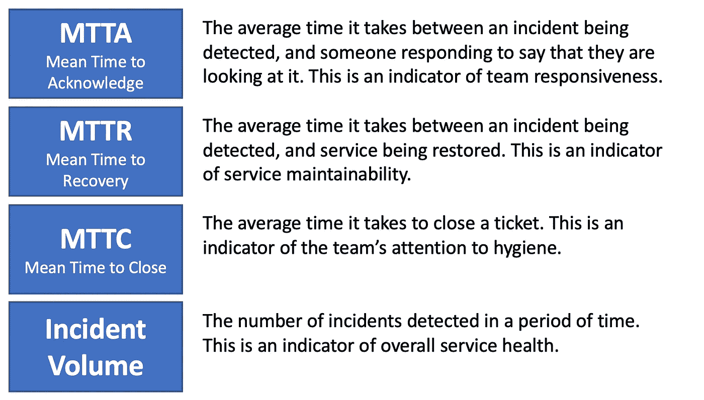
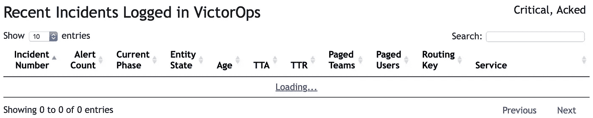

# 监控运营绩效

> 原文：<https://medium.datadriveninvestor.com/monitoring-operational-performance-300155353e4f?source=collection_archive---------8----------------------->

Judge Robert Rosenberg of the Broward County Canvassing Board; *Robert King/Getty Images*

我已经花了一些时间谈论[可观察性和 DevOps](https://medium.com/faun/devops-meets-observability-78775c021b0e) ，但是事实证明，了解组织在这条道路上过渡得有多好是有一些细微差别的。开发人员是否真的精通支持他们自己的代码，他们是否摆脱了筒仓的束缚？

从治理的角度来看，衡量团队以及整个组织的表现很重要。虽然当*看起来*事故总数和维修时间随着时间的推移呈下降趋势时，这很好，但有了正确的见解，就有可能凭经验引导这些对话。

 [## 敏捷管理:好的、坏的和彻头彻尾丑陋的数据驱动的投资者

### 公司不断重塑自己，以获得或保持竞争优势和市场份额。这是…

www.datadriveninvestor.com](https://www.datadriveninvestor.com/2019/03/26/agile-management-the-good-the-bad-and-the-downright-ugly/) 

当我们沿着这条路走下去的时候，我挑选了四个可以提供洞察力的指标。您可能有不同的列表。

也许你会发现一个团队因为一个事件被传呼的次数是一个有用的替代 MTTA 的方法。

我们 DevOps 转型成功的两个早期重要指标是 MTTR 和产量的大幅减少，但随着新团队的加入，我们将始终关注 MTTA 和 MTTC 的情况。开发一个状态板很有帮助，我们可以在那里实时看到事件是如何处理的。我创建了一个 [VictorOps 仪表板](https://github.com/ak15199/victorops-dashboard/)，其加载页面如下所示:

也许您使用的事件管理工具已经有了类似的东西。如果没有，那么考虑应用这个或者类似的东西来观察你的团队适应这种所有权变化的情况。

就我个人而言，我倾向于避免更复杂的指标，如受影响的客户数量(T6)或收入损失(T9)，但这取决于你:如果你相信，以足够的准确度确定这些数字所需要的额外努力将在修复根本原因方面推动正确的行为，那就太好了。如果不是，那么把同样的精力花在解决潜在问题上不是更好吗？哪条路线对服务可用性影响最大？

## 最后一点

看一看[古德哈特定律](https://en.wikipedia.org/wiki/Goodhart%27s_law):使用这些指标来推动围绕改进运营模式的经验性对话，但不要只是给团队工具和为他们设定目标:这可能会导致错误的结果。

*感谢罗伯特·鲍克夏尔推荐标题图片。*