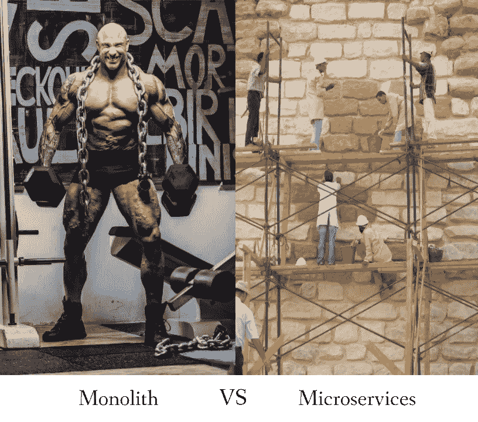

# 单片还是微服务？

> 原文：<https://medium.datadriveninvestor.com/monolithic-or-microservices-41ad0e45478b?source=collection_archive---------1----------------------->

Photo credit to [Damir Spanic](https://unsplash.com/photos/hp3y7G7TALI?utm_source=unsplash&utm_medium=referral&utm_content=creditCopyText) on [Unsplash](https://unsplash.com/search/photos/body-builder?utm_source=unsplash&utm_medium=referral&utm_content=creditCopyText) and [Vera Reis](https://www.freeimages.com/photographer/Dioptria-63604) on [FREEIMAGES](https://www.freeimages.com)

如果你正在阅读这篇文章，我相信你已经听说过**全能微服务架构**？松散耦合、高度可扩展和令人印象深刻的性能，同时为大量用户提供服务。

对**微服务架构**的简单解释是**一个由小工作部件(服务)支持的系统，每个服务可以根据需要复制**，这就是为什么它是可扩展的，并且能够处理大量的并行事务。

然而，有很多初创公司是从单片架构起步的，而**单片架构根本就没有过时**。即使对于这两种类型的架构来说，也有权衡取舍。

这篇文章分享了我作为一家初创公司的第一名员工的经历，在**单片**或**微服务架构**之间做出选择以构建一个全新的**新产品**，以及我如何最终选择**单片架构**。如果你想更深入的了解微服务，[微服务。IO](https://microservices.io) 是可以多学习的地方。

做这个决定时，我考虑了几个要点。

*我的场景:我有大约 3-4 个月的时间，有预算雇用 2 名新人来建立一个由 3 名成员组成的团队(我是开发主管，2 名新人)。最初由创始人自己出资。从头开始开发一个全新的产品。*

## 1.经营风险

这是做出架构决策时要考虑的一个重要方面。

*   产品的市场准备好了吗？
*   产品上市和营销的可行性如何？
*   产品可持续吗？

我们正在开发的这个新产品也带来了商业风险。在此 POC 阶段，我们不知道应用程序将如何扩展，复杂性将会降低，上市时间将会缩短。所以我们可以观察并做出下一个决定。

## 2.可用时间和资源

创业公司时间和资源有限是正常的。虽然我一直想，但我以前从未开发过整个微服务架构。如果我的团队没有具备这种经验的成员，设计**微服务架构**可能会非常具有挑战性。

换句话说，实施微服务架构的**教育成本**比整体架构要高。

## 3.操作复杂性

为了在最短的时间内启动项目并构建工作产品，我必须选择降低操作复杂性的选项，与为每个服务管理多个存储库相比，我的团队在一个存储库中管理整个整体要简单得多。对我来说，教育我的团队适应更简单的分支策略**要快得多。**

此外，为微服务实现 CI/CD 也可能很复杂，因为有如此多的分布式服务。

## 4.监视

对于非常成熟的整体架构，互联网上有大量的开源日志和监控库。另一方面，微服务需要一些额外的工作来实现集中式日志记录和监控，因为有许多分布式服务。

基于此 [AWS 文章](https://docs.aws.amazon.com/aws-technical-content/latest/microservices-on-aws/distributed-monitoring.html)关于**分布式监控**。AWS 确实提供了一系列付费服务，用于集中日志记录，有多种架构选项，如 **CloudWatch、ElasticSearch** 等。在研究了集中日志记录的[定价概述](https://docs.aws.amazon.com/solutions/latest/centralized-logging/overview.html)并进行成本估算后，尽管这些服务非常诱人，但由于**时间太短**，我对实施集中日志记录的**经验有限**，我决定选择整体架构。

## **5。交易管理**

我们的应用程序需要一些事务处理，如果其他事务失败，某些事务需要回滚。对于单片架构，可以通过实现**工作单元设计模式**来处理事务，而微服务架构需要更复杂的事务处理，如 **2PC (2 阶段提交)**或**补偿**。否则，如果场景允许，您也可以将事务性服务像一个**整体一样分组到同一个实例**下。

Photo by [Mathew Schwartz](https://unsplash.com/photos/8rj4sz9YLCI?utm_source=unsplash&utm_medium=referral&utm_content=creditCopyText) on [Unsplash](https://unsplash.com/search/photos/thinking?utm_source=unsplash&utm_medium=referral&utm_content=creditCopyText)

## 我应该总是从整体架构开始吗？

嗯，这取决于很多方面。我推荐这篇文章，它解释了你应该考虑的事情。

这个大家分享讨论一下吧。