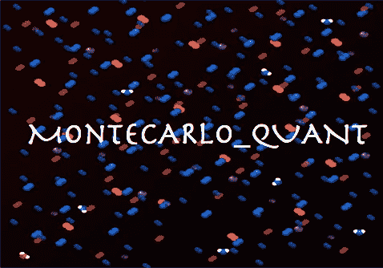

# 金融科技的蒙特卡罗量子方法

> 原文：<https://medium.datadriveninvestor.com/monte-carlo-quantum-methods-for-fintech-32db6db0cb36?source=collection_archive---------6----------------------->

**简介:**

Monte Carlo Quant

蒙特卡罗经典方法与测试一系列可能变量的结果有关。这些方法用于规划金融未来，投资和房地产投资。基于经典蒙特卡罗方法的经典模拟用于测试交易和投资解决方案中各种可能的市场回报组合的结果。这些解决方案创造了投资成功的可能性。仿真平台由一个随机数发生器组成，它从一个均匀分布中产生一组数。随机数生成器必须通过一组随机性统计测试。随机数可能具有微妙的相关性，并可能导致不希望的结果。蒙特卡罗经典方法通过生成一组随机数和平均值来计算积分，例如随机变量的期望值。该方法用随机行走器模拟随机过程。准蒙特卡罗需要更少的路径来获得与经典蒙特卡罗相同的精度。

量子算法类似于经典算法，除了它们的设计是在量子架构上寻找实现。它们有几个与增强的速度和真实的随机性相关的优点。量子行走是随机行走的量子模拟，它大大减少了混合马尔可夫链的蒙特卡罗模拟的时间消耗。蒙特卡罗量子方法用于期权定价、评估对冲策略、回报预测、投资组合评估、个人财务规划和资本投资影响。

**蒙特卡罗方法:**

蒙特卡罗方法用于评估金融交易解决方案中的衍生品。他们模拟资产衍生品的随机变化。这些方法分析交易和投资中的各种风险概念和度量。蒙特卡洛模拟显示，重债策略相对更成功。模拟结果显示，重仓股票策略的相对成功率较低，最优股票配置也较低。这些方法提供了具有路径依赖支付的价值衍生工具的解决方案。基于蒙特卡罗的方法回答了如何估计基于股票、债券、期权和期货的投资组合的风险和回报。风险是根据收益的分布和交易价格序列随时间的变化程度来衡量的。波动性是变化的程度，用对数收益的标准差来衡量。

在这些方法中，模拟是随着时间向前而不是向后进行的。初始远期价格将从市场上获得。该模型描述了基础资产价格的演变。随机过程被选择来适合手头的问题。离散化方法可用于缺失随机过程的情况。随机数生成器可能会在资产价格路径中引起不期望的相关性。这可能会导致资产价格出现意想不到的相关性。这些随机数生成器必须通过许多随机性测试。随机数发生器由可能不是完全随机的准随机数发生器代替。

变分蒙特卡罗方法从试探函数的平方模量中采样电子坐标。试探函数的反对称函数用于改变参数以最小化变化的能量。能量有一个上限，精确的能量可以用本征态试探函数来计算。扩散蒙特卡罗方法有一个哈密顿函数作为试函数。试探函数与初始状态有关。该方法基于随机处理器费米子的近似。

**量子蒙特卡罗方法**

量子蒙特卡罗方法与一大类计算方法有关。量子方法的目标是提供量子多体问题的解决方案。这些方法可以处理在多体问题的不同公式中出现的多维积分。量子方法描述了编码在波函数中的复杂多体效应。

Retirement Planning

量子蒙特卡罗模拟用于退休规划，以预测您在预期寿命内获得特定退休收入水平的可能性。研究退休提取率的经典方法是将它们用于历史模拟中使用的数据。典型的退休蒙特卡洛模拟涉及五个变量，如投资组合规模、分配、每年提取的收入、提取的收入适用的通货膨胀率和时间范围。由于量子状态的固有随机性，用于随机数生成的量子算法有助于生成随机性。

布莱克·斯科尔斯·默顿公式可以映射到薛定谔方程。黑洞 Merton 将资产价格建模为由布朗运动随机驱动。该模型假设，无风险债券和高风险期权等资产可以在没有交易成本的情况下，不定期、无限量地持续买卖。假设股票卖空且不分红。该方法可以模拟套利关系。股票市场可以被模拟成一个量子过程。这个过程由股票、期权、期货和债券等数量组成。使用这些方法估计风险价值和条件风险价值。风险价值是对投资组合分配损失的衡量。条件风险价值与投资组合的预期损失相关，损失大于风险价值。

到目前为止，已经开发了多种算法，以满足在严格的性能限制下加速经典确定性和随机性算法的需求——结果的错误率是这些算法有效性的基准。执行量子积分算法的研究路线始于 Abrams 和 Williams (1999)，他们建立了最终帮助 Heinrich 等人(2001)开发高维积分并行计算的前景。在一个 n 量子位系统上进行测量，其中所有量子位都被初始化为状态|0>…|0 >,通过 Walsh-Hadamard 变换进行运算，得到概率为 2-n 的随机结果|i>。量子计算机实现了具有真实物理随机性的蒙特卡罗。量子查询由酉映射定义。

Qf: |i>|y>→|i>|y + f(i)> (0 ≤ i < 2n-1)

如果我们将最后一个量子位设置为零，那么 Qf 将作为一个子程序，用函数输出更新最后一个条目。在蒙特卡罗模拟中，f(i)可以是积分函数。这些方法侧重于金融衍生品的定价，以及概率分布的安排如何能够利用量子叠加的优势，从而加速模拟。衍生品的价格是通过高可信度的量子测量提取出来的。我们预计会出现二次加速，正如最近的文献所报道的那样(Patrick Rebentrost，[2018])。

量子蒙特卡罗方法研究量子多体问题和多体波函数。这些方法处理多维电子波函数。概率分布可以用量子叠加来准备。回报函数可以通过量子电路来实现。幅度估计算法可用于实现二次量子加速。

典型的量子蒙特卡罗方法选择系统并模拟单粒子轨道。该方法使用变分蒙特卡罗优化波函数。估算能量，计算波函数的性质。一种典型的方法是在扩散蒙特卡罗中使用优化的波函数进行精确和最低能量的计算。在量子蒙特卡罗模拟领域有各种方法。这些方法分为零、基于有限温度和实时动态。下面列出了零温度方法。

*   变化的
*   传播
*   高斯量子
*   路径积分基态
*   名声

有限温度方法有辅助场、连续时间、行列式量子、混合量子、路径积分和随机格林函数算法。实时动态算法是时间相关的。

量子蒙特卡罗方法求解薛定谔方程。这些方法随着具有较大前因子的系统规模而扩展。它们允许获得真实化学系统的精确基态和激发态能量。这些方法模拟结合能、反应势垒和带隙。量子振幅估计可用于通过蒙特卡罗采样在期望值的计算中获得二次加速。

**下一步是什么**

蒙特卡罗的量子算法在解决金融投资组合分析问题的速度上显示了适度的提高。量子蒙特卡罗算法利用并行性来生成高质量的结果，并对较便宜的方法进行基准测试。用蒙特卡罗方法解决实际问题的挑战是在逐次逼近级之间建立紧密的耦合。蒙特卡洛模拟的目标是最小化从不同近似水平获得的输出差异的方差。

Cryptography

黑客可以进入量子计算机，破解现有的加密算法。在银行和金融公司的量子计算机上使用量子蒙特卡罗方法可能是一种威胁。在采用量子蒙特卡罗方法之前，保护密码算法和发展后量子密码方法是非常重要的。

**参考文献**

1. [NIST 邮政量子密码项目](https://csrc.nist.gov/Projects/Post-Quantum-Cryptography)

2.[蒙特卡罗方法的量子加速](https://royalsocietypublishing.org/doi/abs/10.1098/rspa.2015.0301)

3.[欧洲电信标准协会量子安全密码术](https://www.etsi.org/technologies-clusters/technologies/quantum-safe-cryptography)

4.[蒙特卡洛 Quant 开源项目](https://github.com/bhagvank/Montecarlo_Quant)