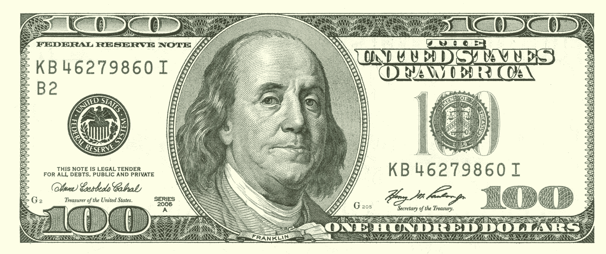

# 道德代数

> 原文：<https://medium.datadriveninvestor.com/moral-algebra-316d8b44556d?source=collection_archive---------5----------------------->

你每天要做大约 35000 个决定。这几乎是每分钟 24 个决定。这些选择中的大多数都是下意识做出的，因为我们的大脑在不涉及我们意识的情况下处理微小的、无关紧要的选择时令人惊叹。根据哥伦比亚大学研究员希娜·艾扬格的研究，我们每天会主动做出大约 70 个决定(如果你感兴趣的话，她的关于决策的 TED 演讲真的很棒)。我们一天中做出的大多数选择不会永远改变我们的生活。你可以在几分钟内做出选择，比如，“*我今天想穿什么去上班”*或者*“我今晚应该出去喝一杯吗？”*这些决定**不**保证一个完整的分析。

在我们生命的各个阶段，我们被迫做出决定，这些决定将对我们的未来产生巨大的、根本性的影响。例如，一个人不会(通常)在几分钟内决定他们是否想结婚。这种选择需要深思熟虑。有太多的变数(结婚对象、时机、费用)和太多的不确定性(未来的家、潜在的孩子、可能的职业变化)，一个人在没有认真考虑所有选择和结果的情况下做出这些影响巨大的决定是愚蠢的。

一个人如何着手做出如此重要的决定？我们从 100 美元钞票中寻找答案。善良的老本杰明·富兰克林设计了一个解决这个问题的方法，既明显又有效。这叫做道德代数。

## 道德代数

1772 年，富兰克林收到了一位朋友的来信，这位朋友急切地寻求职业改变的建议。富兰克林回信说，他无法告诉那个人正确答案是什么，但他可以告诉他如何算出答案。本尼接着描述了今天所谓的道德代数的框架。他的原信可以在这里[读到](https://www.procon.org/view.background-resource.php?resourceID=001474)，但本质上步骤如下:

1.  把一张纸分成两栏。
2.  将第一栏命名为“优点”，第二栏命名为“缺点”

> 在这一点上，你可能觉得被愚弄了——因为我相当肯定每个人都知道什么是利弊清单。但是，这是不同的，因为富兰克林详细说明了如何权衡每一方的每一个因素，以便在过程的最后留给你最理性的选择。为了富兰克林，我劝你继续读下去。

3.在接下来的 3-4 天里，写下你想到的支持或反对你试图解决的问题的关键因素。注意:这个过程需要 3-4 天，这一点很重要，因为为了做出一个绝对的决定，你必须给你的意识和潜意识时间来处理不同的影响及其相应的后果。

4.当你有理由相信你的清单两边都是完整的，下一步就是给每一边的每个元素分配权重。富兰克林概述了这种做法的以下规则。

*   如果有两个，一边一个，看起来相等，把它们都划掉。
*   如果 1 个赞成等于 2 个反对，把其中的 3 个划掉。同样的道理也适用于反面——如果 1 个反面等于 2 个正面，把其中的 3 个划掉。
*   如果 2 个优点等于 3 个缺点，划掉所有 5 个因素。同样，这也适用于缺点-如果 2 个缺点等于 3 个优点，划掉所有 3 个元素。

这个过程一直持续到你要么只剩下一个元素(在赞成的一边或反对的一边)，要么直到你发现两边之间有一个稳固的平衡。对于后一种情况，富兰克林建议“再考虑一两天”，然后“相应地”做出决定。

显然，没有精确的决策科学。做出艰难的决定是有原因的。本杰明·富兰克林的建议是，并非所有的选择都是同等重要的，这一点应该纳入决策过程。有时候一件好事胜过两件坏事。其他时候，情况正好相反。关键是使用这个简单的决策工具，付出一些真正的努力来做出关键的选择。你的“直觉”只能带你走这么远，把一个严肃的决定留给机会会让你后悔。谢天谢地，老好人本在他死后 229 年找到了拯救我们的方法。