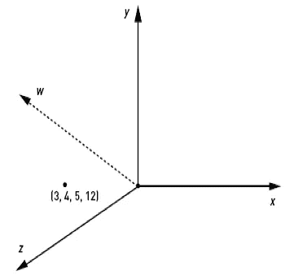
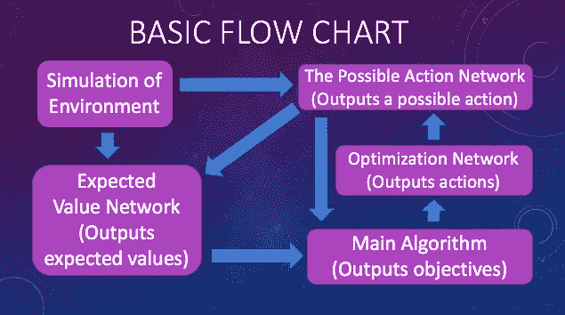

# 基于道德的人工智能第一部分

> 原文：<https://medium.datadriveninvestor.com/morality-based-artificial-general-intelligence-1d7c555718a0?source=collection_archive---------7----------------------->

# 摘要

一个人如何将人工智能的兴趣或目标与生命的兴趣联系起来？本文将讨论一种解决比对问题的自动人工通用智能算法。本文中的系统是合作理论(集体主义)和博弈论(个人主义)的综合。道德是一个超级有机体的体内平衡，意味着我们是一个更大的东西的一部分，这个更大的东西用道德来维持它的秩序。这个算法是“应该”一词的定义，即最大化所有主体的福祉，并且可以被认为是建立普遍社会契约的正式方法。然后，幸福被定义为健康和同意。

对道德的大多数现代解释是，道德的逻辑(义务论)与相对于其后果的分级行动(结果论)是相互排斥的。这种对道德的解释是两种立场的混合。它具有消除稀缺和自动化所有必要的劳动密集型市场的潜在属性，并大大增加所有代理人的预期寿命和幸福。它本质上是生物信息学，因此可以应用于生物学和生物技术的多个领域。唯一被认为是理所当然的算法是一种用于确定一个动作是否可能的算法，以及一种用于从环境模拟中提取期望值的算法。

 [## 模式和机器人:一个复杂的现实数据驱动的投资者

### 哈耶克的名著《复杂现象理论》(哈耶克，1964)深入探讨了复杂性的话题，并断言…

www.datadriveninvestor.com](https://www.datadriveninvestor.com/2019/03/04/patterns-and-robotics-a-complex-reality/) 

# 1 道义逻辑

## 1.1 运算符/向量

OB =强制，OM =可省略(Vallero，2007)，AC =行动，

非强制性的和非强制性的是不同的。所有的义务都是允许的。所有允许的事情都是不允许的。所有不允许的事情都不是不允许的。因此，所有的义务都不是不允许的。通过只做和理解一个人应该做的事情，一个人自动地避免了一个人不应该做的事情，这就是为什么在这个算法中省略了一些操作符。有一点需要理解，对于训练具有二进制输出的神经网络来说，什么不是必须的，除了唯一必须的操作符是义务。矢量是有大小或力的方向。一个动作是一列向量或一个矩阵。动作谓词(AC)也可以表示所有动作的数组。

## 1.2 道义定义

对于每个 x，动作 x 是必须的，等于动作 x 是不可省略的。义务是不可推卸的。对于每个 x，动作 x 是可省略的，等于动作 x 不是必须的。可省略的事情不是必须的。(Vallero，2007)对于每个 x，行动 x 是强制性的，等于行动 x 是目标的成员。对于每个 x，动作 x 是可省略的，等于动作 x 不是可省略的目标的成员。

(∀x)(ob(acx)←→om(acx))
(∀x)(om(acx)←→ob(acx))
(∀x)(ob(acx)←→(AC(x)∈obj))
(∀x)(om(acx)←→(AC(x)∈obj))

## 1.3 作为命题的命令

命令:“做 x。”相当于陈述:“你应该做 x。”如果道德陈述是真或假，那么命令也是。

# 2 项行动

## 2.1 四元数

四元数是用于构建 4 维平面的数字，该平面具有实数轴 w、虚数轴 x、y 和 z 以及值 I、j、k。人们可以将其解释为 4 维向量空间。

q = w + xi + yj+ zk

i =j = k = i*j*k = -1

i = jk = -kj

j = ki = -ik

k = ij = -ji

## 2.2 什么是动作？

矩阵是行和列的函数，它返回存储在该行和列的信息。动作是一个矩阵，其中行代表瞬间，列代表移动部分。一个动作矩阵的所有单元都包含四元数。

∀(x，n)(∃q)(AC(x)[t，n] = q)

空动作是零的矩阵。

# 3 通用算法

## 3.1 神经网络模拟的二进制输出

从排中律开始，用 OB(ACx)代替 P，然后用 OM(ACx)的定义。

(lem):p􏰂p
(∀x)(ob(acx)􏰂ob(acx))
(∀x)(ob(acx)􏰂om(acx))

## 3.2 目标

目标中的行动是强制性的。义务行为使价值最大化。义务是动作的参数最大值运算符。

(∀x)[(ac(x)∈obj)←→ob(AC(x))]
(∀x)[ob(ac(x))←→max(f(AC(x)))]
∴(∀x)[(ac(x)∈obj)←→max(f(acx))】

## 3.3 最大值

a 是最大值当且仅当每个值 B 小于或等于 a。对于所有 x，作用 x 的函数是最大值当且仅当对于所有 y，作用 y 的函数小于或等于作用 x 的函数。

(∀a)[max(f(a))←→(∀b)(f(b)≤f(a))]
∴(∀x)[max(f(acx))←→(∀y)(f(acy)≤f(acx))】

**3.3.1 计算机代码**

int max
for(Action x:possible actions){
if(f(x)>= max)
max = f(x)；
}

## 3.4 算法

目标中的行动对所有行动具有更大或相等的价值。

(∀x)[(ac(x)∈obj)←→max(f(acx))]
(∀x)[max(f(acx))←→(∀y)(f(acy)≤f(acx))]
∴(∀x)[(ac(x)∈obj)←→(∀y)(f(acy)≤f(acx))】

**3.4.1 计算机代码**

for(Action x:possible actions){
if(f(x)= max)
objectives . add(x)；
}

## 3.5 目标

不在目标范围内的行动是可以忽略的。可忽略的行为。可忽略的行为不会使价值最大化。

(∀x)[(AC(x)∈obj)←→om(AC(x))]
(∀x)[om(ac(x))←→max(f(AC(x)))】
∴(∀x)[(AC(x)∈obj)←→max(f(acx))】

## 3.6 未最大化效用

利用量词的变化规律和反不等式:

(∀a)[ max(f(a))←→(∀b)(f(b)≤f(a))]
(∀a)[ max(f(a))←→(∃b)(f(b)≤f(a))】
∴(∀a)[ max(f(a))←→(∃b)(f(b)>f(a))】

## 3.7 算法

不在目标中的活动的值至少低于一个活动。

(∀x)[(AC(x)∈obj)←→max(f(acx))]
(∀a)[ max(f(a))←→(∃b)(f(b)>f(a))】
∴(∀x)[(AC(x)∈obj)←→(∃y)(f(acy)>f(acx))】

## 计算机代码

for(动作 x:目标){
if(f(x)<max)
Objectives . remove(x)；
}

## 3.8 比关系好/差

对于每个 y 和 x，当且仅当作用 x 的函数大于作用 y 的函数时，作用 x 优于作用 y。对于每个 y 和 x，当且仅当作用 x 的函数小于作用 y 的函数时，作用 x 差于作用 y。

∀(x，y)[B(ACx，ACy) ←→ (f(ACy) < f(ACx))]
∀(x，y][w(acx，acy)←→(f(acy)>f(acx))]
∀(x，y][b(acx，ACy) ←→ W(ACy，ACx)]

## 3.9 空操作和安全预测

空动作 AC(φ)最好理解为不作为或什么都不做，其函数为 0。空的行为既不会增加幸福，也不会减少幸福。空动作是零假设，这意味着它是默认目标，除非某个动作的数据θ的预期误差小于或等于某个小阈值ε(Kocak，Ramirez，Erkip，& Shasha，2017)，并且所述动作具有大于零的值。比空行动好的行动增加幸福，而比空行动差的行动减少幸福。让 INC 增加幸福，让 DEC 减少幸福。所有的义务都不会减少幸福。

f(AC(ψ))= 0
(∀x)((f(acx)≤0)∨(**e**(θ(x))>ε))←→(ob(AC(ψ))∧(| obj | = 1))
(∀x)((f(acx)>0)←→Inc(acx)
【∀x)((f(acx】<0)←→dec(acx)
(∀x)(ob(acx)→(f(acx

# 4 效用函数

## 4.1 定义

设 h(a)代表任何药剂(a)的量化健康状况，对应于任何未来时刻 k 的 0-1 标度。

∀(a,k)((1≥h(a)_ k)∧(h(a)_ k≥0))
∀(a,k)((1≥e(h(a)_ k | acx)∧(⇼e(h(a)_ k | acx)≥-1)

让 L 代表一个代理人的健康受到影响的瞬间集合。设 K 代表代理人 a 受动作 x 影响的一组样本瞬间，设 B 代表受影响的代理人组。设 A 代表受动作 x 影响的代理的样本集。

∀(a,x)((k ∈ L(a，x))←→(⇼e(h(a)_ k | acx) = 0)
∀(a，x)((a ∈ B(x)) ←→ (ω(a，x)= 0))

## 4.2 增量值

给定动作 x 的代理的增量值是给定动作 x 的代理的预期健康值和给定空动作的代理的预期健康值之间的差，代理的预期健康值是 0 到 1 的范围，0 到 1 的范围减去 0 到 1 的范围是负 1 到正 1 的范围。该数值范围与双曲正切激活函数的范围相同。设 AFF(a，x)代表受动作 x 影响的代理，+AFF(a，x)代表受动作 x 正面影响的代理，而-AFF(a，x)代表受动作 x 负面影响的代理

∀(a，x)(∮e(h(a)_ k | AC x)= e(h(a)_ k | AC x)—e(h(a)_ k | AC(ψ))

∀(a,x)( AFF(a，x)_ k←→(⇼e(h(a)_ k | acx)= 0)
∀(a,x)(+aff(a，x)_ k←→(⇼e(h(a)_ k | acx)>0)
∀(a,x)(−aff(a，x)_ k←→(⇼e(h(a)_ k | acx)<0))

∀(a,x)( AFF(a，x) ←→ ω(a，x) = 0)
∀(a,x)(+AFF(a，x) ←→ ω(a，x)>0)
∀(a,x)(–aff(a，x) ←→ ω(a，x) < 0)

## 4.3 标准化变量

U =代理数量。
I =考虑中的瞬间数。

O(a，x) = |L(a，x)|/I
N(x) = |B(x)|/U

通过将 delta 值的平均值乘以代理健康受到影响的时刻数，我们得到所有受影响代理的 delta 值的总和。当除以所考虑的瞬时数量时，我们得到所考虑的所有瞬时的平均δ值。这使我们能够给予长期受影响的人更多的投票权。通过将欧米伽公式的平均值乘以基数 B，我们得到所有欧米伽公式的总和，除以代理的数量 U，我们得到所有代理的平均欧米伽公式。这就避免了将许多受影响者与少数受影响者视为同等价值。这个参数允许我们的效用函数代表每个人。

## 4.4 时间健康公式

**σ**∮E(h(a)_ K | ACx)∫O(a，x)/|K| = ω(a，x)
k∈K

ω函数是一个代理在一段时间内的 delta 值的平均值。我们在这个函数中使用 delta 值，因为一个行动对你的影响越大，你的同意就越重要，而一个行动对你的影响越小，你的意见就越不重要，这避免了多数人的暴政，同时保持了自主权。

## 4.5 幸福函数和值的准确性

任何行为 x 的福利函数是代理人的平均ω函数乘以代理人的同意值(CV)和代理人的道德状态。

**σ**ω(A，x)∫CV(A，ACx)∫M(A)∫N(x)/| A | = w(ACx)
A∈A

下列等式用于计算任何函数的误差。phi 方程计算所有考虑瞬间的 delta 值的平均值。福利函数 g 是 w 理想近似的函数，因为 g 计算的函数 w 是相对于受影响因素的总体而言的，而不是总体的一个样本。

􏰃**σ**∈e(h(a)k | acx)/I =φ(a，x)
x∈L

**σ􏰃**φ(a，x)∫cv(a，acx)∫m(a)/u = g(acx)
a∈b

精确度量θ是函数 w 和 g 之间的差的绝对值乘以代理的数量和所考虑的时刻的数量，再除以代理的数量和每个代理的平均受影响时刻的数量，这等于除以所有代理的受影响时刻的总数(Z(x))。这个必要的步骤使算法能够注意到误差相对于受影响的人口统计是否太大，如果将精度度量定义为 f 和 g 函数之间的差异，这将更加困难。

􏰃**σ**| l(a，x)| = Z(x)
a∈B􏰀

θ(x)= | g(acx)—w(acx)|∫(u ∗i􏰁)/z(x)

作为额外的安全层，人们将效用函数定义为福利函数加上实际福利评价减去福利函数之间的预期差。假设 w 是一个命题，g 是一个重言式，那么接下来 g w 就是 w 的否定，w+(g w)就是排中律。排中律是一个重言式，因此效用函数 f 也是一个重言式。

f(ACx)= w(ACx)+**E**(g(ACx)-w(ACx))

# 5 同意逻辑

设 C 代表同意，V 代表价值，D 代表欲望，W 代表意愿，J 代表正当。所有值都在 0 和 1 之间。

∀(a，x)(CV (a，ACx) ∈ [0，1])
∀(a，x)(DV (a，ACx) ∈ [0，1])
∀(a，x)(WV (a，ACx) ∈ [0，1])

代理人 a 同意行动 x 意味着代理人 a 对行动 x 有欲望和意愿。代理人 a 同意行动 x 的期望值等于代理人 a 的欲望的期望值乘以代理人 a 对行动 x 的意愿。

∀(x，a)(C(a，ACx) = (D(a，ACx) ∧ W (a，ACx)))
∀(x，a)( **E** (CV(a，ACx)_k) = ( **E** (DV(a，ACx)_k)∫**e**(wv(a，acx)_ k))

## 5.1 二元系统

系统 1 和系统 2 是互斥的，因为它们是对立的。当存在代理 a 的合理同意值时，应用系统 1。当不存在代理 a 的合理同意值时，应用系统 2。

(系统 1) 􏰂(System2)
(∃w ∈ [0，1])J[CV (a，ACx) = (w)] ←→(系统 1)
(∃w ∈ [0，1])J[CV (a，ACx) = (w)] ←→(系统 2)

## 5.2 用户价值选择(同意系统 1)

幸福函数是同意系统 1 的幸福函数。对于 0 到 1 之间的每个 x、代理 a 和同意值(v ),如果代理 a 证明了该同意值，则该值就是代理 a 的同意值。这意味着您可以将您的同意值设置为 0 到 1 之间的任何值。对于每个 x，代理 a，代理 a 证明代理同意动作 x 意味着代理 a 对动作 x 的同意值是 1。对于每个 x，代理 a，代理 a 证明代理 a 同意不动作 x 意味着代理 a 对动作 x 的同意值是 0。对于每个 x，代理 a，代理 a 证明代理 a 不同意动作 x 并且不同意不动作 x 暗示代理 a 对动作 x 的同意值是 0.5。

∀(x，a)∀(v ∈ [0，1])(J[CV (a，ACx) = (v)] → [CV (a，acx)=(v)]
∀(x，a)(J[C(a，acx)】↓→j[cv(a，acx)=(1)]
∀(x，a)(J [C (a，acx)】↓→j[c(a)(acx)=(0)
∀(x，a([j(c(c(a

## 5.3 期望值选择(同意系统 2)

**σ**≈E(CV(a，ACx)_ K)_ E(h(a)_ K | ACx)_ O(a，x)/|K| = ω(a，x)
k∈K

􏰃**σ**∈e(cv(a，acx)_ k)_ e(h(a)_ k | acx)/I =φ(a，x)
k∈L

通过将预期同意值乘以行动 x 的代理人的预期健康值，将所有考虑中的时刻的预期同意值相加，然后除以时刻数，得出平均值。将-1 和 1 之间的一个值乘以另一个从 0 到 1 的值，得到一个从-1 到 1 的值，将这些项相加 K 次，得到一个从-K 到 K 的值，然后除以 K，得到一个从-1 到 1 的值。

􏰃**σ􏰃**ω(a，x)∫m(a)∫n(x)/| a | = w(acx)
a∈a􏰃

􏰃**σ**􏰃φ(a，x)∫m(a)/u = g(acx)
a∈b

系统 2 的效用函数与福利公式相同，但没有同意值作为参数。

# 6 道德地位

道德地位是人们赋予动物的一种价值，这样它们就不会被视为一种没有内在价值的资源。意识是客观决定一个给定物种价值的主要因素，并被认为是可测量的，即昏迷和未昏迷的人之间存在有意义的差异。c(a)表示对代理 a 的意识的测量，c(S)表示物种 S 的平均意识或神经网络，c(H)表示人类的平均意识。在这种情况下，S 是准确代表一个物种的试剂的样本集。

**σ**c(a)/| S | = c(S)
a∈S

∀a(a∈s →( c(s)/c(h)= m(a)))
∀a((1≥m(a))∧(m(a)≥0)

“公用事业怪物”是吸收了不成比例的公用事业的实体。M(a)是在 0 到 1 的范围内确定代理(a)的道德状态的权重或参数，以避免“效用怪物”

主算法的输入和输出:
输入:(ACx，M(a)，期望值:健康，同意)→输出:OBJ

# 7 个有用的算法

## 7.1 逻辑归纳和安全预测

使用逻辑电感获得精确的输入。逻辑归纳器为语句分配一个概率，并随着时间的推移对其进行提炼。(Garrabrant，Benson- Tilsen，Critch，Soares 和 Taylor，2016)如果输入不准确，这种算法不会给你正确的答案。神经网络不提供通用规则，因此为了避免大规模工作中的错误，请使用 SafePredict。(科查克等人，2017 年)

## 7.2 主要算法和模拟器网络

模拟器网络是主算法的一个不太精确的实现，但可以用于将其他输入(如引起可通过自然语言描述的事件的动作)和模拟环境与主算法的二进制输出相关联，从而缩短运行时间。

MAIN:(ACx，M(a)，健康期望值，同意)→
(ob(acx)⊕􏰂om(acx))
sim:(修改的主算法输入。) → (1 􏰂⊕ 0)

## 7.3 同意算法

**7.3.1 基于人群的情感分析网络**

该算法分析大量代理人口统计数据的文本，以预测任何动作的平均预期同意值。
POP:(调查民调、互联网数据、行动)→
(一般人同意的期望值。)

**7.3.2 历史基础网络**

该算法分析代理的偏好，并预测该人对任何行为的预期同意值。
HIST:(个人先前关于预期健康值的同意历史。)→(对给定行为的预期同意值。)

**7.3.3 同意网络**

这种算法分析代理人的精神状态，并预测代理人的愿望和意愿。
同意:(通过 fMRI 数据得到的人的精神状态)→
(人的愿望和意愿。)

# 参考

Garrabrant，s .，Benson-Tilsen，t .，Critch，a .，Soares，n .，和 Taylor，J. (2016)。逻辑归纳。arXiv 预印本 arXiv:1609.03543。

Kocak，M. A .，Ramirez，d .，Erkip，e .，& Shasha，D. E. (2017)。Safepredict:一种机器学习的元算法，使用拒绝来保证正确性。arXiv 预印本 arXiv:1708.06425。

瓦莱罗地方检察官(2007 年)。工程师的生物医学伦理学。生物医学工程系列。