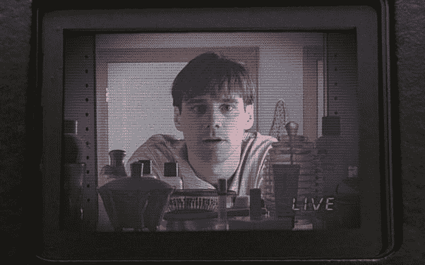
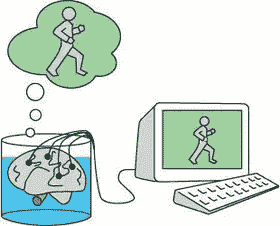

# 模拟的道德性

> 原文：<https://medium.datadriveninvestor.com/morality-of-simulations-89661752880e?source=collection_archive---------4----------------------->

在电影《楚门的世界》中，我们被介绍给角色楚门，他无意中成为记录他生活的电视节目的一部分。这部电影展示了他开始寻找线索的过程，这使他意识到他是这部电视剧的一部分，并以他最终步入现实世界而告终。这部电影提出了一些有趣的道德困境，涉及电影中描绘的情况，以及其他假设的场景。

想想这个场景，与电影相反，杜鲁门一生都没有意识到自己被这部电视剧的制片人所控制。

如果他从未了解真相，他会过着和其他人非常相似的生活，完全意识不到周围每个人的欺骗。因此，杜鲁门永远不会因为意识到他所知道的一切都是谎言而受到影响，因此，他永远不会经历他发现真相后会出现的心理问题。

许多人会认为《楚门的世界》的制片人是不道德的，因为他们几乎完全控制了他生活的方方面面，并且仅仅为了他们自己的利益而影响他的生活。然而，关于这个和类似的假设情景的道德问题远比这个复杂，而且经常在其他场合讨论。

**模拟理论**[【1】](https://www.quora.com/profile/Matthew-Prince-24#IVWni)**与【瓮中之脑】**[【2】](https://www.quora.com/profile/Matthew-Prince-24#kDZAo)**类比:**

Brain in a vat visualised

模拟理论的概念是，所有的生命实际上都是人工或计算机模拟的，我们过着类似于计算机游戏中角色的生活，从来不知道我们正被一些高等物种所控制。

类似地，瓮中之脑的概念是一个哲学思维实验，最初由勒内·笛卡尔概念化。在这个思维实验中，一些疯狂的科学家给罐子里的大脑提供与正常人完全相同的刺激，大脑的反应将与人类头骨内的反应相同。因此，大脑不可能区分它是位于头骨内部还是位于缸中。这就提出了一个问题，任何人是否真的有可能真正建立他们所生活的世界的真实性。

关于《楚门的世界》,从他的角度来看，这种生活与他不参与电视节目的生活没有什么区别。如果有一个完全受控的环境(不像电影中出现的暗示他生活在电视节目中的线索)，那么你可以说这种生活与他有实际自由意志并且不是电视节目的一部分的情况没有什么不同。

本质上，楚门在这个类比中扮演了与大脑相似的角色，电视制片人代表了科学家。假设在电影中，杜鲁门从未了解真相——就像缸中的大脑一样——杜鲁门永远无法区分现实和模拟。因此，如果你完全不知道自己是模拟的一部分，就像《楚门的世界》中描述的那样，你真的会变得更糟吗？

**这些场景的道德性:**

对于大多数人来说，考虑到他们在模拟之外的视角，我们通过决定这个角色遇到的人和经历的一些事情来决定他如何生活似乎是残酷的。然而，假设模拟中的人从来没有意识到他们被欺骗了，那么以这种方式控制他真的是不道德的吗？事实上，大多数人在日常生活中的许多经历，经常受到其他人的决定和行为的影响——那么这有什么不同呢？

这也使古老的格言*“你知道的魔鬼比你不知道的魔鬼好”*受到质疑。关于这部电影，我相信大多数人都会同意，如果杜鲁门从来不知道他正在经历的电视节目，他的生活将与大多数人的生活非常相似，除了他遇到的每个人都是一个付费演员，他们都知道这个大秘密。因此，尽管大多数人会认为告知他所生活的人造世界是合乎道德的，但最仁慈的做法难道不会让他继续生活在无知的极乐中吗？

如果我们处在杜鲁门的位置，当考虑我们的幸福时，这是最容易想象的。假设有一些电视制片人在主宰我们的生活——这些制片人工作非常出色，我们已经发现了，但永远也不会发现。我们真的会因此受到负面影响吗？难道我们不希望继续我们一直熟知的生活，而不是被拖入一个不同的现实，在那里我们曾经被告知的一切现在都成了问题。

显然，让一个人置身于任何模拟现实中，并不比让他们完全自由地正常生活更道德。然而，重要的是，如果模拟现实中的人从未发现真相，那么模拟实际上有任何道德问题吗？

**脚注**

[【1】](https://www.quora.com/profile/Matthew-Prince-24#cite-IVWni)[我们的世界是模拟的吗？为什么有些科学家说这很有可能](https://www.theguardian.com/technology/2016/oct/11/simulated-world-elon-musk-the-matrix)

[大脑在一个大缸里——维基百科](https://en.wikipedia.org/wiki/Brain_in_a_vat)

## 来自 DDI 的相关故事:

 [## 用 7 个步骤解释深度学习——数据驱动投资者

### 在深度学习的帮助下，自动驾驶汽车、Alexa、医学成像-小工具正在我们周围变得超级智能…

www.datadriveninvestor.com](https://www.datadriveninvestor.com/2019/01/23/deep-learning-explained-in-7-steps/)  [## 数据科学和软件工程哪个更有前途？-数据驱动型投资者

### 大约一个月前，当我坐在咖啡馆里为一个客户开发网站时，我发现了这个女人…

www.datadriveninvestor.com](https://www.datadriveninvestor.com/2019/01/23/which-is-more-promising-data-science-or-software-engineering/)