# 更多关于梯度下降算法和其他有效的学习算法…

> 原文：<https://medium.datadriveninvestor.com/more-on-gradient-descent-algorithm-and-other-effective-learning-algorithms-a1222a8d6c33?source=collection_archive---------5----------------------->

梯度下降算法的数学推导的正式介绍在我上一篇关于 [Sigmoid 神经元](https://medium.com/datadriveninvestor/simplified-sigmoid-neuron-a-building-block-of-deep-neural-network-5bfa75c8d8a9)(逻辑回归)的文章中给出。但是梯度下降更新规则在某些情况下存在收敛速度慢的局限性。例如，当*‘w’*和*‘b’*在高损耗平台点初始化时(如下图突出显示为 1)，则*‘w’*和*‘b’*的变化率最小。*‘w’*和*‘b’*的变化率随着斜率的增加而增加(下图中高亮显示为 2)。因此，基于*‘w’*和*‘b’*的初始化，所需的历元数将非常高。

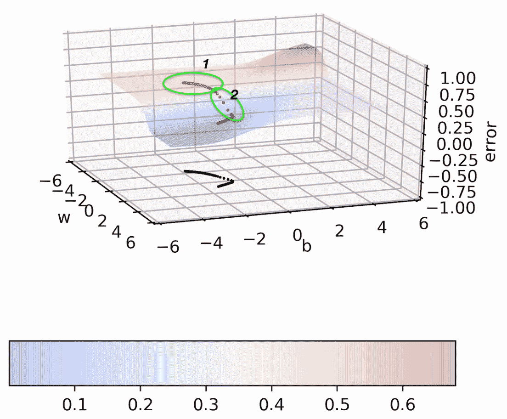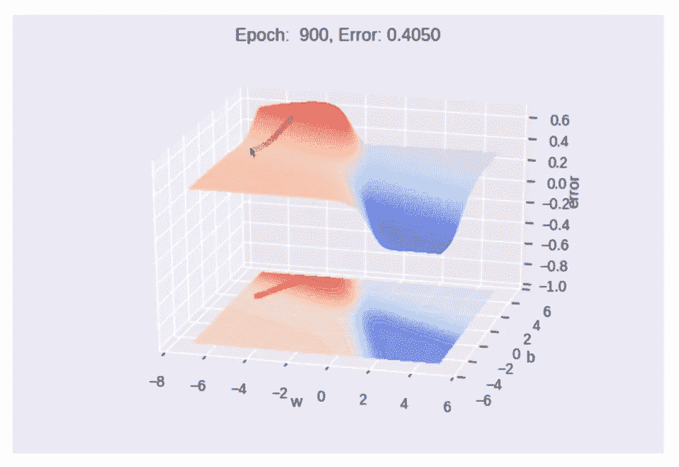

梯度下降更新规则的另一个限制是，如果点停留在局部最小值，学习可能会停止。请参考相邻的图片，在随机初始化的基础上，*‘w’*和*‘b’*学习在局部极小值处饱和，即使经过 1000 个历元，算法也不能收敛到全局极小值。

 [## 模式和机器人:一个复杂的现实数据驱动的投资者

### 哈耶克的名著《复杂现象理论》(哈耶克，1964)深入探讨了复杂性的话题，并断言…

www.datadriveninvestor.com](https://www.datadriveninvestor.com/2019/03/04/patterns-and-robotics-a-complex-reality/) 

为了解决梯度下降更新规则的上述 2 个缺点，让我们考虑要回答的两个主要问题。

"应该用什么数据来计算梯度？"

"我们如何计算梯度？"

为了回答上面的两个问题，我介绍了 3 种使用数据计算梯度的方法和另外两种计算梯度的方法(除了梯度下降)。我们可以结合使用这些方法来产生准确的结果。

## 需要更好的算法:

梯度下降更新规则中的以下问题促使人们寻求更好的算法。

*更平坦的误差表面导致非常非常小的梯度，反过来，对于‘w’和‘b’的可忽略的移动，需要大量的历元。*

# 基于动量的 GD:

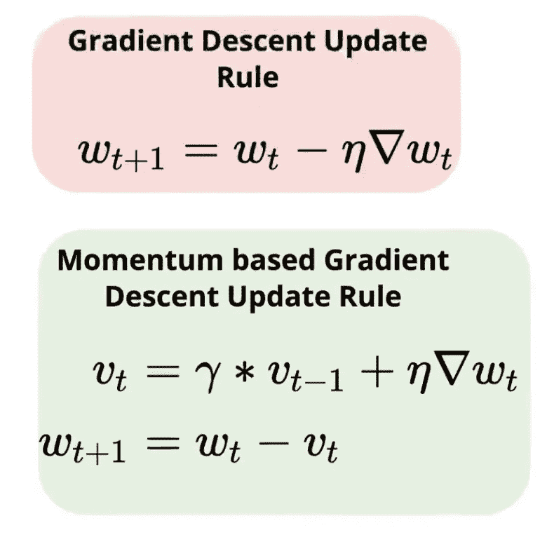

上述问题导致了基于动量的梯度下降更新规则的诞生，其中，*‘w’*和*‘b’*不仅基于当前更新(导数)，而且基于过去更新(导数)来更新。在左边的等式中，***‘gamma * vt-1’***代表历史分量。

对于历史组件，在每个时间步长期间，梯度移动当前方向以及先前的梯度方向，其中 ***【伽玛】*** 值的范围从 0 到 1。因此，基于动量的梯度下降更新规则采用梯度的指数衰减平均值。

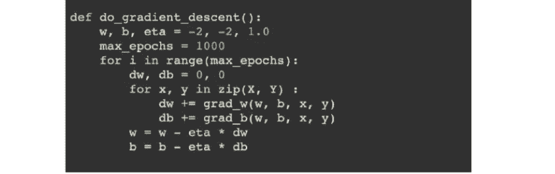

Code snippet for implementing momentum based gradient descent update rule

## 基于动量的 GD 的缺点:

基于动量的 GD 即使在缓坡区域也能迈出更大的步伐，因为历史梯度的动量伴随着它的每一步。但是迈出更大的一步总是更好吗？全球最小值即将达到的时候呢？会不会有这样一种情况，动力会导致我们超越目标？考虑下面的例子，其中基于动量的 GD 过冲并超过全局最小值。

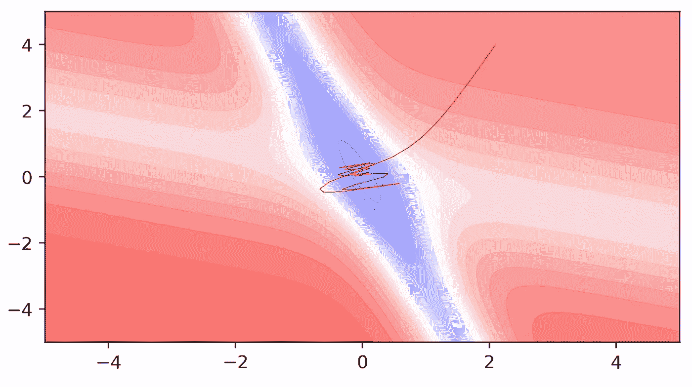

虽然基于动量的 GD 比 GD 快，但它在极小值谷内外振荡。但是这种振荡能减少吗？当然，内斯特罗夫加速的 GD 有助于我们减少基于动量的 GD 中发生的振荡。

# 内斯特罗夫加速 GD:

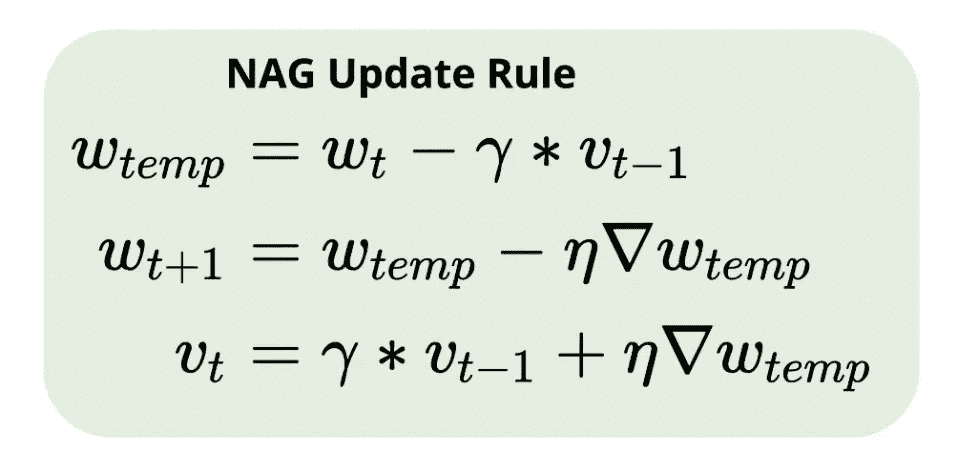

我们可以注意到，在上述基于动量的 GD 公式中，它包括两个分量。一个是当前导数，另一个是历史分量。这意味着运动是成倍增加的。一个基于历史，另一个基于当前梯度。因此，如果无论如何移动是要乘以，为什么不先移动历史组件，然后计算导数，稍后更新，如上图所示。

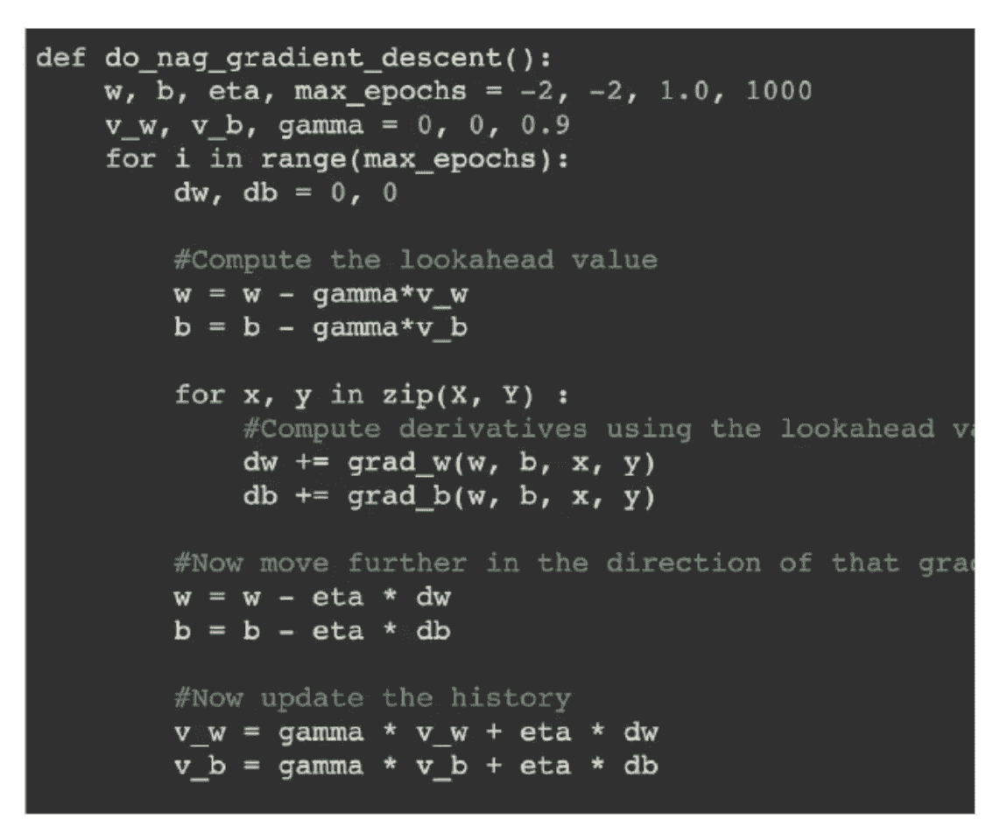

Nesterov Accelerated GD

下图中的红色曲线显示了内斯特罗夫加速 GD 的*【w】*和*【b】*运动。我们可以清楚地看到，与基于动量的 GD 更新规则的红色曲线相比，振荡减少了。

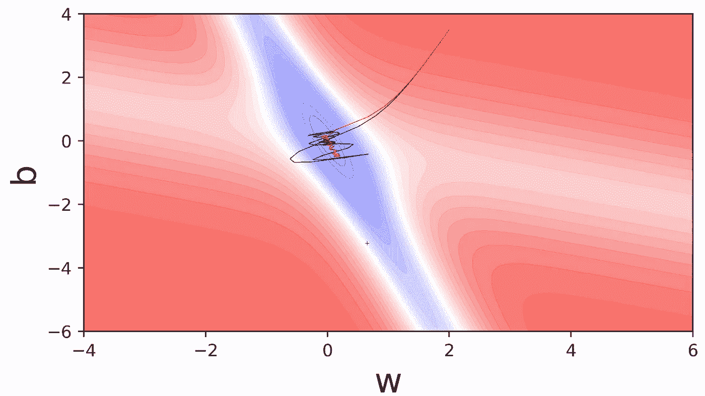

# 我们如何计算梯度？

知道了更好的算法，现在让我们试着理解如何计算梯度？是使用完整数据还是部分数据？如果偏，怎么偏？我们做了多少次更新？

Code for batch GD

一般来说，我们在为一个时期中的所有数据点计算梯度之后进行一次更新。这意味着更新完成了 epoch 次数。我们这样做是因为我们的损失函数是所有数据点损失的总和。因此，导数是一个时期内所有数据点的偏导数之和。这是**批次 GD** 。因此，batch GD 在更新损失函数之前会参考所有数据点。理想情况下，在高维数据集中，更新成为 CPU 密集型过程。为了处理这种情况，我们有随机和小批量 GD 选项。

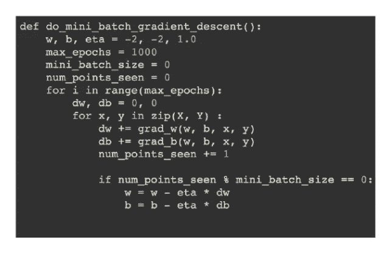

Code for mini-batch GD

如果我们可以计算一批数据点(比如 10 或 20)的导数并更新参数，这就是**小批量 GD** 。考虑到高维数据集，这将有助于我们快速达到全局最小值。小批量 GD 比随机和批量 GD 有许多优点。

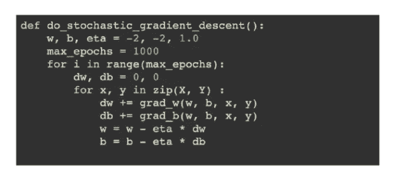

Code for Stochastic GD

如果可以对每个数据点进行更新，那么这就是**随机 GD** 。因此，我们对每个数据点的损失函数进行更新。随机 GD 具有在一个历元中进行频繁和快速更新的优点，但是具有近似梯度的缺点。

根据具体情况，可以使用批量、小批量或随机 GD。但一般来说，小批量 GD 是常用的。

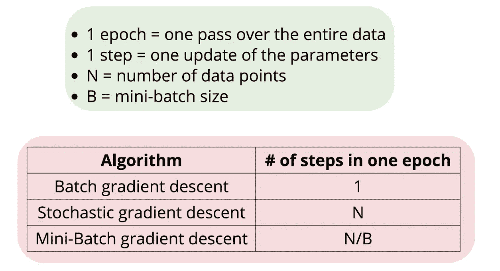

# 更好的算法—自适应学习率:

为什么我们需要一个自适应的学习率？在大多数情况下，数据集是稀疏的。很明显，损失函数相对于权重的导数与相应的输入*成比例(x1 和 x2* 是输入)。

当输入稀疏时，大部分输入值为 0。当输入值为零时，损失函数相对于权重的导数为 0，因此更新为 0。如果更新没有发生，那么在收敛到全局最小值时就有问题。因此，每当更新发生时，它应该以更快的速度发生。因此，每当更新非零时，我们需要更大的学习速率。换句话说，学习速率应该适应我们处理的特征。如果我们处理稀疏特征，学习率应该很高，如果我们处理密集特征，学习率应该很低。

准确地说，我们需要为每个参数设定不同的学习速率，以考虑特征的频率。

## 阿达格拉德:

在 AdaGrad 中，我们按照与更新历史成比例的方式衰减参数的学习速率(更新越少，衰减越小)。左边是阿达格拉德的公式。当 Vt 较大时(对于更新非常频繁的数据集)，有效学习率较小。并且当 Vt 较小时(在稀疏特征的情况下)，有效学习率较高。AdaGrad 的优点在于，对应于稀疏特征的参数变得更好，但是对于密集特征，学习速率迅速衰减并变为零，并且更新从不发生。这是阿达格拉德的问题。

## RMSProp:

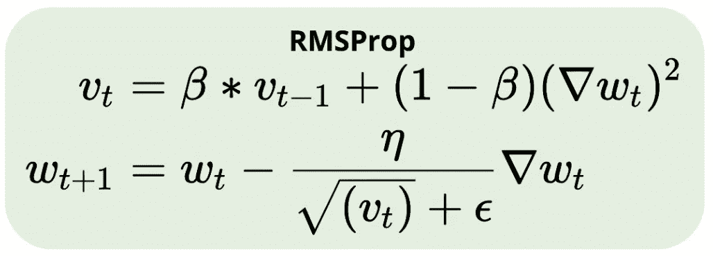

为什么不能避免分母的衰减呢？RMSProp 通过引入另一个超参数来帮助实现这一点。

## 亚当:

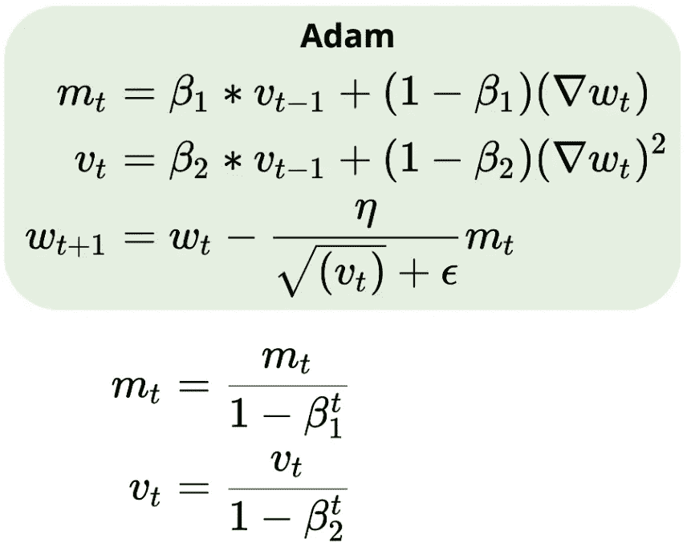

ADAM 结合了基于动量的 GD 更新规则和 RMSProp 的优点。ADAM 使用梯度的累积历史。它维护一个历史记录，即所有更新的运行总和(用于进行更新)和另一个历史记录以调整学习率。除此之外，ADAM 还进行偏差校正。

在实践中，小批量(32、64、128)的 ADAM 是最优选的组合。

谢谢你看我的帖子。我的下一篇文章将讨论初始化方法和激活函数。敬请关注。