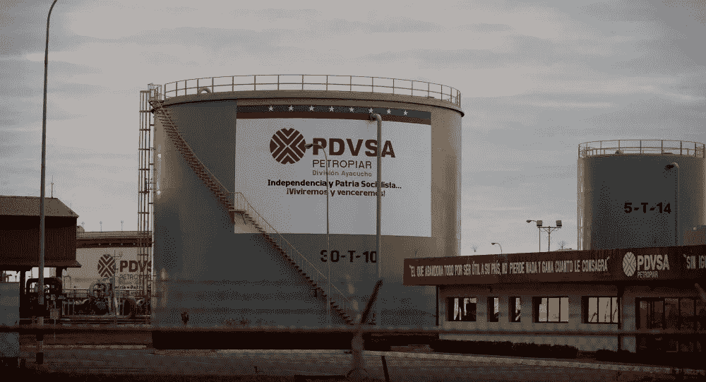

# 更多的 PDVSA 困惑

> 原文：<https://medium.datadriveninvestor.com/more-pdvsa-confusion-c64d9a16fdab?source=collection_archive---------21----------------------->

这是我 2005 年为加拉加斯《每日日报》撰写的一系列转载文章的一部分。

*日报*

*2005 年 5 月 12 日*

夏洛克·福尔摩斯将很难弄清楚委内瑞拉国家石油公司这些天到底发生了什么。

BCV 中央银行的七名董事之一 Domingo Maza Zavala 周四告诉 Globovision，PDVSA 石油公司没有将出口利润交给该银行。他说，除了用于国内支出的“扶轮基金”之外，所有来自石油利润的美元都应该存入中央银行。

据 El Universal 报道，Maza Zavala 周三告诉国民议会(AN)代表，PDVSA 宣布今年头四个月的出口利润总额为 80 亿美元。这个数目与 PDVSA 公司总裁拉斐尔·拉米雷斯所说的 2005 年前三个月从他的公司转移到 BCV 的 64.33 亿美元是一致的。

据 El Universal 报道，Maza Zavala 的会计与 ramírez 和总统 Hugo Chavez 宣布的 330 万桶/日(bpd)的产量水平不一致。该报周三指控 PDVSA 没有向 BCV 报告 2，400 万美元，即每天 2000 万美元。

该公司将这种所谓的差异归因于自 2003 年 2 月实施外汇管制以来，对 BCV 产量数据的错误计算。

El Universal 还报告说，PDVSA 每周向管理国家发展基金的国家发展银行账户转移 4 000 万美元，这些资金没有通过 BCV 或国际储备。

国民议会控制委员会主席塞萨尔·林孔内斯(Cesar Rincones)周三呼吁与马扎·扎瓦拉召开紧急会议，以澄清 PDVSA 令人困惑的会计问题。

“PDVSA 似乎有两个平行的预算，一个是官方的，另一个是不受监督的，”Rincones 说。“这个委员会应该宣布自己处于紧急状态，”他补充说。

Maza Zavala 在 Globovision 的“体内”节目中说，自从 2003 年初全国石油罢工结束以来，BCV 和 PDVSA 没有以流畅或频繁的方式交换信息。

El Universal 表示，周三，Maza Zavala 提议通过创建一个类似于宏观经济稳定基金的基金来解决会计“二元性”，该基金将允许 BCV 和 AN 对 PDVSA 的会计进行控制。

据联合电台报道，反对派委内瑞拉项目党的 Vestalia Sampedro de Araujo 表示，有关出口利润的数据应该由能源和石油部提供，但存在不确定性。

Araujo 重申，石油部保证 PDVSA 的石油日产量为 340 万桶，这与 Chavez 两周前所说的日产量为 230 万桶不一致。他补充说，查韦斯说委内瑞拉没有达到石油输出国组织(石油输出国组织)设定的石油配额。

Araujo 在一份声明中反驳 Maza Zavala 周四的评论说:“BCV 的 Maza Zavala 保证，自石油开采以来，PDVSA 没有提交任何关于向政府移交利润的信息，他们不知道产量是多少。”。

下周，BCV 官员预计将出席欧盟委员会的全体会议。

[**【jenserikgould.com】**](https://www.jenserikgould.com/)