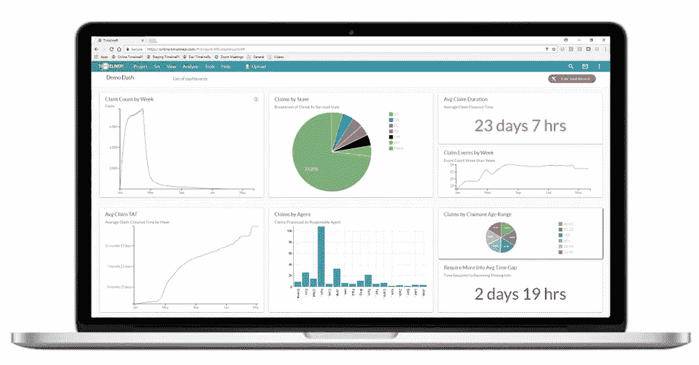
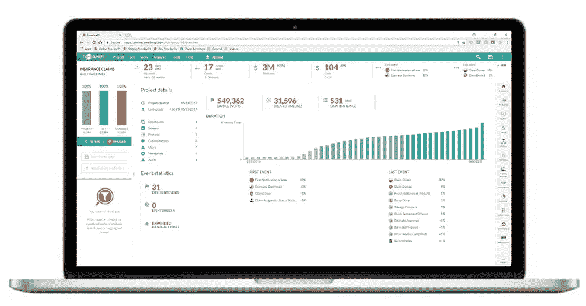

# 不仅仅是仪表板

> 原文：<https://medium.datadriveninvestor.com/more-than-just-dash-boarding-a0815378e2b6?source=collection_archive---------17----------------------->

## 管理层如何从数据中获取更多价值并改进业务流程

当今的管理团队必须高度依赖业务图表、业务报告和仪表板来做出决策并高效地运营业务。管理团队的时间特别紧张，需要快速、简单的方法来分析大量数据和信息，以做出明智的决策。随着流程变得越来越复杂，传统的流程管理技术变得越来越低效。业务用户更喜欢在报告和仪表板中看到他们的流程的“原样”或“当前状态”，而不是原始数据的形式。这使用户能够分析他们的流程，产生可操作的见解，并做出及时、明智的决策。

因为仪表板等辅助工具对公司的成功至关重要，所以让我们花点时间来看看管理层如何利用这些工具来确定关键绩效指标并做出最终推动业务成功的决策。

一个仪表板可以为管理层提供丰富的信息。除了仪表板提供的有价值的信息之外，它还以易于查看、分析和解释的方式呈现信息。仪表板提供的价值不能被夸大。

从仪表板开始可以节省管理团队的时间。想想在一页一页地筛选数据，并试图根据从这些数据中收集到的信息做出有意义的决策时会遇到的困难。现在想想在一个提供图形表示的页面上查看相同的信息有多容易，就像仪表板一样，想想不仅理解数据告诉你什么，而且根据仪表板提供的信息做出决策有多容易。正如您所看到的，使用仪表板可以让管理层减少分析和解释信息的时间，将更多的时间花在决策上，从而推动公司走向未来的成功。

然而，管理层仍然需要解释和理解数据，以做出自己的决策。因此，管理者和业务用户如何超越传统的商业智能工具，这些工具根本无法满足当今流程领导者的需求。BI 中隐藏的缺陷是假设业务流程总是已知的，并且按照规定发生。我们都希望如此，但我们从经验中知道，即使是最明确的行动也不总是按计划进行。当这些偏差发生时，BI 可以向您展示发生了什么(即会计部门重复步骤 xxx 4 次)，但却很难回答我们需要回答的真正问题:为什么。

流程分析工具可以为管理团队解决这些问题提供巨大的价值。作为一名经理，人们需要对企业内部的许多方面做出决策。管理人员应该知道企业每一部分的详细情况。同样，管理团队的时间是宝贵的，很难期望他们花时间去了解每个核心层的业务。时间不允许这样做。因此，管理层必须依靠其他工具来保持业务中各个部门和分部的最新可见性。

**采用 TimelinePI 流程智能的流程分析:**

分析已完成的流程及其模型的行为，亚秒级响应时间

评估当前正在进行的流程实例，对违反协议或异常变化发出警报

预测流程实例在未来的行为，确保积极的结果

流程分析和企业资源规划(ERP)供应商之间的合作，以及任务级自动化实施的兴起正在推动流程分析市场的增长。

它使用起来非常简单，不需要集成！加载您的数据，并立即在类似仪表板的表格中看到详细的指标。单击鼠标即可执行高级查询，并立即获得结果，无需等待报告编写人员为您提供已经过时的数据！

Left: TimelinePI Custom Process Dashboard; Right: TimelinePI Overview — Automatic Discovery of Process Metrics;

由 TimelinePI 等高级流程智能提供的流程分析有助于提供业务运营流程的简明而详细的概述，就像一个仪表板，但具有更强的理解和深入细化细节的能力。该平台可以作为一个企业范围的分析和监控系统，查看哪些员工负责特定的任务，确定哪些部门有最多的瓶颈，并告诉你原因，还可以洞察特定流程给公司带来的成本以及其他许多事情。通过这种方式，过程智能平台中的支持工具可以使经理与他们的员工保持一致，并确保他们牢牢把握公司作为一个整体需要采取的方向。有了监控和警报功能，问题可以在发生之前避免。

Process intelligence 将流程视为相互关联的事件的动态流程流，这是一种全新的、独特的方式来查看、理解和进一步改进业务流程。BI 解决方案专注于围绕流程中各个步骤或事件的数据和指标，无法测量和分析时间间隔，甚至无法处理重复事件多次出现的事实。获得专利的时间线方法使之变得简单。因此，TimelinePI 赋予所有用户成为流程专家的权利，无论他们是经过精益认证的还是计算机编码天才。现在，任何人都可以超越传统的业务运营方式，轻松查看和分析流程流的所有模式，看穿业务流程的复杂性。帮助管理层做出正确决策的关键是能够为他们提供有价值的准确信息，无论是简单的仪表板、短信/电子邮件提醒还是其他支持工具，以便他们能够做出明智的管理决策，确保公司朝着正确的方向前进。

Ryan M. Raiker, MBA

**关于作者**

Ryan Raiker 是一位有着中小型企业工作经验的资深商业顾问。Ryan 在州政府和地方政府从事项目管理工作。他学习商业分析，后来在宾夕法尼亚州切斯特的威得恩大学获得工商管理硕士学位。目前，Ryan 正专注于 TimelinePI 的品牌管理和产品开发。

与我联系:

领英:【https://www.linkedin.com/in/ryan-raiker/ 

推特:[https://twitter.com/ryraiker](https://twitter.com/ryraiker)