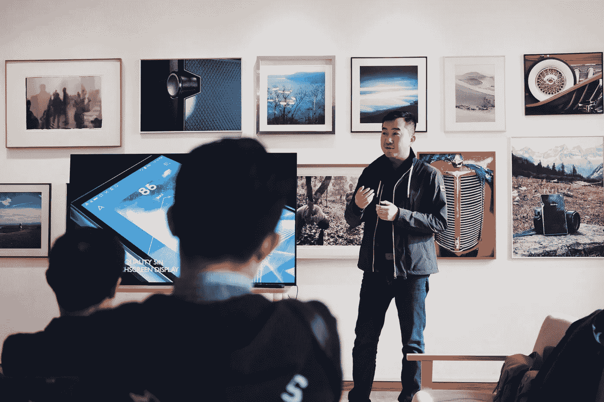

# 不仅仅是 STEM:教授人类专业如何帮助孩子为人工智能做准备

> 原文：<https://medium.datadriveninvestor.com/more-than-stem-how-teaching-human-specialties-will-help-prepare-kids-for-ai-8b72898f9b3d?source=collection_archive---------10----------------------->

由斯佳丽·乔治和[艾玛·马蒂诺-特鲁斯韦尔](https://medium.com/u/331ea588a1d7?source=post_page-----8b72898f9b3d--------------------------------)主演

听到‘AI 与教育’你会怎么想？机器人教孩子，人工智能帮助老师做标记，或者只是在学校教人工智能？虽然这些都是重要的主题(具有重要的伦理意义)，但我们认为，在关于人工智能和教育未来的讨论中，一个关键领域是“是什么让我们不同于机器？”。随着人工智能变得越来越有用，越来越普遍，这对我们现在的教育系统意味着什么？我们应该教我们的孩子什么，以确保他们为即将毕业的世界做好准备？

那些谈论人工智能对未来工作的影响的人倾向于分成两大阵营:A)认为未来将有大量剩余劳动力(因此失业)的人，以及 B)相信失去的工作将被新的工作取代，或者不仅仅是被取代的人。无论人工智能对就业的净影响是什么，我们认为我们将需要教育系统的重大变革，以让我们为更多人工智能的未来做好准备。在世界各地，许多学校正在为未来做准备，在科学和数学上花费更多的课堂时间，并教孩子们编程。这很重要，但我们认为帮助学生发展他们的人文特长更重要。

“人类专长”是我们在牛津洞察中使用的一个术语，用来描述人类胜过机器的那些技能。碰巧的是，这些技能中有许多似乎与我们的人性特别接近，比如情商、创造力和协作。现代课程需要融合人类专业和 STEM(科学、技术、工程和数学)学科。我们不认为这是一个我们应该放弃什么科目的问题，而是我们如何教学生的问题。

为了在自动化的世界里茁壮成长，我们的孩子需要像机器人一样学习。

虽然“人类特长”的确切构成仍有争议，但澳大利亚新南威尔士州(NSW)教育部发表的一篇研究论文很好地概述了当前的想法。新南威尔士州教育部将“21 世纪技能”描述为包含九个领域:批判性思维、创造力、元认知、解决问题、协作、动机自我效能、意识、勇气或毅力(详见[新南威尔士州研究论文“21 世纪关键技能”第 19 页](https://education.nsw.gov.au/our-priorities/innovate-for-the-future/education-for-a-changing-world/research-findings/future-frontiers-analytical-report-key-skills-for-the-21st-century/Key-Skills-for-the-21st-Century-Analytical-Report.pdf))。

关于如何教授这些人类专长，以及为什么这样做在人工智能时代尤为重要，已经有了广泛的研究。但没有多少指导将“如何做”和“为什么做”结合起来，以提供明智的政策建议。我们发现的显著例外是[新南威尔士州教育部门](https://education.nsw.gov.au/our-priorities/innovate-for-the-future/education-for-a-changing-world)和经济合作与发展组织(OECD)项目 [OECD 教育 2030](http://www.oecd.org/education/2030/) 的工作。

因此，当谈到教授人类专业时，有许多悬而未决的问题和挑战需要解决。

首先，我们怎样才能最好地教授人类的特长？新南威尔士州教育部发表的一篇论文给出了一些国家的例子，这些国家已经积极地将这些技能的一部分或全部融入到他们的课程中:比如芬兰、澳大利亚、加拿大的一些地区和美国。似乎在所有情况下都行之有效的政策包括促进将这些技能纳入各级(小学和中学)学校课程，鼓励所有科目的合作项目，并允许教师自由鼓励这些技能，并在他们认为合适的时候对其进行评估。做出这些改变不仅仅意味着改变课程:它还意味着给予教师更多的空间来寻找创造性的教学方法，为教师提供更多的职业发展机会，以及反思当前的教学和学习环境。

第二，如果学校专注于不同的技能，应该如何评估？这是一个重要的问题，因为根据不同的答案，学校的课程最终会看起来非常不同。经合组织教育 2030 项目的一部分是为人类专业建立一个[评估框架](http://www.oecd.org/education/2030/E2030%20Position%20Paper%20(05.04.2018).pdf)，他们希望在 2019 年启动。

让我们的孩子做好准备是否意味着继续对他们进行更多的测试，或者我们是否应该开始重新设计我们的课程，让他们不再那么依赖考试？理查德·沃森在[未来前沿:人工智能世界的教育](https://education.nsw.gov.au/our-priorities/innovate-for-the-future/education-for-a-changing-world/media/documents/future-frontiers-education-for-an-ai-world/Future_Frontiers-Text.pdf)的第三章中，要求我们重新思考我们如何评估学生。他给出了许多建议，包括结束我们对考试结果和排名表的痴迷，彻底取消考试，或者寻找评估人类特长的新方法。沃森指出，为什么这是一个如此重要的问题，部分原因是我们正在(甚至更进一步)走向知识经济。我们需要孩子们去创新，去独立思考，去合作。当前的个人标准化测试系统并不鼓励这种行为。所以，如果我们真的想测试人类的特长，我们需要想出一个与我们所教的不相矛盾的方法。

第三，我们如何使课程更具适应性，并在新的研究出现时考虑到新的研究？联合国可持续发展目标 4 ( [SDG4](https://sustainabledevelopment.un.org/sdg4) )提出了到 2030 年要实现的一些目标，包括“完成免费、公平和高质量的初等和中等教育，产生相关和有效的学习成果”以及“大幅增加拥有相关技能的青年和成年人的数量……以促进就业”。为了让各国在 2030 年前实现这些目标，需要迅速开始工作。教授“就业相关技能”的问题在于，这些技能是在学生进入劳动力市场之前的几年教授的。因此，我们的任务不是教授与当今劳动力市场相关的技能，而是明智地预测未来几十年将需要哪些技能:这就是为什么我们呼吁更加关注人类专长的发展。

将这些技能加入学校课程的想法并不新鲜，但磨练人类的特长从未像现在这样重要。这意味着快速灵活地行动，信任专家、老师。教师需要空间和时间来投资于他们自己的理解，这样他们也可以给学生提供他们需要的更广泛的教育。未来几十年，我们将需要更多的 STEM 专家，但也需要有同理心、创造力和思维的公民，他们知道哪些问题可以由机器解决，哪些问题需要人来解决。