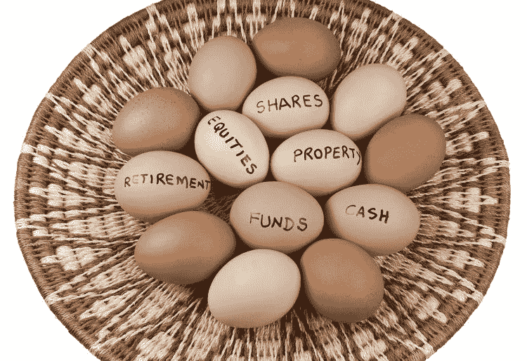

# 关于索引的更多思考

> 原文：<https://medium.datadriveninvestor.com/more-thoughts-on-indexing-9e053cad1aad?source=collection_archive---------27----------------------->

我们以前讨论过一些标准，关于如何创建一个好的加密硬币指数(不是骗局 NS:100)。让我们在这里讨论为什么我们在投资加密货币时不使用传统的指数技术。我不反对分散投资策略，当然，如果你是一个成熟市场的股票投资新手，分散投资是你的朋友。分散投资是一种非常有用的工具，可以在不投入工作的情况下获得市场利率，正如你可能知道的那样，在任何给定的一年里，大多数对冲基金都很难击败“市场利率”。成熟经济体中的大多数市场都是如此。

那么区别在哪里呢？不同的是，我找不到一种不太直接的方式来说，在纽约证券交易所，60%的首次公开募股不会在头 4 个月内失败，90%的新公司(ICO)不会在头 18 个月内破产。在纽约证券交易所，有成千上万的公司拥有有效的商业模式；密码公司离永远消失只差一步之遥；毫无预兆。我们都在玩一个游戏，如果我们玩市场赔率，我们 90%的时间会输得精光，你最好去拉斯维加斯玩 21 点。索引，至少是整个市场的索引，在加密中不起作用。

但是其他类型的指数呢，比如市值指数？这种特殊的方法没有整个市场指数化我们的加密投资那么直接，但尽管这个问题的数据很难获得，但过去 7 年的观察表明，即使你在一年内投资了市值排名前十的硬币，几年后，随着新技术和创新超越排行榜，这些硬币中的大多数将不再是前十。即使你用一些幸运的长期选股赚了钱，你的亏损头寸也会困扰你。

我不会说短期市值指数可能会产生结果，但当寻求 1000 倍的回报时，我们必须以五年为增量来考虑我们的投资。5 年后，市值指数将会变得面目全非。

那么，如果我们不能通过指数化获得 1000 倍的长期回报，我们该怎么办呢？嗯，我们提倡沃伦·巴菲特所说的“把你所有的鸡蛋放在一个(或几个)篮子里，然后看着那个(那些)篮子”，并且密切关注它们。我们在以前的一些帖子中已经讨论过方法，所以我在这里就不赘述了，但是作为一个投资者，你必须制定一个选择和投资 crypto 的标准。你的主要过滤器必须是你对投资的意愿和信念，这样你才能放心地持有它，度过多年的熊市和牛市。

如果你能够聚集一小群你愿意长期持有的投资者，你必须密切关注这些投资。你必须小心不要被日复一日，甚至年复一年的市场波动所左右，我们不在乎硬币是涨是跌，也不在乎媒体或电视对我们的投资说了些什么，我们在寻找根本性变化的迹象。基本变化是经济和技术原则的变化，这导致我们选择一个特定的密码作为一个良好的长期投资。

在我个人的投资历史中，当他们拒绝提高块大小限制时，我离开了比特币核心，因为这预示着比特币经济学的根本变化。我注册了点对点数字现金，而不是数字黄金，所以这对我来说是一个根本性的变化，我已经有几年没有持有比特币了。触发卖出情景的变量将因您自己的投资标准而异，并可能对您的回报产生负面的短期影响，但您必须根据给定加密货币相对于新兴竞争对手的长期生存能力做出清算决定。如果竞争对手有更好的潜力/经济效益，转移你的资金。借用写作老师的一句口头禅:“有时你不得不杀死你的宝贝。”

当你关注你的鸡蛋篮子时，你的考虑通常必须是技术和经济的，事实上，大多数时候这两个标准是一样的。我个人的方法过滤了大多数不打算作为日常货币使用的加密货币，除了 Tezos、以太坊等显著的例外。我也重视创新。但所有这些硬币本质上都是经济工具，如果开发团队开始扰乱经济激励，如采矿、硬币排放等。我开始注意了。

重要的是要理解让我们以这种方式对待投资的原则，并避免多样化带来的虚假舒适。生态系统中的项目太不成熟，该领域的创新太势不可挡，无法基于死记硬背来选择硬币。当我们选择硬币时，我们必须是排他性的和严格的，一旦我们获得了我们的位置，我们就要保持警惕。我们必须清楚地了解投资决策背后的基础，并能够以超然的方式判断变化的环境。要成为一个成功的加密投资者，你必须避免指数化的诱惑，并随时准备随着情况的变化而执行。

*免费复制 Pablo 广受好评的* [*书*](https://pablo-lema.squarespace.com/s/Crypto-Success-V2.pdf) *，重点讲解加密投资原理:*

[**现在免费阅读**](https://pablo-lema.squarespace.com/s/Crypto-Success-V2.pdf) **或者** [**在亚马逊上购买**](https://goo.gl/Cv9QSi)