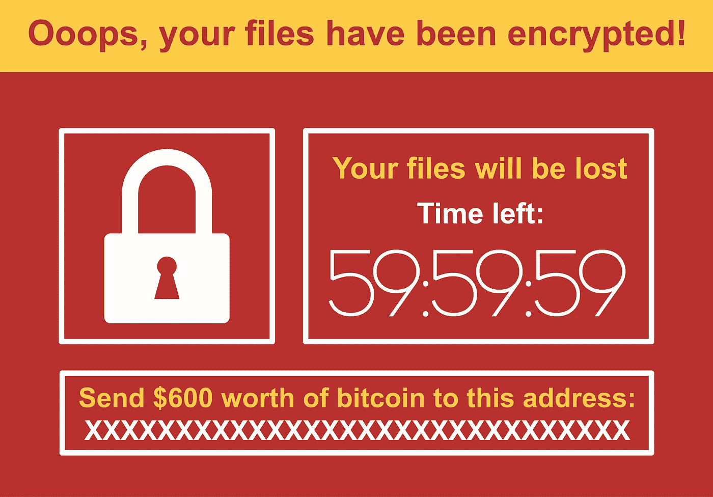

# 最常见的加密钱包攻击和钱包安全。

> 原文：<https://medium.datadriveninvestor.com/most-common-crypto-wallet-attacks-wallet-safety-cfb976e2c508?source=collection_archive---------8----------------------->

Shutterstock

数字钱包是一种虚拟钱包，允许你使用手机、智能手机、台式机、平板电脑和任何连接互联网的设备进行交易。这是一个更加安全的[版本的实体钱包，因为你“不会丢失它”,而且需要密码才能登录。](https://blog.goodaudience.com/7-reasons-why-you-should-be-using-a-digital-wallet-3ce0e72cfbf4)

[密码钱包](https://okanepay.com)是[密码](https://blog.winco.io/cryptocurrency-basics-put-simply/)的数字钱包！你可以用它来存储、发送和接收密码。它配有一对密钥(公钥&私钥),这对你的整个加密货币体验至关重要。而且钱包主要有两种[冷热](https://blog.winco.io/cryptocurrency-wallets-hot-or-cold/)。

> 不出所料，(无论何时处理金钱和资产)，加密钱包一直是恶意行为者的目标。

那么，保护我钱包安全的最好方法是什么呢？首先，你必须了解这些掠夺者是如何思考和工作的，这样你就可以通过知道会发生什么来设计你的安全系统。

加密货币的魅力在于财务自由，你可以完全掌控自己的资产，但随着控制而来的必须是新的培训和准备，因为我们大多数人都不是网络安全专家。

> 在加密货币区块链行业，你不能像中央机构那样，把自己的安全责任推卸给他人。随着分散化而来的是了解自身安全的责任。

人们每天都面临无数可能的攻击，但他们不知道自己处于危险之中。你知道大多数袭击都发生在入口处吗？不是在区块链本身，区块链甚至从来没有被黑过，甚至不是在钱包本身，而是在你进入你的钱包时的连接点。甚至被认为是黄金钱包和存储密码最安全的方式的硬件钱包也遭到了黑客攻击。

*“区块链是军用级加密技术，从未被破解过。当你听说黑客窃取比特币时，他们不是从区块链本土窃取，而是在入境点、钱包或浏览器层面窃取信息，但区块链本身非常安全。”*——[里克·威拉德](https://www.youtube.com/watch?v=v-qvqCn4tHE)，纽约代理集团的创始人兼董事总经理。

> *“有风险的不一定是你的设定，而是你的注意力。”一位网络安全专家。*

Ohayon 说我们一定是*偏执狂*，我知道这听起来很极端，但是黑客已经准备好在你的智力点上欺骗你，你一定要警惕。

最近一位 [Reddit 用户](https://cointelegraph.com/news/myetherwallet-warns-that-a-couple-of-its-dns-servers-have-been-hacked)描述了他/她如何在试图登录 [MEW](https://blog.winco.io/how-to-add-on-metamask-to-my-google-chrome-and-import-my-mew-account-into-metamask/) 时被拦截而丢失了 0.9 ETH:

> *“今天醒来，打开电脑，上了 myetherwallet，看到 myetherwallet 的角落里有一张无效的连接证书。我觉得这很奇怪。*[*https://i.imgur.com/2x9d7bR.png*](https://i.imgur.com/2x9d7bR.png)*。所以我反复检查了网址，又检查了三遍，上了谷歌，找到了网址。使用 EAL 确认这不是一个钓鱼网站。尽管我身体的每一部分都告诉我不要尝试登录，但我还是登录了。我一登录，就有一个大约 10 秒钟的*倒计时，并发出一个 tx 将我钱包中的可用钱发送到另一个钱包，“0x1d 50588 c0aa 11959 a5c 28831 ce 3c 3 D5 f1 d 3120d 29”。"

他或她的攻击是可以避免的，就像如果我们知道会发生什么，大多数攻击都是可以避免的一样；他知道得更清楚，但没有采取相应的行动。

最终，这种类型的安全将成为常识；随着我们摆脱集中的思维模式，去中心化将会扩大。

> 这意味着我们不仅渴望财务自由，我们还将拥有它，并为此承担责任。

**加密货币钱包最常见的攻击:**

**1。**复制**粘贴&又名“剪贴板劫持者”**

比方说，你想发送 [WCO](https://winco.io) 到一个钱包，你复制并粘贴地址，似乎无害的权利？但是，有一些程序可以将你复制的地址替换为另一个地址，让你将资金发送到错误的钱包。

所以，你必须再三检查你要发送的地址。我知道这是一个痛苦的战利品，但它是在您的最佳利益，检查地址，并注意黑客可能会使用试图欺骗你的细节。 [Cryptoshuffler](https://www.kaspersky.com/blog/cryptoshuffler-bitcoin-stealer/19976/) 是一个用来劫持加密地址的程序，已经被用来盗取 14 万比特币。

**2。** **2 因素认证短信或短信**

千万不要使用短信或文本设置双因素认证([2fa](https://en.wikipedia.org/wiki/Multi-factor_authentication))，因为它们很容易被劫持。这种类型的黑客攻击正在疯狂增长，尤其是在移动电话运营商易受攻击的美国(谁会想到呢！)并在泄露信息方面被欺骗了无数次，这些信息使黑客能够访问与被黑客攻击的移动电话相关联的账户。黑客需要的只是密码持有者的名字、姓氏和电话号码。

被黑的比特币基地钱包(一个成功的实验故事):

*“该组织(积极技术公司)锁定了一个注册了 Gmail 账户的比特币基地账户，该账户也受到双重保护。通过利用手机网络中的已知缺陷，该组织能够在一段时间内拦截发送到该号码的所有短信。这足以重置 Gmail 账户的密码，然后控制比特币基地钱包。该组织只需要目标比特币用户的姓名和电话号码。这些是安全研究人员，而不是罪犯，所以他们实际上没有窃取任何人的比特币，尽管这本来是一个容易的步骤。”—来自边缘* [*文章*](https://www.theverge.com/2017/9/18/16328172/sms-two-factor-authentication-hack-password-bitcoin)

你可能想看看这个视频:[比特币钱包通过短信被黑](https://www.youtube.com/watch?v=mLh1Nmqa6OM)

**3。** **山寨手机应用**

我们，仅仅是凡人，永远不要低估黑客的能力，他们能够侵入真实的应用程序，构建假的真实移动应用程序，误导人们在假的平台上交易。交易者将“交易”,放弃他们所有的信息，把他们的资金送到黑客的钱包里。

这发生在众所周知的交易所 Poloniex，遍布谷歌的钓鱼应用误导人们在一个[假 Poloniex 平台](https://thenextweb.com/hardfork/2018/03/28/google-play-store-poloniex-app/)上交易。

您必须确保使用触控 ID、pin 码和一切可用的东西来保护您的设备，以保护您用来访问钱包和钥匙的设备。要求保护你的手机听起来似乎是显而易见的，但是大多数劫持都是由于我们对最小的细节缺乏注意而发生的。PS:Android 比 iOS 更容易被黑客攻击。

**4。** **钓鱼邮件**

这可能是所有攻击中最常见的一种，黑客会向你发送一封电子邮件，就好像他们来自你的钱包服务(举例来说)，其中的 URL 看起来是合法的，但会将你重定向到一个虚假的 URL，让你在尝试进入你的钱包时输入你的信息。你可以随时*用吸尘器*扫过这个链接(看起来可能是真的),看看你是否被引导到你所看到的链接。

黑客搜索简单的人类“缺陷”，社交媒体上个人数据的泄露，密码等。所以千万不要在你的邮件中留下任何这类信息。

**加密钱包安全**

1) [使用离线钱包](https://www.ledger.com/?r=eb7e):特别是如果你有大量的钱，并且你不打算定期交易。如果你学会正确使用硬件设备，它们是安全的。

2) [为你的钱包和私人钥匙创建一个安全的备份](https://www.youtube.com/watch?v=05XQtF5qBBY):大多数钱包如果你丢失了你的信息，它将永远消失，没有人会恢复你的帐户和密码。创建离线备份，它总是更安全。

3) [创建一个强密码](https://passwordsgenerator.net):永远不要使用容易记住的密码，使用难记的密码，把它们写在安全的地方。不要使用你生活方式中常见的日期、数字或名字。

4)使用交易所提供的 [2FA](https://en.wikipedia.org/wiki/Multi-factor_authentication) ，生物识别&指纹。

5)使用[密码短语](https://en.wikipedia.org/wiki/Passphrase):这些会让黑客的日子变得异常艰难。

6)永远不要使用同一个邮箱:确保每个钱包都有一个邮箱，不要在其他地方使用同一个邮箱，尤其是你的社交媒体。在参加 ICOs、[空投、水龙头&奖金时，一定要创建单独的电子邮件。](https://blog.winco.io/what-is-the-difference-between-faucets-airdrops-and-bounties/)

7)永远不要共享私钥:私钥被称为私有是有原因的(lol)。让你的钥匙离线总是比在线好，在你的电脑上，保存在你的桌面上，谷歌硬盘上…等等。永远不要在网上保存它们。你可以把它们保存在一张纸上或者 USB 里。

8)永远不要在网上分享你的个人信息:这是一个网络安全的新时代，我们不应该继续像过去那样天真，在脸书各地(或任何其他社交媒体上)暴露我们的全名、地址、电子邮件、出生日期。

9) [正确使用钱包(软件&硬件)&钥匙](https://www.youtube.com/watch?v=8mpDcBfNA7g):不要试图比标准更聪明。如果你了解协议以及如何正确使用钱包、交易所、钥匙、应用程序和密码，没人能骗过你。你一看到不寻常的东西，你就会知道不要弄乱它。

10)进行你自己的研究&跟上时代:你必须定期进行你自己的研究。请立即联系您所参与项目的支持团队或您所使用的设备，以了解如何在加密货币行业进行交易(如何使用您的钱包、交易所等)。有很多很棒的资源，比如 Youtube & Medium。确保了解行业最新动态，联系[社区](https://blog.winco.io/cryptocurrency-communities-why-get-involved/)、[加密博客](https://blog.winco.io)，在加入任何加密优惠或使用任何产品之前寻求评论。此外，每天都有各种各样的安全黑客发布，所以总有一些新的东西可以实现你的钱包的安全。

**最终想法**

要直觉，*要偏执* (lol)！我是认真的！注意那些小迹象，如果它看起来不对劲，那么它就不对劲，*跟着感觉走*。

我希望这篇博客已经激发了你的警觉。

你可能想读: [2019 一定比 2018 更安全](https://blog.winco.io/2019-must-be-safer-than-2018/)

[奥肯支付团队](https://okanepay.com)

# 加入我们的社区:[脸书](https://www.facebook.com/OkanePay-199777494229807/)，[推特](https://twitter.com/OkanePay_)，&中型

*免责声明:我们的团队努力为您带来加密货币市场的最佳内容，但这仅是我们的观点而非法律建议，可能与其他意见有所不同，因此请不要在没有完成您自己的研究以了解利润可能性和风险的不确定性之前做出任何决定。*