# 2018 年与 ML 最常见的词

> 原文：<https://medium.datadriveninvestor.com/most-common-words-in-2018-with-ml-9ba60b20717b?source=collection_archive---------18----------------------->

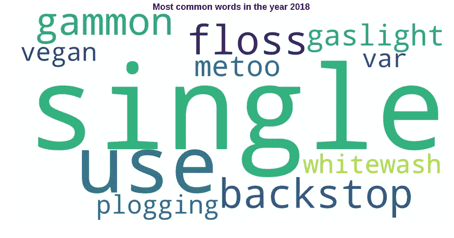

S **单一用途**是 2018 年使用最多的术语，描述了那些不受控制的扩散被指责破坏环境和影响食物链的物品，被评为 2018 年柯林斯年度词汇。 [**柯林斯字典的**](https://www.collinsdictionary.com/pt/) 词典编纂者监控 45 亿字的柯林斯语料库，并创建年度新词和著名词列表，这些词反映了不断演变的文化和使用文化的人的偏好。

在经历了 2018 年的一系列事件、辩论和激烈的政治和体育纠纷后，我对今年最常用词的统计数据感到好奇。

[阅读](https://www.irishtimes.com/culture/books/collins-dictionary-2018-word-of-the-year-revealed-1.3688069)[爱尔兰时报](https://www.irishtimes.com/culture/books/collins-dictionary-2018-word-of-the-year-revealed-1.3688069)上的主题，我确认只有 3 个最常用的词会得到我的认同(一次性使用、VAR 和 MeToo)。这只是一个个人观点，但它反映了我们有时远离创造世界和关注人们的新闻。

利用之前实验中已经描述过的一些机器学习的技术，我探索出了一个用词最多的文本，利用漂亮的**单词云图**库，我打印出来。一个漂亮的演示格式，视觉上吸引人，一个信息格式，让你的头脑有一个直接的阅读。上面的大图是文字云图制作的。

其他术语有:一次性、backstop、floss、gammon、gaslight、metoo、plogging、var、vegan、whitewash。

# 柯林斯字典定义

**一次性**:一次性使用

**止退**:在没有其他安排的情况下生效的制度

弗洛斯舞:一种舞蹈，人们向一个方向扭动臀部，同时向相反方向挥动手臂，拳头合拢

**金门人**:持反动观点的人，通常为男性、中年白人，尤指支持英国退出欧盟的人

试图操纵(一个人),不断给他们提供错误的信息，直到他们怀疑自己的精神状态

MeToo: 表示一种文化运动，旨在揭露和根除掠夺性的性行为，尤其是在工作场所

一种娱乐活动，起源于瑞典，将慢跑和捡垃圾结合在一起

**VAR** —视频助理裁判的缩写

**纯素食主义者:**不使用任何动物产品作为食物、衣服或任何其他用途的人

**粉饰**:让白人演员扮演(一个少数民族的角色)或者用白人演员扮演一个少数民族的角色来制作(一部电影或戏剧)

如果你想了解更多的单词，请点击[这里](https://www.irishtimes.com/culture/books/collins-dictionary-2018-word-of-the-year-revealed-1.3688069)阅读。

像数据科学家一样寻找信息，我用单词制作了一个文本文件，并给系统计数单词和绘图。

所有的工作都可以在 [Github](https://github.com/MRobalinho/Most_Common_Words_2018) 中查阅。我们在 Jupyter 上写 python 吧。

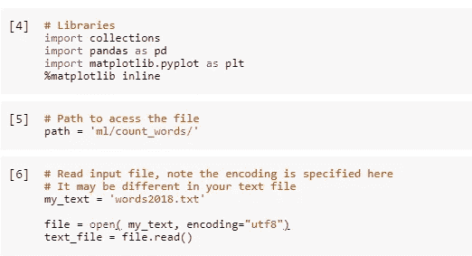

打印信息文本文件:

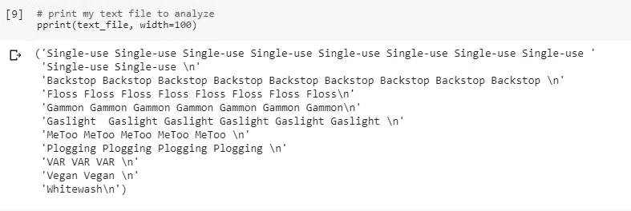

用系统没有计算的单词创建了一个文本文件:

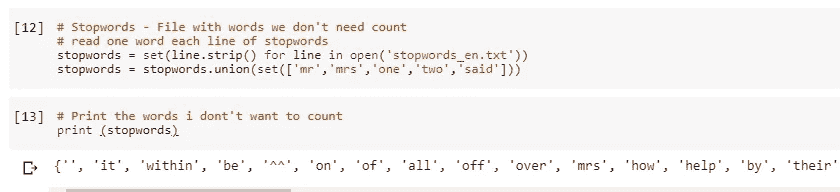

计数术语:

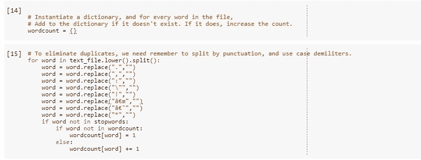

打印计数:

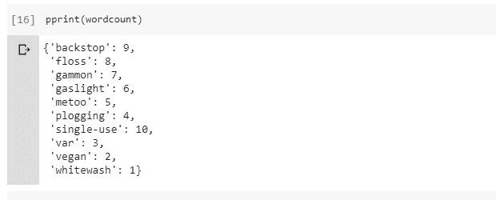

现在我们可以把信息放在图书馆词云中

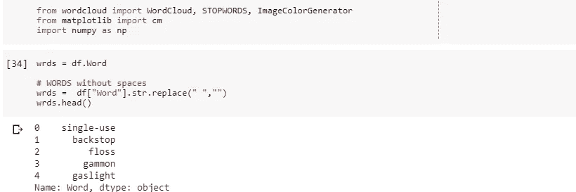

现在画一个圈:

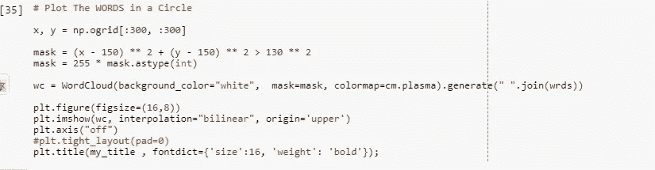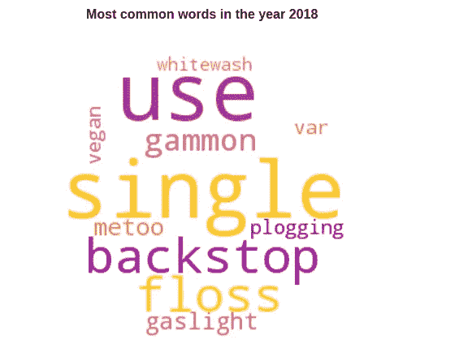

或在框架中绘图:

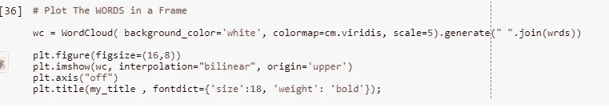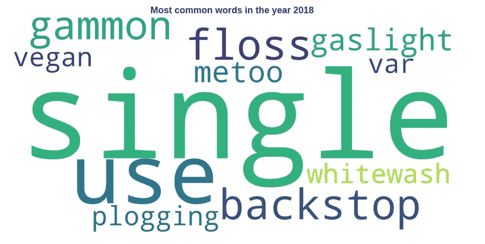

简单又好看。

## **参考文献:**

 [## 柯林斯字典 2018 年度词汇揭晓

### “一次性使用”，这个术语描述的是那些不受控制的扩散被指责为破坏环境和…

www.irishtimes.com](https://www.irishtimes.com/culture/books/collins-dictionary-2018-word-of-the-year-revealed-1.3688069) 

[https://www . data camp . com/community/tutorials/word cloud-python](https://www.datacamp.com/community/tutorials/wordcloud-python)
[https://www . common lounge . com/discussion/317 a 12109 a 634 fc 1a 44150 ea 806 bbf 3](https://www.commonlounge.com/discussion/317a12109a634fc1aa44150ea806bbf3)
[https://matplotlib . org/examples/color/color maps _ reference . html](https://matplotlib.org/examples/color/colormaps_reference.html)

 [## 柯林斯词典

### 网上词典和科林斯词典 com 但 1 milho de palavras:Defini es，sinô nimos，pronúncia，tradu es…

www.collinsdictionary.c](https://www.collinsdictionary.com/pt/)