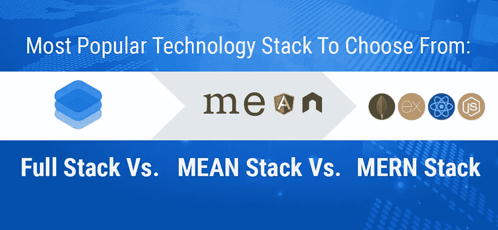
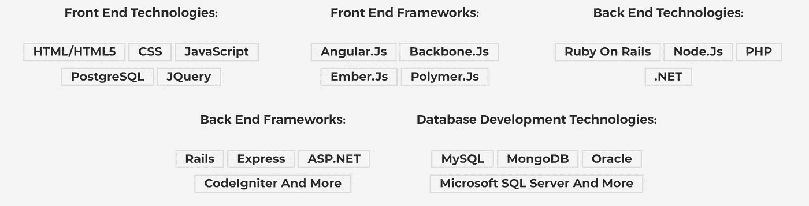
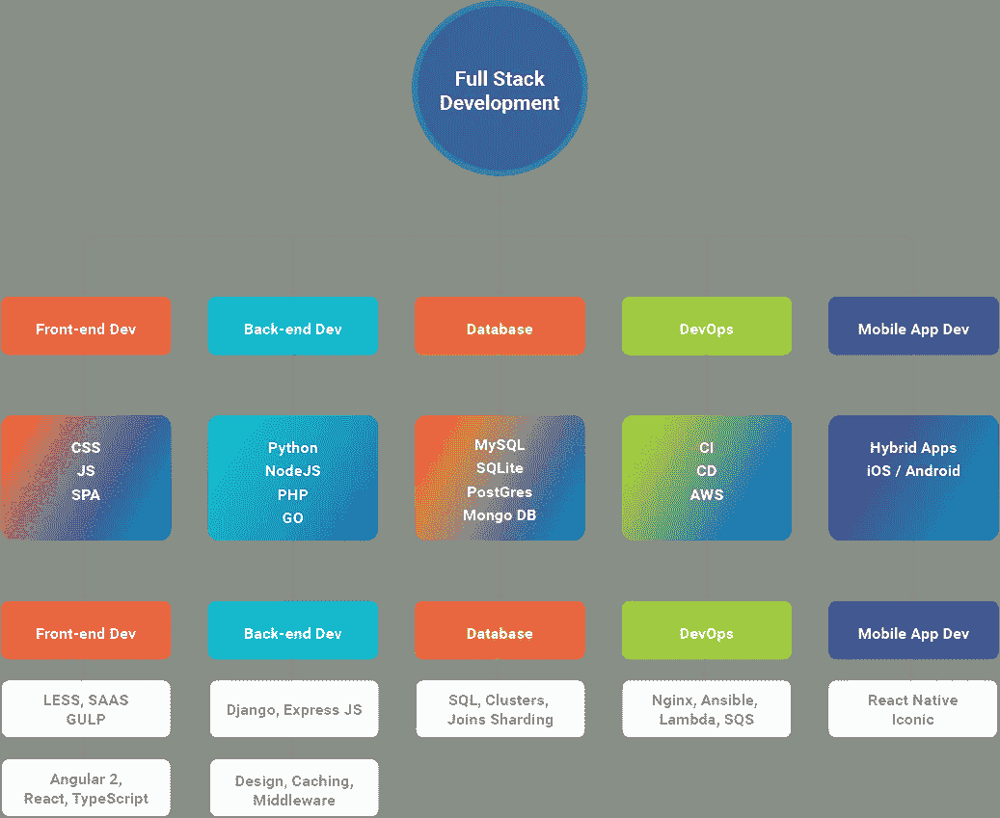
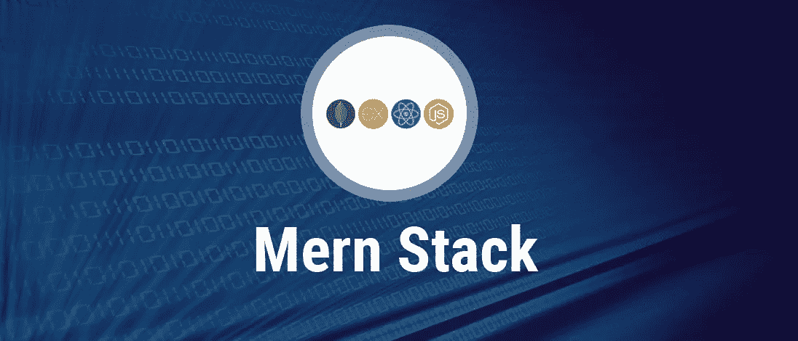

# 2020 年最受欢迎的技术堆栈，可从全堆栈、平均堆栈和 MERN 堆栈中选择

> 原文：<https://medium.datadriveninvestor.com/most-popular-technology-stack-to-choose-from-full-stack-vs-mean-stack-vs-mern-stack-in-2019-d12c0a17439a?source=collection_archive---------0----------------------->

嘿，伙计们，与过去 2-3 年相比，现在的 web 和移动应用程序开发服务已经迈上了一个新的台阶。如今，网络和移动应用都是利用各种技术的“堆栈”构建的。想知道怎么做？让我们开始吧！

# 什么是堆栈？

“栈”指的是编程语言和技术的任意组合或者软件产品的组合。
技术上有两种类型的开发栈:
***一是技术栈&二是应用栈。*** 简单来说，技术栈在任何软件开发过程中都是一个比较跨学科的术语。

因此，在本文中，我将向您简要介绍可供选择的 3 大趋势技术堆栈；对于你的创业或正在进行的业务。
但是在开始使用技术堆栈之前，您需要了解堆栈的可行性和属性，这在开发和软件产品解决方案中是非常重要的。

 [## 2019 年最值得学习的编码语言——数据驱动的投资者

### 在我读大学的那几年，我跳过了很多次夜游去学习 Java，希望有一天它能帮助我在…

www.datadriveninvestor.com](https://www.datadriveninvestor.com/2019/02/21/best-coding-languages-to-learn-in-2019/) 

**让我们从敏捷开始:**“[*敏捷是一套与软件开发相关的管理实践*](https://e27.co/a-detailed-guide-to-adopting-agile-development-for-your-startup-20190301/) *。”那是因为敏捷最初的倡导者是软件开发人员，它的基础文件是 2001 年的软件开发宣言。*

敏捷正在成为一场超越软件的全球性运动。这是一个发现的路线图，它为组织提供了一条唯一的道路，以适应当今以客户为导向的市场。

虽然您是使用技术的专家，但为您的企业选择正确的技术基础架构绝非易事。通过增强你的技术基础设施，它总是给你的 hickup。然而，作为一个利益相关者，你经常被要求这样做，这是不可避免的。有不同的数据库架构和软件解决方案，你不太清楚它们之间的区别，所以你不知道你应该选择哪个托管解决方案，为什么。

> 这些问题以及从众多问题中选择一个的任务已经减缓了您的运营速度，并使您的注意力从经营核心业务上移开。你现在要做什么？你将如何解决这个耗费你大量时间的谜题？

> 首先，我会帮你为你的网络或软件产品选择合适的技术。在选择合适的技术组合 **之前，你需要考虑以下几点:你的项目:**

1.  了解项目需求
2.  引入敏捷性
3.  超越项目要求，获得更好的受众
4.  你所雇佣的团队或组织的专业技能和知识
5.  开发团队的灵活性和可伸缩性
6.  最终开发成本

# 什么是全栈，为什么要选择？

***全栈:*** 熟练的开发者来自各个流；具体来说，有前端、后端、数据库、手机 App 和测试。早期的开发人员已经获得了上述任何领域的专业知识，并在该领域继续他们的职业生涯。然而，现在趋势改变了。对技术的需求要求开发人员既要在前端工作，也要在后端工作，等等。
全栈开发人员因其提供的众多优势而备受瞩目，最有可能是针对多种技术的独特代码&多技术项目，以创建出色的 UX/用户界面。

如今，开发人员正在理解并能够解决软件开发的几个流程中的小故障。公司现在正努力雇佣全栈开发人员，他们可以从零开始构建完整的网络或应用程序，在这个过程中不会有任何中断。

现在，很有理由说，为什么要为你的下一个软件开发项目雇佣全栈开发人员或开发团队。

## 全堆栈的优势:

还在迷茫该雇谁！检查下面提到的全栈开发的优势:

*   基于项目的需求，在前端和后端开发之间轻松切换。
*   关注整个设计结构，并在开发过程中根据需要在任何级别上工作。
*   通过雇佣专门的全栈开发人员而不是专门雇佣前端和后端来节省成本。
*   轻松掌控网站的设计和实施
*   易于使用新技术和工具升级，比专门从事前端或后端技术的人更快。
*   个人全栈开发人员的综合工作提供了根据项目需要从一个任务到另一个任务的灵活性。
*   一个完整的问题解决方案，不仅仅着眼于解决方案，而是要找到问题的根源。
*   中小型企业的理想选择，因为复杂的网站要求可以分成几个部分以节省时间。

# 什么是均值叠加，为什么选择均值叠加？

术语“ ***表示堆栈*** ”，是一组基于 JavaScript 的技术集合，用于开发复杂的网站和 web 应用程序(渐进式或响应式)。简而言之，我的意思是，作为一个全栈 JavaScript 框架——它简化并加速了 web 应用程序的开发。

MongoDB，Express。JS、Angular 和 Node。JS 是一组技术，它们结合了移动和 Web 应用程序中的 MEAN Stack 技术。最近，一些复杂的网站和网络应用程序(响应式)都是由 MEAN Stack 驱动的。
MEAN Stack 是发展最快的开源堆栈开发框架之一，它通过流行的工具或插件来帮助开发人员或团队减少系统管理的时间，并且它还允许更快地部署 web 应用程序、网站和 API，以便专注于项目的复杂开发过程。

1.  **MongoDB** :文档数据库——后端应用程序使用它将数据存储为 JSON (JavaScript Object Notation)文档
2.  **Express(有时也称为 Express.js):** 运行在 Node.js 之上的后端 web 应用程序框架
3.  **Angular(原 Angular.js，现又名 Angular 2):** 前端 web app 框架；在用户浏览器中运行您的 JavaScript 代码，允许您的应用程序 UI 是动态的
4.  **节点。JS:** JavaScript 运行时环境——让您用 JavaScript 实现应用程序后端

## 选择均值堆栈的优势:

*   涵盖了使用 JavaScript 从前端开发(客户端)到后端开发(服务器端)的整个 web 开发周期。
*   支持 MVC(模型视图控制器)架构，使开发过程流畅。
*   有助于抵制不必要的繁重工作，从而使 web 应用程序开发更有条理。
*   MongoDB、Express 四大技术的合并。JS，有棱角。JS 和 Node.JS。
*   附带一套预先构建的广泛的测试工具。
*   在框架中开源，并有良好的社区支持。

# 什么是 MERN 堆栈，为什么选择它？

MERN 堆栈，一种用于制作优质网络应用的技术组合。Web 应用程序是使用多种技术开发的，更有可能是框架、库、数据库等等。MERN 栈是一个 JavaScript 栈，用于开发过程的平滑流动。MERN 由不同的开源组件组成:MongoDB、Express、React 和 Node.js。所有组件都为开发人员提供了端到端的框架支持。

MERN 堆栈变得越来越流行，是一个强大的工作堆栈。 ***MERN 堆栈*** 是指如下技术:

1.  MongoDB :基于文档的开源数据库
2.  **Express**:node . js 的一个快速、非个性化、极简的 web 框架
3.  **React** :用于构建用户界面的 JavaScript 前端库
4.  **Node.js** : Node.js 是基于 Chrome 的 V8 JavaScript 引擎构建的 JavaScript 运行时。Node.js 为服务器带来了 JavaScript

MERN 堆栈非常类似于平均堆栈。这里唯一的区别是，MEAN stack 使用 Angular 构建前端 web 应用程序，而 MERN stack 使用 React。

## 选择 MERN 堆栈的好处:

*   涵盖了使用 JavaScript 从前端开发(客户端)到后端开发(服务器端)的整个 web 开发周期。
*   支持 MVC(模型视图控制器)架构，使开发过程流畅。
*   有了 JavaScript 栈，开发者只需要精通 JavaScript 和 JSON。
*   MongoDB、ExpressJS、React、NodeJS 四种最佳技术的可行性。
*   附带一套预先构建的广泛的测试工具。
*   在框架中开源，并有良好的社区支持。

# ******结论* * * * * *

据我所知，我总结了三个技术堆栈的所有基础知识和技术基础，以便在将您的项目引入错误的方向或开发过程之前加以考虑。这些开发人员精通[网络和软件应用程序或产品开发的各个方面](https://www.bacancytechnology.com/)。在服务的早期阶段，这些是最令人垂涎的技术，是 2020 年 [**的趋势。**](https://medium.com/swlh/top-web-development-trends-you-need-to-consider-for-your-project-in-2019-37e4c83b691d)

不过，如果你还没有找到迹象，那么看看上面关于 2020 年 最热门 ***的超链接，以获得更多参考。***