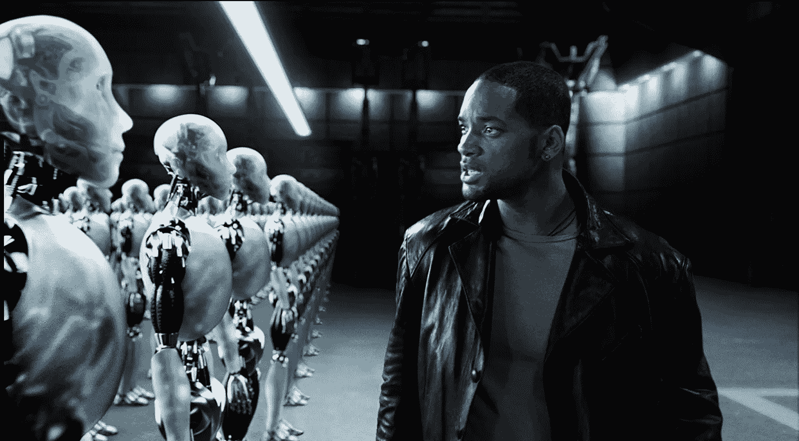
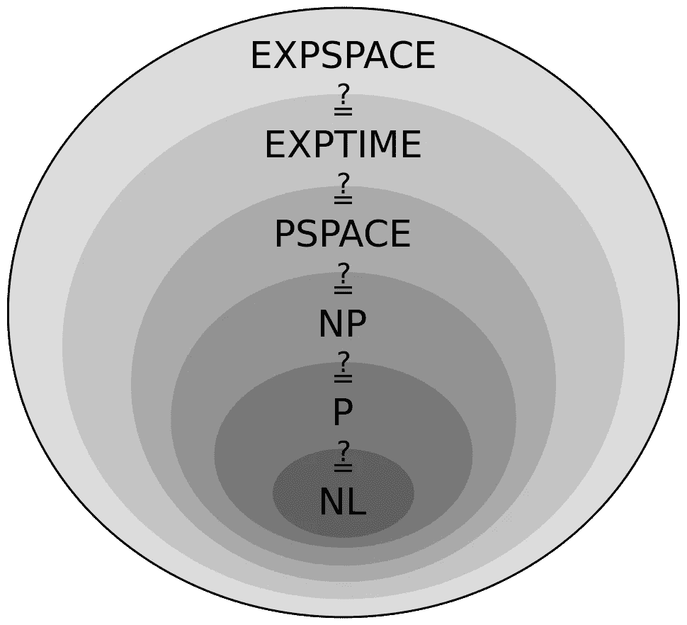
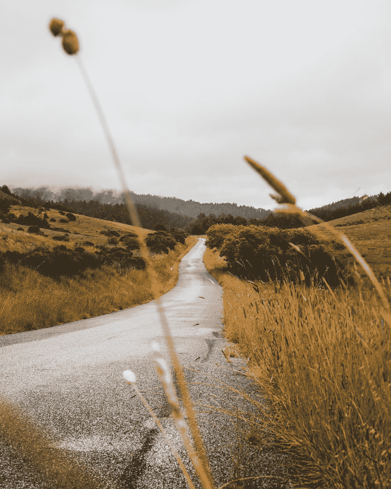
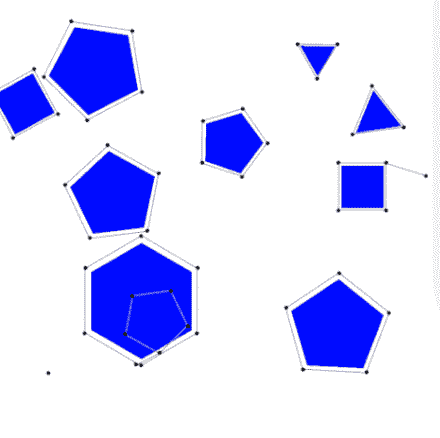

# 机器人运动规划和避障

> 原文：<https://medium.datadriveninvestor.com/motion-planning-and-obstacle-avoidance-ml-on-robotics-2a4ad7bd0373?source=collection_archive---------5----------------------->

《我，机器人》是一部很好的开始主题的电影。忍不住。

Photo by Digital Domain — © 2004 Twentieth Century Fox

# 计算复杂性理论

理论基本上，根据计算问题的困难程度对其进行分类，并描述使用上述分类形成的集群。为了知道我们处理的是什么，我们需要知道运动规划在哪个类中。

在 Jeffrey R. Hartline 和 Ran Libeskind-Hadas 的文章“运动规划的计算复杂性”中，他们指出:

> “有些运动规划问题似乎比 NP-complete 还要难。**PSPACE-complete**问题是一类至少和 NP-complete 问题一样难的问题，并且被认为甚至更难

Classes of The Computational Complexity Theory

很高兴看到这一点，这将是另一个话题来讨论“运动规划”是否会隶属于 PSPACE-complete 类。

杰弗里和冉在他们的文章中提到。

> “确定一个问题是 **PSPACE-complete** 表明**寻找一个有效的算法**来最优地解决这个问题可能是没有结果的。取而代之的是，开发问题的试探法或使用近似技术。

现在，我们坚持 Np-Complete。那是什么？

**Np-Complete** 类由最难的 **NP** 问题组成，这些问题可以通过彻底检查每个候选解来解决。最著名的问题可能是[旅行推销员问题](http://en.wikipedia.org/wiki/Travelling_salesman_problem)。

# 运动规划

**又叫，钢琴移动者问题**。对于机器人来说，这是一个重要的话题，它是通过将预期的运动分成几个部分来处理的过程，而不会与周围的环境发生冲突。它已经被应用在许多领域，其中一些是:

*   自主性，机器人设计，
*   数字角色动画，视频游戏，
*   机器人手术。

# 能达到什么目的？

From BostonDynamics’s YouTube Channel

波士顿动力公司通过 YouTube 分享了他们项目的进展，机器人行走、跳跃和翻筋斗而不摔倒是一个巨大的成功，并且与我们的主题相关。

.

.

# 现实生活问题

在主题的基础上做了一点澄清后，思考一个问题通常会帮助我们集中注意力。

> “如果我有一个小时来解决一个问题，我会花 55 分钟思考问题，5 分钟思考解决方案。”阿尔伯特·爱因斯坦

这是我们的场景，我们有一辆汽车，它有一个机器人手臂在路边割草。一路上，可能会有一些障碍物机器人手臂必须避开前方，反射板，树木碎片和垃圾。

“gray concrete road along grass field” by [Dane Deaner](https://unsplash.com/@danedeaner?utm_source=medium&utm_medium=referral) on [Unsplash](https://unsplash.com?utm_source=medium&utm_medium=referral)

首先，正如爱因斯坦所说，在开始解决问题之前，我们需要思考问题。

机器人手臂的结构和它如何割草不是我们的问题。主要问题有两个组成部分:

*   阻塞感
*   规避动作的计算。

在**第一个**部分，arm 需要硬件来看路径。**机器学习**和**传感器**在这里会很方便。

在**第二**部分，**算法**要规划 arm 的逃跑路线。

.

# 阻塞感

看到路径取决于位置的条件，如天气和植被。如果该地点有雾，摄像机将无法工作。所以，包括摄像头在内的任何解决方案都可以忽略。下次按像素分类…

激光雷达**和雷达**之类的系统可以提供帮助。激光雷达很便宜，利用光工作，它可以探测小物体。雷达很贵，而且是用无线电波工作的，它能看到更远的地方。两者都有缺点，激光雷达在雾中看不到太多东西，雷达不能像激光雷达那样探测附近的物体。为了获得高质量的数据，需要两个传感器。****

拿到传感器了，现在怎么办？

现在，我们需要构造机器学习算法来感知障碍物，这部分包括两个部分；

*   生成数据
*   创建 ML 模型

因此，**游戏引擎**可以在生成带有和不带有待训练障碍物数据变量的标记镜头时受益，例如 Unity 和 Unreal 引擎。

实质部分是模型的建立，对于这个问题**随机森林分类**将是一个最优的解决方案。首先，它比决策树执行得更好，并且通过大量决策树的多数投票来提供群体对此事的决策。其次，这项技术已经被用于开发微软 Kinect 系统的视觉能力(识别身体部位),允许用户在没有任何控制器的情况下玩游戏。

*名为“* [*从单幅深度图像局部实时人体姿态识别*](https://www.microsoft.com/en-us/research/wp-content/uploads/2016/02/BodyPartRecognition.pdf) *”的文章与主题相关可在微软网站上阅读。*

# 规避动作的计算

算法感知到障碍，在很短的时间内，是时候相应地移动了，现在我们正在移动钢琴；

有著名的算法，比如；快速探索随机树和概率路线图。我们需要**最快** ( *我们在感知障碍*上损失了时间)和更多**健壮**的算法(*应该有逃生路线*)。

首先，**快速探索随机树**本身是不够的，它运行时间快，可以找到一条安全路径，但不是一直都能找到。这就是为什么我跳过了这个算法。

其次， **A*** 和 **D*** 是这个问题实现的很棒的算法；

> 如果你正在考虑在图**随时间变化**的情况下*最好*，这在机器人学中经常发生，当你合并移动障碍物时，那么你需要一个为此设计的算法(例如 Stentz 的 [D*](http://en.wikipedia.org/wiki/D*) 或 Koenig & Likhachev 的 D*-Lite)
> 
> [-安迪·沃克对堆栈溢出的评论](https://stackoverflow.com/questions/9511118/is-a-the-best-pathfinding-algorithm)

最后，**概率路线图**引起了我的注意，它可以快速解决问题，问题可以是高维的**；**

An example of a probabilistic random map algorithm exploring feasible paths around a number of polygonal obstacles.

> [**概率路线图**](http://www.wikizeroo.net/index.php?q=aHR0cHM6Ly9lbi53aWtpcGVkaWEub3JnL3dpa2kvUHJvYmFiaWxpc3RpY19yb2FkbWFw) 规划器是机器人学中的[运动规划](http://www.wikizeroo.net/index.php?q=aHR0cHM6Ly9lbi53aWtpcGVkaWEub3JnL3dpa2kvTW90aW9uX3BsYW5uaW5n)算法，解决了在避免碰撞的同时确定机器人起始构型和目标构型之间的路径问题。
> 
> ——维基百科对 PRM 的描述

.

.

.

# 结论

试图通过研究机器学习及其应用的关系来为机器人技术提供解决方案是一个非常不同的挑战。运动计划与 ML 的联系比我预想的要多得多。

当我开始研究提出一个解决方案时，许多算法和论文出现在我的眼前，这里是我的总结；

*   作为硬件，将使用激光雷达和雷达传感器
*   训练数据将根据需要使用游戏引擎生成
*   随机森林分类将用于了解道路上是否有障碍物
*   为了执行规避动作，将使用概率路线图算法

最后，这是电影《机器人 I》中的终极运动规划；

I,Robot rogue robots tries to escape.