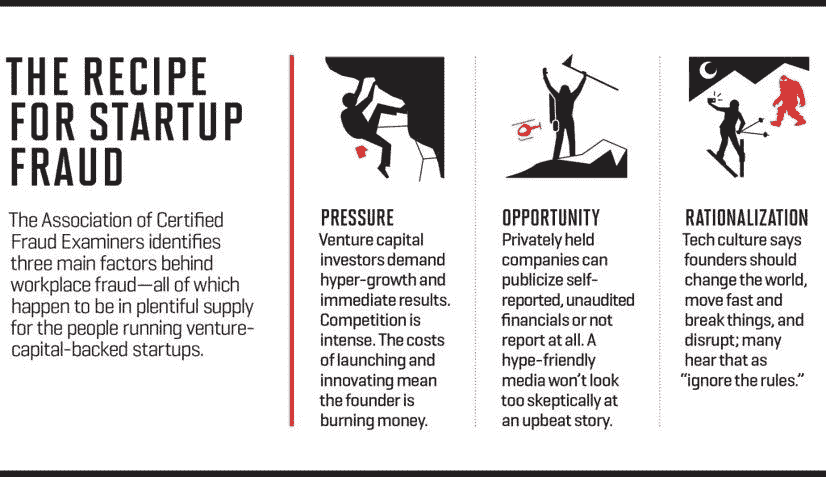
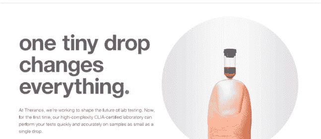
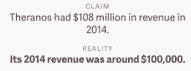
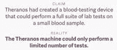
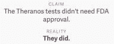

# 快速移动，打破东西。但是后果是什么呢？

> 原文：<https://medium.datadriveninvestor.com/move-fast-break-things-but-what-are-the-consequences-94377b589a16?source=collection_archive---------6----------------------->

布兰登·佩克，阿尼鲁德·斯里达尔:弗吉尼亚大学

我们正在研究硅谷的道德规范，以及“快速行动，打破常规”的模式如何与影响我们物理世界的冒险结合在一起。

你如何区分好的想法和疯狂的想法？

历史上，硅谷以擅长创造消费产品和软件而闻名。如果你看看过去的 20 年，你会发现很多好的想法通过出色的执行变成了成功。这方面的例子有苹果和脸书，他们是各自行业的领导者。我们也可以看看 MySpace 和 YikYak 这样的公司，它们都变成了坏主意。

 [## 波动迫使数据驱动的投资者冷静

### 自然界中很少有东西是直线行进的，尤其是经济。当投资者和消费者希望平静时…

www.datadriveninvestor.com](https://www.datadriveninvestor.com/2019/03/25/volatility-compels-calm-amid-the-storm/) 

好的、坏的和疯狂的想法之间有什么共同点？它们看起来都很有逻辑，并且天生具有吸引力。好主意和坏主意在开始时很难区分，所以坏主意曾经是好主意，但很少被接受，也不再受欢迎。坏主意的反响相对来说是无害的，它们的成功很难预测。这些是说服公司“快速行动，打破常规”的想法。

我们认定所有的科技创业想法都是以一个非常基本的逻辑模型存在的: **P^(P- > Q)** (读作**p****p**暗含 **Q** )。在这里， **P** 代表“我可以建立一个工作技术”，而 **Q** 代表“该技术将会成功”。因此，合乎逻辑的说法是:“我可以建立一个工作技术，如果我这样做了，它将是成功的”。

每种想法类型(好的、坏的和疯狂的)都是用这个模型形成的，但是坏的和疯狂的想法打破了它。坏主意通常会跟随着 P^(P-！Q) ，他们能够构建技术，但后来发现他们不成功。这方面的一个例子是脸书剑桥分析公司丑闻，其中脸书开发了一个工具，允许第三方应用程序开发者在用户同意的情况下接收脸书用户数据。虽然 270，000 名脸书用户同意向剑桥分析公司提供他们的信息，但剑桥分析公司使用用户关系数据来获取 8，700 万脸书用户的信息。这种意想不到的效果给脸书带来了负面影响。当脸书认为如果他们开发了这个功能，就会成功时，却发现事情并非如此。最终，问题得到了解决，脸书的主要后果是声誉恶化，这是他们可以恢复的。

相反，疯狂的想法违反逻辑模型，遵循**！P^(P- > Q)** ，在那里他们甚至无法制造出创造成功技术所需的产品。这种模式建立在错觉的基础上，很快使人们脱离现实。没有现实的约束，这个想法就成了灵丹妙药。Theranos 就是基于这种模式建立的，我们后来解释说，这种模式与一种医疗技术相结合，给公司和受影响的人带来了灾难性的后果。

硅谷有一种忘记可行性的偏见，只关注效用，比如受影响的人数和赚到的钱。效用和可行性之间的这种紧张关系严重偏向于效用一方，因为能够理解和构思一个想法的人比能够想出如何实现它的人多得多。在两者拔河的游戏中，工程师有责任确定技术可行性，并努力对抗公用事业。

([http://fortune.com/silicon-valley-startups-fraud-venture-capital/](http://fortune.com/silicon-valley-startups-fraud-venture-capital/)

[https://www.google.com/url?sa=i&source=images&cd=&cad=rja&uact=8&ved=2ahUKEwia1Jzn3-vhAhUGvVkKHYZ2AucQjRx6BAgBEAU&url=https%3A%2F%2Fliesandstartuppr.blogspot.com%2F2016%2F05%2Ftheranos-101-one-tiny-drop-changes.html&psig=AOvVaw2bOpnXjZ9dnUHDLma8hTaj&ust=1556299026709279](https://www.google.com/url?sa=i&source=images&cd=&cad=rja&uact=8&ved=2ahUKEwia1Jzn3-vhAhUGvVkKHYZ2AucQjRx6BAgBEAU&url=https%3A%2F%2Fliesandstartuppr.blogspot.com%2F2016%2F05%2Ftheranos-101-one-tiny-drop-changes.html&psig=AOvVaw2bOpnXjZ9dnUHDLma8hTaj&ust=1556299026709279)

Theranos 旨在彻底改变我们进行血液测试和理解结果的方式。目前，当一个人想要检查血液标记时，他们必须首先获得医生的同意，然后取得一些血液小瓶。然后，血液由 Quest Diagnostics 或 LabCorp 等公司进行测试，这些公司拥有大型设施，并控制着该行业的大部分市场份额。这就造成了没有保险的情况下验血极其昂贵。

伊丽莎白·霍姆斯出售了一种被称为爱迪生的设备，它可以用一小瓶血液进行 240 种不同的血液测试。她筹集了 6 亿美元，获得了 90 亿美元的估值。然而，这个愿景，就像她的许多想法一样，产生于错觉。从年轻的时候起，福尔摩斯就有理想主义的想法，而这些想法在物理上是不可能创造出来的，

“当她 7 岁时，福尔摩斯试图发明自己的时间机器，用详细的工程图纸填满了整个笔记本。”([https://www . business insider . com/ther anos-founder-CEO-Elizabeth-Holmes-life-story-bio-2018-4 # Holmes-family-moved-when-she-young-from-Washington-DC-to-Houston-2](https://www.businessinsider.com/theranos-founder-ceo-elizabeth-holmes-life-story-bio-2018-4#holmes-family-moved-when-she-was-young-from-washington-dc-to-houston-2))。

虽然对于一个 7 岁的孩子来说，这似乎是无害的，也许令人印象深刻，但这代表了福尔摩斯从未摆脱的思维模式。她希望事情以某种特定的方式运转，这种方式在现实中是没有基础的，这种想法一直延续到大学，在那里她找到一位大学教授，他说:

“她带着一个测试微生物然后输送抗生素的贴片(想法)来找我……我说‘哦，这是个好主意，但行不通。’太天真了。抗生素没有效力。这就是为什么你有大静脉注射袋。"([https://www . refinery 29 . com/en-us/2019/03/226452/Phyllis-Gardner-Elizabeth-Holmes-professor-interview-the-inventor](https://www.refinery29.com/en-us/2019/03/226452/phyllis-gardner-elizabeth-holmes-professor-interview-the-inventor))。

福尔摩斯的头脑受到了理想主义的系统性感染，这种理想主义涌入 Theranos，并驱使该公司与**合作了太长时间！P^(P- > Q)** 型号。脱离现实的想法的种子成长为价值近十亿美元的失败和大规模的欺诈性索赔，

([https://qz.com/1229656/everything-elizabeth-holms-and-theranos-did-wrong-according-to-the-us-securities-and-exchange-comission/](https://qz.com/1229656/everything-elizabeth-holms-and-theranos-did-wrong-according-to-the-us-securities-and-exchange-comission/))

亚历克斯·奥哈尼安(Reddit)如何评价疯狂的想法:

[https://www.youtube.com/watch?v=h_EK6-sab7Q&feature=youtu.be&t=1460](https://www.youtube.com/watch?v=h_EK6-sab7Q&feature=youtu.be&t=1460)

亚历克西斯认识到，最好的想法是那些最初看起来不可实现，但经过进一步分析后实际可行的想法。通过批判性分析这一步是区分好想法和疯狂想法的关键。

随着越来越多的硅谷公司试图直接影响我们的物理世界和人们的生活，投资者和企业家需要做出更好的道德决策。我们已经对许多数据泄露丑闻无动于衷，因为它们不会直接损害我们的日常生活。硅谷的简单解决方案并不总是适用于复杂的问题。例如，Waymo 正试图用自动驾驶汽车彻底改造交通，23andMe 声称，他们可以通过一个看似简单的 DNA 测试告诉你很多关于你健康的信息。需要制定更好的道德标准和决策，因为无人驾驶汽车造成的死亡和不正确的健康结果是不可接受的。这些类型的错误对个人造成很大的伤害。我们作为工程师，决定在旨在解决大问题的初创公司工作，需要为确定创始人主张的可行性承担更大的责任。