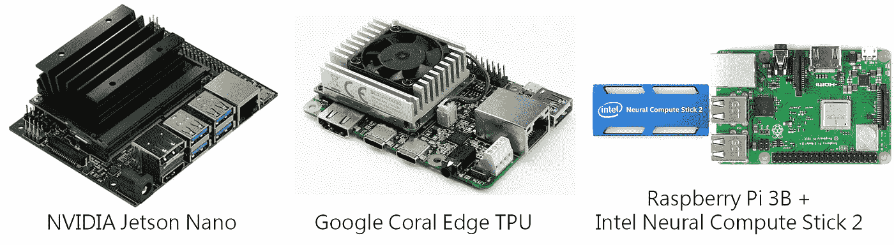
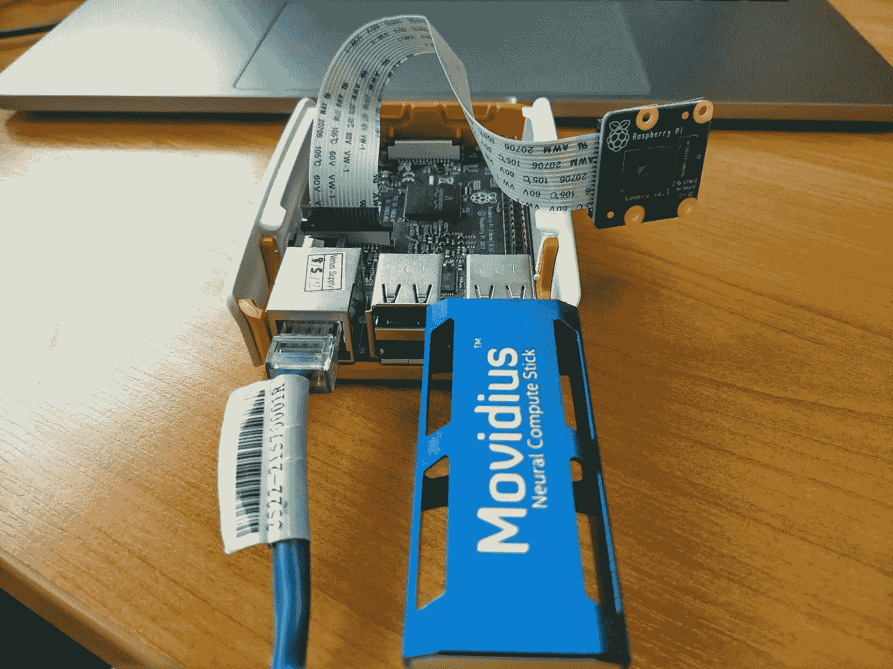
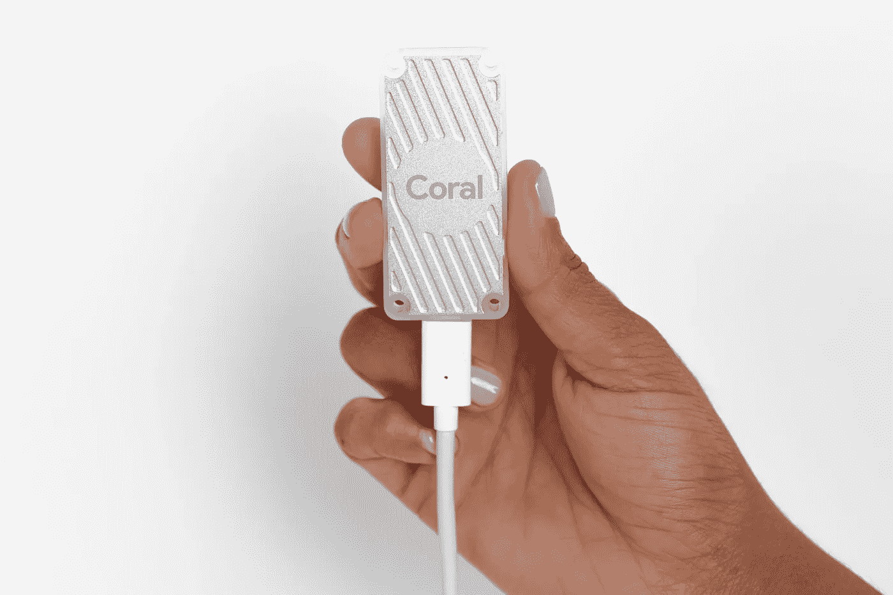
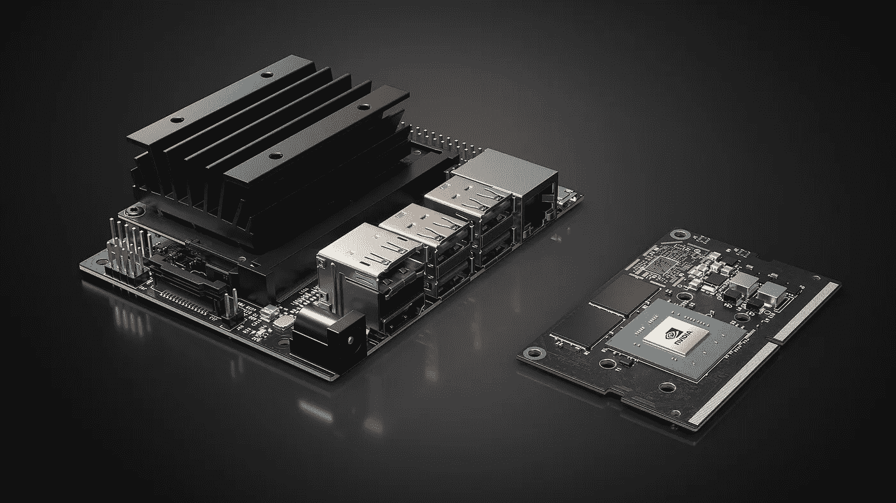

# Movidius NCS(带 Raspberry Pi)与 Google Edge TPU (Coral)和 Nvidia Jetson Nano——快速对比

> 原文：<https://medium.datadriveninvestor.com/movidius-ncs-with-raspberry-pi-vs-818427734d3c?source=collection_archive---------1----------------------->

最近，有很多关于机器学习做人类在工厂、家庭和办公室做的事情的可能性的讨论。随着 [**人工智能**](http://bit.ly/DeepPiCourse) 的进步，人们对人工智能、机器学习和深度学习的能力产生了广泛的恐惧和兴奋。

真正酷的是，深度学习和人工智能模型正在从云和笨重的桌面转向更小、更低功率的硬件。在这篇文章中，我们将帮助你了解三个最主要的深度学习 AI 硬件平台的优势和劣势。

**带树莓 Pi 的英特尔 Movidius 神经计算棒(NCS)**

由英特尔公司开发的 Movidius [**神经计算棒**](http://bit.ly/DeepPiCourse) 可以在没有活跃互联网连接的情况下高效运行。它的计算能力来自 Myriad 2 视觉处理单元(VPU)。它通过正确的工具在开发计算机上提供剖析、调整和编译深度神经网络(DNN)。

 [## 认识 Raspberry Pi——革命性的计算设备|数据驱动的投资者

### 计算机过去笨重、昂贵且难以操作的日子一去不复返了。随着技术的进步…

www.datadriveninvestor.com](https://www.datadriveninvestor.com/2019/01/23/meet-raspberry-pi-a-revolutionary-computing-device/) 

英特尔 NCS 还提供 dnn 的原型制作、验证和部署。低功耗对于自动驾驶和无人驾驶车辆以及物联网设备来说是不可或缺的。对于那些希望开发深度学习推理应用的人来说，NCS 是最节能和低成本的 USB 棒之一。

## **特性**

我们可以把 Movidius NCS 想象成一个装在 u 盘里的 GPU(图形处理器)。人们可以在该单元上快速运行最佳的训练模型，该模型可以用于测试目的。除此之外，Movidius NCS 还提供以下功能:

1.  可以配合 Ubuntu 版或者树莓 Pi3 Raspbian Stretch 使用。
2.  Movidius NCS 轻松支持两个 DNN 框架，即 TensorFlow 和 Caffe。
3.  Movidius Myriad 2 VPU 与基于 Caffe 的卷积神经网络一起有效地工作。
4.  它可以在处理能力较低的系统上高效执行复杂的深度学习模型，包括 SqueezeNet、GoogLeNet、Tiny YOLO、MobilrNet SSD 和 AlexNet。

[The Movidius Neural Compute Stick (NCS) on a Raspberry Pi 3](https://medium.com/@ghimire.aiesecer/getting-started-3-movidius-neural-compute-stick-with-pi-3-raspbian-stretch-desktop-image-38d0fc9f5b74)

## **谷歌边缘 TPU** (又名谷歌珊瑚)

一方面，谷歌云 TPU，也被称为 [**谷歌珊瑚**](http://bit.ly/DeepPiCourse) 是为了比 GPU 或 CPU 更有效地处理工作负载而开发的，它仅限于为服务器机房和主要数据中心供电。谷歌还为小型设备开发了硬件，名为 Edge TPU。谷歌 EDGE TPU 有一个 u 盘版本。

Edge TPU 是 Google 为低端设备上的高性能 ML 推理设计的小型 ASIC。它可以轻松地以 100+ fps 的速度执行最新的移动视觉模型，包括 MobileNet V2。Edge TPU 轻松支持 TensorFlow Lite。第一代 Edge TPU 可以轻松执行包括卷积神经网络(CNN)在内的深度前馈神经网络(DFF)，这使其成为不同基于视觉的 ML 应用的最佳选择。

## **特色**

1.  谷歌边缘 TPU 称赞云 TPU 和谷歌云服务为部署客户基于人工智能的解决方案提供完美的端到端云到边缘硬件和软件基础设施。
2.  Edge TPU 不仅仅是一个硬件。它轻松结合了定制硬件、开放软件和最先进的人工智能算法的力量。它提供高质量的人工智能解决方案。
3.  边缘 TPU 可以帮助发展许多工业用例，包括预测性维护、异常检测、机器人、机器视觉和语音识别等。它适用于制造、医疗保健、零售、智能空间、现场监控和交通部门。

[The Google Coral USB Accelerator](https://coral.withgoogle.com/products/accelerator/)

## NVIDIA Jetson Na 否

NVIDIA 最近宣布了采用 Tegra SOC 的坚固开发板，即[**NVIDIA Jetson Nano**](http://bit.ly/DeepPiCourse)。它是设计师和研究人员为 AI 提供一个易于使用的平台的最佳工具。Jetson Nano 还提供了完全的软件兼容性，更不用说 472 GFLOPS 的计算能力，以及四核 64 位 ARM CPU 和 128 核集成 NVIDIA GPU。Jetson 还配备了充足的 4g lpddr 4 内存，以及低功耗的 5 瓦和 10 瓦电源节点。

## **特性**

NVIDIA Jetson NANO 的兼容性使基于 AI 的工作负载更容易部署到 Jetson。它可以轻松实现多传感器自主机器人和先进的人工智能系统。除此之外，NVIDIA Jetson 还具有以下优势:

## **存储和连接**

Jetson Nano 具有强大的 eMMC 存储功能，并提供额外的 microSD 卡存储选项。该开发套件的连接功能包括四个 USB 3.0 Type-A 端口、一个 HDMI 2.0、显示端口 1.2、一个 40 针接头、MIPI CSI 摄像头连接器、microSD 插槽、M.2 Wi-Fi 插槽和千兆以太网。你不会在飞机上安装集成 Wi-Fi；然而，外部卡会使无线连接更容易。

## **多流视频分析**

Jetson Nano 可以高效地实时处理八个全高清运动视频流。它是网络视频录像机(NVR)、智能摄像机和物联网网关的最佳低功耗智能视频分析平台。Jetson 可以在 8 个 1080p 视频流中快速执行对象检测，基于 ResNet 的模型以每秒至少 500 百万像素的高分辨率运行。

[NVIDIA Jetson Nano Developer Kit](https://www.extremetech.com/computing/288153-hands-on-with-nvidias-new-jetson-nano)

## **总结**

**T** 英特尔 Movidius 神经计算棒(NCS)工作高效，是一款高能效、低成本的 USB 棒，用于开发深度学习推理应用。谷歌边缘 TPU 提供高质量的人工智能解决方案。最后，NVIDIA Jetson Nano 在一个小外形中提供了大量的人工智能功能。因此，这取决于人们愿意使用哪种类型的应用程序，这将决定哪种设备适合他们的需求。

## 要了解更多关于采用英特尔 NCS 的 Raspberry Pi 深度学习的信息，请点击此处