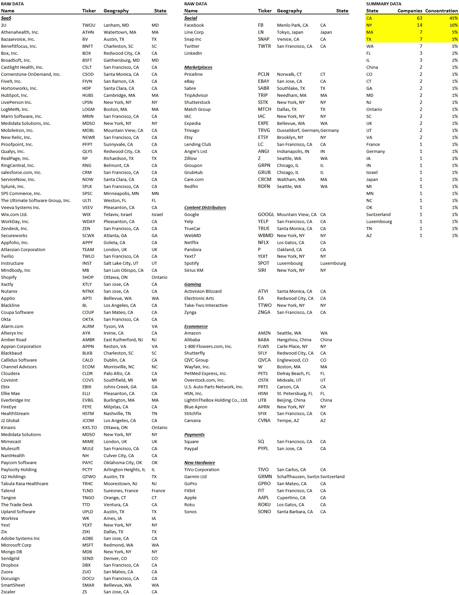

# 搬到加州会大大增加你的机会

> 原文：<https://medium.datadriveninvestor.com/moving-to-california-improves-your-odds-dramatically-c55390958e6a?source=collection_archive---------21----------------------->

“aerial shot photo of Golden Gate Bridge” by [Michal Pechardo](https://unsplash.com/@michalp24?utm_source=medium&utm_medium=referral) on [Unsplash](https://unsplash.com?utm_source=medium&utm_medium=referral)

加州一直是风险投资的磁石，每年吸引所有风险投资的 50%到 60%。但是，这是否意味着加州是最成功的科技公司所在的地方？毕竟，筹集资金并不等同于成功。

为了回答这个问题，我们研究了 139 家上市科技公司的总部，分别位于 SaaS (83 家)、社交媒体(4 家)、市场(17 家)、内容分发(9 家)、游戏(4 家)、电子商务(14 家)、支付(2 家)和新硬件(7 家)。这些都是科技界最著名的名字，所以不用说，如果你在这些上市公司，你就是成功的。下面左边是原始数据，右边是汇总数据。

主要观察结果如下:

加利福尼亚占主导地位。在 139 家公司中，有 63 家位于加州(45%)。第二大集中地是纽约市(14 家公司占 10%)，接下来是德克萨斯州和马萨诸塞州(各占 5%)。加州无疑是大多数最成功的科技公司的所在地，其规模几乎是第二名的 4 倍。

**有一些例外。**有趣的是，我们数据集中的市场和电子商务领域并没有显示出集中在加利福尼亚或其他任何州。17 家上市公司中只有两家在加州。14 家电子商务公司中只有 3 家在加州。我们不清楚为什么这两个部分都集中在加利福尼亚。

总之，几十年来，风投资金一直流向加州，我们跟踪的成功科技公司中，几乎一半都位于那里。无论是首都、硅谷文化、开发人员/工程师的优势，还是水中有什么东西，很容易相信在加州确实会提高成功的几率。如果可以的话，去那里。

【blossomstreetventures.com 拜访我们