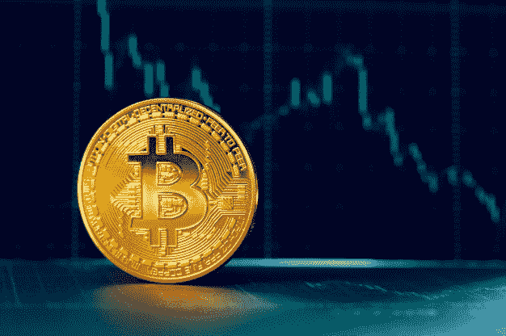
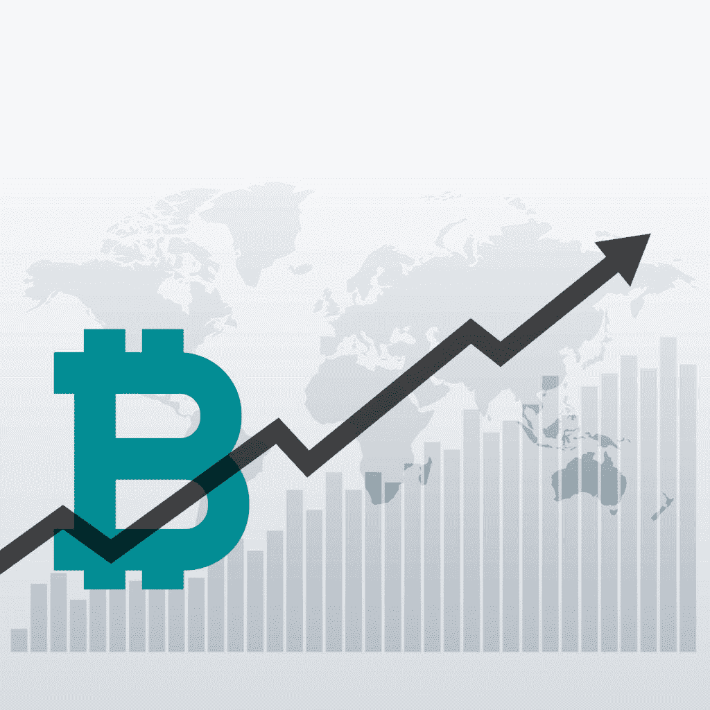

# 走向下一个比特币减半事件

> 原文：<https://medium.datadriveninvestor.com/moving-towards-the-next-bitcoin-halving-event-c937edbcb730?source=collection_archive---------5----------------------->

Image by [Fabrikasimf](https://www.freepik.com/fabrikasimf) on [Freepik](https://www.freepik.com/premium-photo/bitcoin-chart_4902201.htm#page=2&query=bitcoin+mining&position=19)

## 用外行的术语解释比特币减半

比特币减半是指有计划地减少被开采并进入流通的新比特币的数量。

我喜欢把它想象成一个碗和一个水龙头。碗代表已经开采并进入流通的比特币数量。到 2019 年 2 月，大约有 1750 万个比特币被挖掘出来。水龙头代表了目前正在开采的新比特币，这些比特币正在流入碗中，实际上正在进入流通领域。

随着时间的推移，这个水龙头正在慢慢关闭。这就是所谓的比特币减半。每隔 4 年，这个喷嘴就会关闭一点点，直到下一个世纪，这个喷嘴将完全关闭，不再有比特币被创造出来并进入流通。我们在碗里剩下的将是比特币的最大供应量，也就是 2100 万。

## 比特币减半的技术基础

当中本聪在 2009 年首次创造比特币时，他做了一个去中心化的设计，比特币可以在没有任何个人或群体参与的情况下分发。比特币挖矿的创新理念是，矿工将获得比特币，作为通过验证比特币交易成功生成新区块的奖励。

 [## 总部位于瑞士的 ETP 进入加密交易市场|数据驱动的投资者

### 虽然金融市场几乎没有沉闷的时刻，特别是在引入…

www.datadriveninvestor.com](https://www.datadriveninvestor.com/2019/03/10/swiss-based-etp-enters-the-crypto-trading-market/) 

为了确定这些比特币将如何在矿工中分配，中本聪在比特币协议中设置了一些规则。第一个规则是比特币将有 2100 万的限量供应，即全球只能创造和开采 2100 万个比特币。第二条规则是，比特币区块链每开采出 21 万个区块，比特币奖励就会减半。这种情况将持续下去，直到 2100 万枚比特币全部被开采。

这种每挖掘 21 万个比特币，比特币奖励就减半的事件，被称为比特币减半。

最初，当比特币在 2009 年问世时，矿工们过去常常会获得 50 个比特币作为成功开采一个区块的奖励。第一次比特币减半发生在 2012 年，当时比特币奖励从 50 个比特币减少到 25 个比特币。第二次比特币减半事件发生在 2016 年年中，区块编号为 420001，当时比特币奖励进一步降低至 12.5 个比特币。通过这种方式，比特币奖励将在每开采 210，000 个区块后继续减半，直到所有 2100 万个比特币被开采。预计这将发生在 2140 年。

## 为什么比特币的供应量有限？

这里的关键问题是，为什么比特币的供应从一开始就受到限制，为什么这个减半事件成立？简单的答案在于供求规律。如果比特币的供应是无限的，并且它是以快速的速度持续产生的，没有任何减半事件，那么太多的比特币将立即进入市场流通，将其价值降至最低。

让我们以法定货币为例，这种货币的供应量是无限的，因为中央银行可以随心所欲地印刷这些货币。这是传统法定货币的根本缺陷，根据供求定律，如果央行印刷的货币超过需求，其价值将开始下降。因此，如果某种法定货币的发行量持续增加，其购买力就会持续下降。这就是导致通货膨胀的原因。

中本聪创造了比特币，牢记法定货币导致通货膨胀的错误。比特币遵循黄金等商品的机制。黄金在地球上的供应量有限，而且开始时很容易开采。但是随着越来越多的黄金被开采，提取和开采新的黄金变得更加困难。由于地球上的黄金供应有限，所以它能够在过去的 6000 年里保持其价值。为了利用这一特性，中本聪通过限制比特币的供应量，赋予其价值储存手段，并随着越来越多的比特币流通，加大挖掘比特币的难度，从而使比特币的属性类似于黄金。其目的是比特币也可以像黄金一样保持其价值。

Photo by [Starline](https://www.freepik.com/starline) on [Freepik](https://www.freepik.com/free-vector/bitcoin-upward-growth-chart-design-background_2393297.htm#page=1&query=price%20chart&position=3)

## 2020 年下一个比特币减半会有什么影响？

如果我们观察比特币的价格走势图历史，它的价格这些年来也是整体上涨的，就像黄金一样。事实上，每次减半事件后，比特币的价格都会以更快的速度上涨。到目前为止，已经发生了 2 次减半事件，每次比特币价格都在前一次减半后达到峰值。

第三次比特币减半预计发生在 2020 年 5 月。如果这一次，比特币遵循前两次减半事件的价格模式，其价格可能会升至 11，000 美元至 16，000 美元。在减半之后，到 2020 年 12 月或 2021 年初，每比特币 19000 美元的历史最高纪录有可能被打破。

但是记住，这只是一种看法。这不是理财建议，我也不是理财顾问。

*原载于 2019 年 11 月 24 日*[*【https://opinined.com】*](https://opinined.com/moving-towards-the-next-bitcoin-halving-event/)*。*