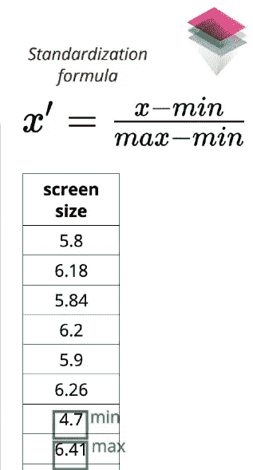
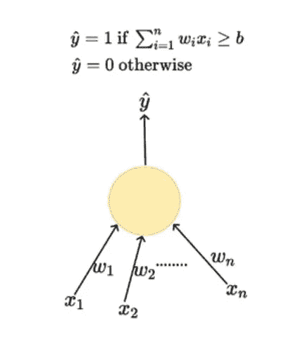
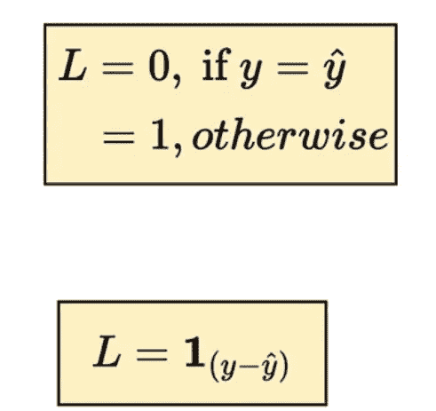
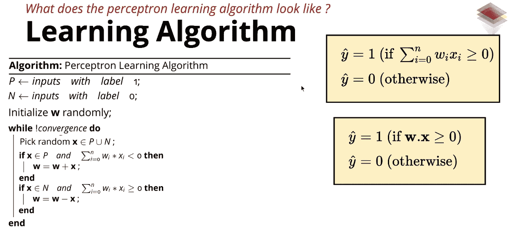

# MP 神经元和感知器

> 原文：<https://medium.datadriveninvestor.com/mp-neuron-and-perceptron-98abbd542e47?source=collection_archive---------0----------------------->

***参考 Mitesh Khapra 教授和 Pratyush Kumar*** 的会议

# **MP 神经元模型**

麦卡洛克-皮茨神经元模型与上世纪 90 年代沃尔特·麦卡洛克和沃伦·皮茨提出的理论有关。它类似于生物学中的人类神经元，由轴突、胞体等组成。这些被映射到神经网络的功能。

MP 神经元模型是根据早期发表的 [***六罐机器学习***](https://medium.com/@nitinnaidu/six-jars-of-machine-learning-2dd5a72ca1b) 实现的。

1)数据

MP 神经元接受二进制输入并给出二进制输出。如果输入数据不是二进制的，则可以在输入到模型之前将其压缩为二进制。

**2)分类-**

分类也是二进制的，即 0 或 1。该模型可以基于输入和阈值给出是或否的答案。

 [## 投资算法快速指南-数据驱动投资者

### 让我们想象一下 30 年前的股票市场:让我们想象一下现在:像现在的许多其他领域一样，投资市场已经…

www.datadriveninvestor.com](https://www.datadriveninvestor.com/2019/01/31/a-quick-guide-to-investment-algorithms/) 

**3)型号-**

Image credit: One Fourth Labs

它由一个只有一个参数的函数组成。输入被聚合(g)。有一个确定的阈值。如果函数值等于或大于阈值，则输出为正，反之亦然。

MP 神经元模型基本上画了一条线，其中正值在线上或在线上，而负值在线下。

**4)损失函数-**

应用平方损失函数。它将预测值和实际预测值之间的差值作为一个平方。

**5)学习-**

Image credit: One Fourth Labs

MP 神经元的学习包括寻找预测误差最小的阈值。这是对单个参数的强力操作。

**6)准确性-**

准确度由正确预测数除以预测总数的标准矩阵给出。

MP 神经元基本上有助于找到一条将正值与负值分开的线。

MP 神经元的缺点是-

1.  布尔输入和输出。
2.  固定斜率
3.  很少可能被拦截
4.  固定参数

# **感知器**

感知器算法是 1957 年由 T2 的弗兰克·罗森布拉特在 T4 的康乃尔航空实验室发明的，由美国海军研究办公室资助。感知器也是生物[神经元](https://en.wikipedia.org/wiki/Neuron)的简化模型

感知器模型符合如下六个罐子:

**1)数据-**

数据可以灵活地使用二进制以外的值。这些输入被标准化以将其输入到函数中。

Image credit: One Fourth Labs

标准化公式由 x' = x-min/max-min 给出，其中 x 是输入值，min 是该特定特征的最小值，max 是该特定特征的最大值。这确保了输入具有压缩的值。与特征相关联的权重有助于给特征赋予负值或正值，这又会影响最终值，从而越过阈值或低于阈值。

**2)分类-**

分类是基于输入的二元分类。

**3)型号-**

该模型是可以具有多个参数(权重)的函数。该模型作为输入和参数(权重)的乘积的加法。基于其对最终预测的正面影响或负面影响，权重可以是正面的或负面的。

Image credit: One Fourth Labs

如果结果大于阈值，则它对应于特定的二进制输出，反之亦然。

**4)损失函数-**

Image credit: One Fourth Labs

损失计算如下:

如果与真实输出有偏差，损耗值为 1。如果它与实际产量相同，损失值为零。损失值告诉模型需要做一些修正。为了校正，调整权重或阈值。

**5)学习-**

学习参数的一般方法如下:

对于给定的输入和权重，找到损失。如果损失很高，则通过反复迭代数据直到满意为止来找到理想的参数。一旦损失相对可以忽略不计。选择理想的参数。

Image credit: One Fourth Labs

感知器参数的学习方法如下:

输入以及计算的权重。如果权重和输入的乘积小于零，而它应该是正的，则减去权重。如果乘法大于等于零，而它应该是负的，则减去权重。这发生在寻找理想参数(即理想权重)的 while 函数中。当所有输入被正确分类时，算法收敛。

参数(权重)加减说明-

如果该值介于 0 和 1 之间，则该角度为锐角，即介于 0 和 90 度之间。然而，如果它在-1 和 0 之间，它是钝角，即在 90 和 180 度之间。做减法和加法是为了得到正确的角度，从而得到正确的输出。

学习算法只有在数据是线性可分的情况下才会起作用。

**6)准确度-**

准确度由正确预测数除以预测总数的标准矩阵给出。

感知器的缺点是-

图中的点应以线性方式正负分离。

这总结了 MP 神经元和感知器在深度学习中应用的六个罐子。

**参考文献:**

1.  四分之一实验室的深度学习
2.  维基百科(一个基于 wiki 技术的多语言的百科全书协作计划ˌ也是一部用不同语言写成的网络百科全书ˌ 其目标及宗旨是为全人类提供自由的百科全书)ˌ开放性的百科全书