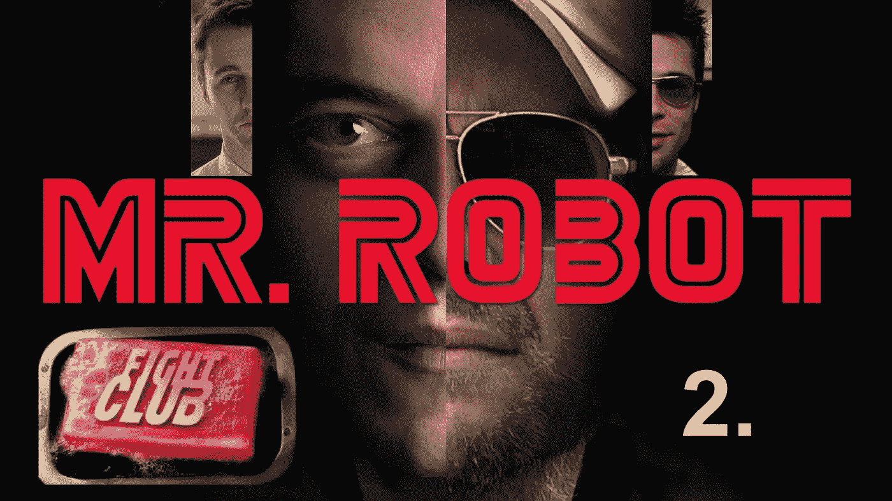
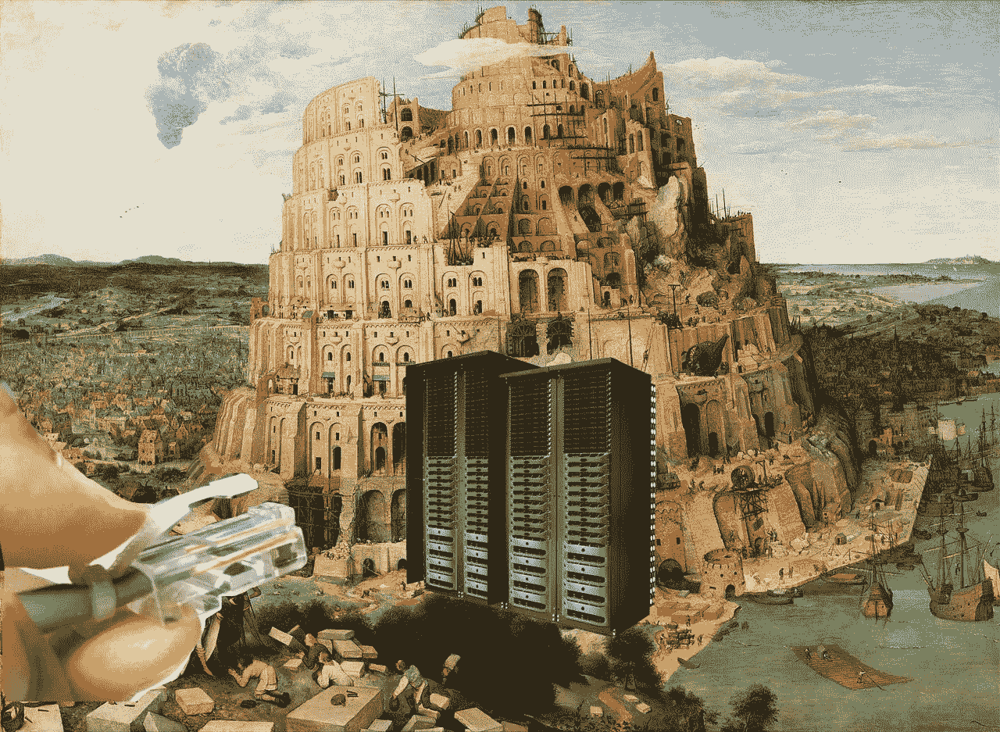

# 机器人先生平行叙事金融危机 2.0

> 原文：<https://medium.datadriveninvestor.com/mr-robot-paralelle-narrative-financial-crisis-2-0-fdfbf523b667?source=collection_archive---------1----------------------->

collage from Google images found artworks.

# “在社会发生任何巨大变化之前。必须有一个叙述。”匿名。

在电影《搏击俱乐部》中，有三个明显的受益人，他们都是患有分裂型人格障碍的脱节角色。

大混乱计划；结果——本土恐怖分子/爱国者法案

 [## 网络安全非营利组织帮助中小企业打击网络犯罪|数据驱动的投资者

### 一个名为全球网络联盟(GCA)的非营利组织发誓要改善…

www.datadriveninvestor.com](https://www.datadriveninvestor.com/2019/02/22/cybersecurity-non-profit-to-help-smes-fight-against-cybercrime/) 

搏击俱乐部；结果——UFC 和 MMA 的受欢迎程度

打击银行以释放世界债务；成果——2008 年 9 月 9 日至 11 日，GFC 双子塔。

google images found image

现在由马特·布伦南|汤普森在好莱坞讨论的机器人先生！2015 年 11 月 3 日上午 9 点

> [《机器人先生》(Mr. Robot)由山姆·艾斯梅尔创作，也关注流离失所的身份和债务奴役，但直到前面提到的《叮叮当当的钢琴声》，我才开始把它看作是对《搏击俱乐部》(Fight Club)的一种连续致敬，为数字时代做了更新。在精彩的第一季中，埃利奥特在神秘的机器人先生(克里斯汀·史莱特饰)的鼓励下，加入了一个名为 fsociety 的义务警员黑客团体，试图搞垮世界上最大的企业集团 E Corp——取消该公司持有的所有债务，并在此过程中重创全球经济"](http://blogs.indiewire.com/thompsononhollywood/the-anarchy-of-influence-on-fight-club-mr-robot-and-the-leftovers-video-20151103)

**现在我们都知道有模仿也有影响。**

这种机器人先生的叙事是否会引发全球混乱，从而引发足够的动荡，让人们接受纯粹野蛮的变革？

例如像一场世界大战，全球性的金融危机。联邦应急管理局营地和大规模难民安置计划。

一种斯大林主义(索罗斯)世界政府，用古拉格集中营关押持不同政见者、艺术家和反对派而不受惩罚。

或者这是自恋的事实，关于我们在我们的脑海中走向哪里，以不断的科幻小说参考，数字世界是新的巴比伦塔，我们会因为相信服务器塔会找到上帝而失去这一切？

Pieter_Bruegel_the_Elder_-_The_Tower_of_Babel_(Vienna)_-_Google_Art_Project_-_edited collage google images

# 精神食粮？

《机器人先生》第四季的最终结局似乎是，在烂番茄电视台的预告片中，一个恶意软件攻击了(包括所有主要公司谷歌/拜耳/孟山都/FAANG/特斯拉等的集团代表)，在该系列中表现为*“邪恶公司”*。

从我从预告片中收集的信息来看，基本上是在《搏击俱乐部》中，角色 ***【埃利奥特】*** 意识到另一个自我就是他自己(和《搏击俱乐部》一样)。一些恶意软件对银行业的破坏。政府指责伊朗发动了战争。埃利奥特还开枪自杀，这是一个直接引用搏击俱乐部结局，这是潜意识隐喻流行文化比喻引用搏击俱乐部流派弯曲的电影。

Rotten Tomatoes TV youtube trailer.

我可能完全错了？但这难道不是正在进行的 2020 偏见媒体议程，兜售 2020 年 12 月/1 月金融部门的重大变革吗？事实上，美国股票市场有一个**暴跌保护团队**，它知道它将用尽柱塞来保持华尔街的污水向上流动。

因此，在猜测中，有可能引入国际货币基金组织的特别提款权。总统召开紧急会议讨论北约全球主义议程。

其他各种本土恐怖主义和枪击事件在美国生活中变得无处不在。

我能看到的唯一的扳手是奇怪的变性中国亿万富翁和他们对恶意软件和金钱再分配的干涉。对纽约军事戒严法的其他引用和所有媒体的其他比喻肯定会在这个最后的系列中被探究。