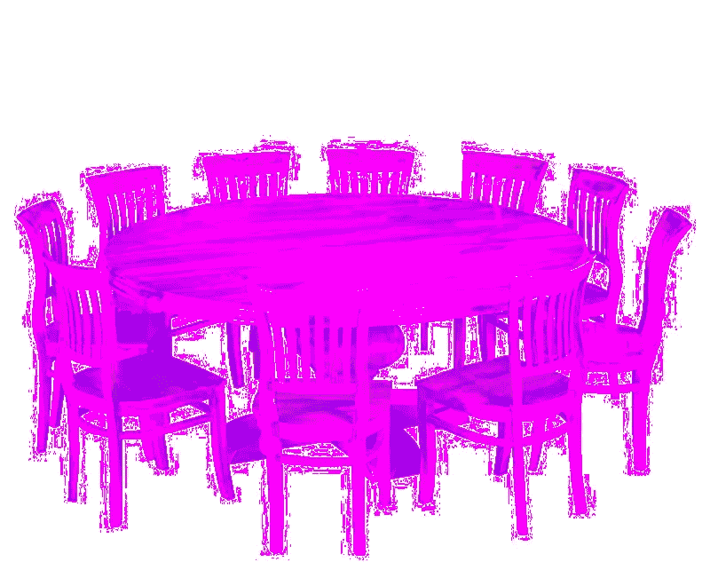

# 我们的网络世界会和我们今天所知道的有所不同吗？

> 原文：<https://medium.datadriveninvestor.com/muezzin-will-we-change-the-online-world-as-we-have-come-to-know-it-772a863df17b?source=collection_archive---------1----------------------->

King Arthur recognized the value of more then one voice.

如果更多的人因为分享而获得经济回报会怎么样？如果任何人都可以很容易地建立更有建设性的联系呢？如果我们所有人都可以发现和享受与我们志趣相投的人，那会怎么样？如果我们能在家乡发现其他类型的兴趣会怎么样？如果所有这些网络巨魔都被追究责任会怎样？

谁知道未来几年会发生什么。文化一直在变化，随着这些变化，态度需要不同的方法来解决问题。接下来会发生什么？今天的表情符号会被 3d 跳跃袋鼠取代吗？或者，我们会决定放弃速度与激情，回归更稳重的生活方式，以更欣赏文字的方式拒绝今天的玩具吗？

需求改变了，生存技巧也随之改变。对于今天的青少年来说，敲屏幕是真实的。市场观察者密切关注行为，导致服务不断调整，有些是破坏性的，有些只是调整。

我们真的不能指望今天的问题的答案保持不变…毕竟，这就是为什么青少年被发明出来:让我们这些老一代疯狂。对于我们这些观察者来说，我们很难满足年轻一代的需求。

针对企业的“精益创业”项目在通过持续的市场访谈帮助定义需求方面尤其有价值。有时候，要深入到经验不足的受访者之外需要更多的时间。它需要视觉，需要连接模糊点的能力。那种点，不太有经验的市场在被眼前淹没的时候可能永远看不到。

未来的互联网会提供什么？这是它的奇迹。未来的挑战。有一点是肯定的，问题依然存在，每天都有答案。正如斯坦利轮船的发明一样，自动驾驶汽车很可能会出现在我们的未来。互联网仍处于起步阶段，除了今天的安全问题之外，还有许多问题需要解决。有几代人在排队回答我们目前无法猜测的问题。

除此之外，不要做任何假设，变化是一个常数。问题，或者如我们在创业领域所称的痛苦，总是会出现。今天的一个大问题是富人和穷人之间的差距越来越大。很大一部分原因是，太少的人控制了太多的东西。结果是经济多样性减少。如果使用得当，互联网可以通过为更多的人提供更多的渠道来改变这一现实。目前，“大”已经变得越来越大，控制着我们任何人都无法想象的日常生活的方方面面。我们屈服了吗？或者，我们是否在变化最有影响力的地方做出了改变？

我对经济差距问题的答案在于提供一张更好的桌子，只需投入最少的时间，桌子周围的所有座位都很容易坐满。

欢迎来到按地区筛选的“兴趣媒体”。

*约翰科尔，*[*Muezbiz.com*](http://muezbiz.com/)

Muezbiz 是一家初创公司。所有新成员的加入都被转发到圣达菲民间/美洲对话时间线。可以通过顶部成员名称下的首选项菜单随时更改默认值。“在音乐对话中结识当地朋友。分享你喜欢的音乐来赚钱。”

*我更多的流浪:*

[*拾音器:来自麦克风的麦克风*](https://medium.com/@john_cole/the-tip-jar-microphones-from-a-microphobe-85227b32be57)

[*小费罐:字面意思小费罐*](https://medium.com/@john_cole/the-tip-jar-literally-the-tip-jar-fc13c8757a89)

[*小费罐:得到了反馈，还有均衡器？*](https://medium.com/@john_cole/the-tip-jar-got-feedback-and-equalizer-f4b93d69f639)

[*为了对音乐的热爱:一起成长一个社区*](https://medium.com/@john_cole/for-the-love-of-music-growing-a-community-together-b4773e33bc43)

[*出于对音乐的热爱:为什么做音乐人谋生这么难？*](https://medium.com/@john_cole/for-the-love-of-music-why-is-it-so-hard-to-make-a-living-being-a-musician-4a7af7fcd07)