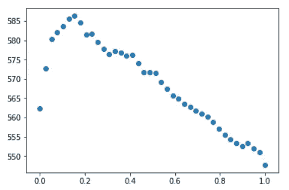
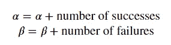

# 多臂强盗算法

> 原文：<https://medium.datadriveninvestor.com/multi-armed-bandit-algorithms-ae174ecdee25?source=collection_archive---------3----------------------->

## 勘探与开发的权衡


Photo by [Aysha Begum](https://unsplash.com/@aysha_be?utm_source=medium&utm_medium=referral) on [Unsplash](https://unsplash.com?utm_source=medium&utm_medium=referral)

我喜欢在本地用户组会议上发言。以下是我关于多臂强盗算法的最新报告的笔记。诚然，这是教科书上的内容，但即使是经验丰富的数据科学家也应该记住这些基础知识，特别是如果他们在日常工作中不使用它的话。你可以在[我的 github 库](https://github.com/mlarionov/presentations/blob/master/multiarmed_bandit/multiarm_bandit.ipynb)找到 Jupyter 笔记本。

# 问题陈述

**多臂 bandit:** 一个假想的吃角子老虎机，有多个臂供顾客选择，每个臂都有不同的收益，这里被视为一个多治疗实验的类比。每一方都有一个未知获胜概率，或者一般来说，一个未知的预期收益。你只有有限的尝试次数。你的目标是收益最大化。

该算法用于决策支持系统，包括 A/B 测试和强化学习。

# 勘探与开发的权衡

当我们没有数据时，除了探索，我们别无选择。我们承诺最有利的解决方案并进入开发阶段需要多长时间？如果我们持续探索太长时间，我们会因为故意选择随机选项而错过机会，即使大多数选项都不是最优的。另一方面，过早承诺可能会导致承诺一个次优选项，而这个选项在实验的早期阶段碰巧表现得更好。Bandit 算法代表了一种折衷，当我们继续探索时，会优先选择在那个时刻显示出最佳结果的选项。我们将在下面讨论其中的两种算法。之后，我们将使用 python 测试这两种算法。

# ε-贪婪算法

1.  生成一个介于 0 和 1 之间的随机数。
2.  如果数字介于 0 和 epsilon 之间(其中 epsilon 是介于 0 和 1 之间的数字，通常相当小)，随机选择“手臂”
3.  如果数字≥ε，显示迄今为止奖励最高的报价。

# 汤普森取样

在每一步之后，我们都要重新评估每个“手臂”的预期回报，然后选择预期回报最高的“手臂”。举个例子，假设你能赢`$0`、`$1`、`$5`或者`$10`。那么如果各自的概率是 p0，p1，p5 和 p10，那么期望的回报是:

现在，我们不使用概率 p 的点估计，而是从后验分布中抽取样本。

提醒你一下贝叶斯法则:

奖励的概率遵循多项分布(或二项式分布，如果我们只能有固定价值的奖励)。我们接受奖励#1 n1 次、奖励#2 n2 次等的概率。是:

这里

参数 q 的先验分布是狄利克雷分布:

由于在开始与多臂土匪互动之前，我们对它一无所知，因此将所有αα设置为相同的值是有意义的，例如，设置为 1。

由于狄利克雷分布是多项式分布的共轭先验分布，后验分布也是狄利克雷分布，其参数按给定类别中事件的数量递增。

所以算法如下:

1.  对于每个臂，重新计算后验分布的参数
2.  对于每只手臂，从后验分布中抽取一个样本
3.  计算每只手臂的预期奖励
4.  选择预期奖励最高的手臂

随着后验分布参数的增加，分布越来越窄，勘探元素自然减少，有利于开发。

在我们的 python 例子中，我们将使用固定的奖励，因此我们将使用二项式分布而不是多项式分布，并且我们将使用 beta 分布而不是 Dirichlet 分布。

# 天真的方法

在这种方法中，我们将探索 10 次，然后选择最佳选项。我们在这里说明了“先勘探，后开发”的简单方法可能不是最佳的，尤其是当数据生成过程接近时。

```
A: 0 B: 0
A: 1 B: 1
A: 1 B: 0
A: 1 B: 0
A: 1 B: 0
A: 1 B: 0
A: 0 B: 1
A: 0 B: 0
A: 1 B: 0
A: 0 B: 1
```

如你所见，尽管第二只手的概率更高，但在最初的 10 次试验中，弱手得到了更好的回报。

接下来我们将尝试ε-贪婪策略，并将尝试看看ε的最佳值是什么。

# ε-贪婪算法

接下来，我们将演示ε-贪婪算法

```
(519, 999, 1)
```

不太好。但是看，因为ε是零，它坚持它的第一选择，在我们的例子中是更差的臂。让我们试着增加ε，看看是否能得到更好的结果

```
(583, 277, 723)
```

这样更好！我们不仅有更多的钱，而且我们还有更喜欢第二臂的算法。这意味着算法已经学习了哪只手臂更好。让我们看看不同ε值的结果:



这似乎是随着ε增加，性能通常会恶化。让我们来看看ϵ的最佳价值

```
best_epsilon = eps[np.argmax(results)]
best_epsilon0.15384615384615385
```

最佳平均回报是:

```
best_reward = np.max(results)
best_reward586.28
```

# 汤普森取样

由于每个臂都有固定的报酬，其分布可以建模为伯努利分布，对应的共轭先验是贝塔分布。它有两个参数α和β:

无信息先验对应于α和β都等于 1。使用以下简单规则更新后验分布的参数:



```
thompson(p_a, p_b, 1000)(603, 191, 809)
```

我们可以看到它更倾向于第二个臂。让我们运行多次，看看平均回报是多少

```
**for** seed **in** range(1000):
    random.seed(seed)
    np.random.seed(seed)
    attempts.append(thompson(p_a, p_b, 1000)[0])
print(np.mean(attempts))584.7009090909091
```

它几乎与ε-贪婪算法的最佳回报完全相同，但这里的区别是，我们不需要进行超参数调整。当我们没有机会尝试不同的ϵϵ值时，Thompson 抽样几乎总是比ε-greedy 方法表现得更好

# 结论和进一步研究

我们已经陈述了多臂强盗的问题，并提供了一些带有 python 代码的算法。在这两种方法中，Thompson 采样给出了更好的结果，但是计算量更大一些。

这个主题在 20 世纪初就被探索过，但最近由于强化学习的需要而成为一个活跃的主题，特别是在**上下文强盗**算法领域，当你也有一个输入向量 X 作为做出正确选择的额外帮助时。

# 参考

1.  *数据科学家实用统计学:50 个基本概念*作者:Peter Bruce，Andrew Bruce
2.  【https://en.wikipedia.org/wiki/Multi-armed_bandit 