# 多标签分类:案例研究(StackOverflow 标签预测器)

> 原文：<https://medium.datadriveninvestor.com/multi-label-classification-case-study-stackoverflow-tag-predictor-832bb6bc18db?source=collection_archive---------0----------------------->

*其不是多级分类！* *想了解更多，请在我整理你那些混乱的推论时，在整篇文章中跋涉前行。*

Photo by Elvis Bekmanis, Unsplash

由于数据科学的无数应用，它对许多人来说非常有吸引力。基于历史数据预测事件发生的旅程通常从非常简单的是或否预测开始，也称为二元分类&预测多少？也称为回归。这些是任何数据科学家的面包和黄油。许多机器学习工程师在他们职业生涯的初始阶段都在分析这种规模的问题。

当手头的问题相当具有挑战性时，肾上腺素就会发挥作用。有许多这样的问题处于危险之中，也有许多这样的需求，这些问题不太普遍，但解决起来很有趣。

 [## 机器学习对外汇交易的挑战——数据驱动的投资者

### 机器学习是人工智能的一个分支，之前占据了很多头条。人们是…

www.datadriveninvestor.com](https://www.datadriveninvestor.com/2019/02/18/the-challenge-of-forex-trading-for-machine-learning/) 

# 那么，什么是多标签分类呢？

Photo Courtesy : google images

让我们看看上面的图像。假设，我问你这个图像是否包含一辆汽车。一个简单的二元分类问题将预测“是”或“1”。

但是，如果我想理解这个图像的所有相关标签呢？

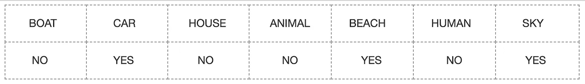

使用简单的二元分类来预测多个标签是对多标签分类非常天真的解释。直观地说，使用这种分类，我们可以推断出给定样品的许多或几乎所有属性。我们最终使用一个复杂的算法解决了一个复杂的问题。

另一个多标签分类的经典例子是预测社交平台上的查询标签。

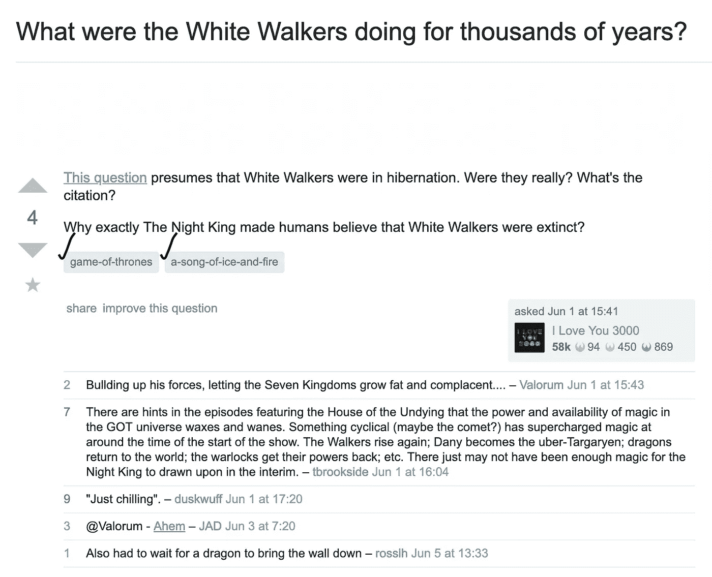

Photo Courtesy : Stack Exchange

# 二进制 v/s 多类 v/s 多标签

为了更好地理解，考虑上面讨论的汽车的图像

> ***-二元分类:***
> 我们可能预测 1 个标签(从一组 2 个结果中)
> 给定图像是否有汽车:是/否
> 
> ***-多类分类:***
> 我们可能预测 1 个标签(从一组 n 个结果中:其中 n 个> 2)
> 汽车的颜色是什么:蓝色/红色/绿色/黄色
> 
> ***-多标签分类:***
> 我们可能预测到> 1 个标签(从一组 n 个结果中)
> 你在这幅图像中看到了什么:汽车、天空、道路、轮胎、海滩。

# 如何解决多标签分类问题？

为了解决多标签分类问题，我们可以将其修改为二元分类问题或多类分类问题。这使我们能够利用所有可用的现有算法。

Scikit-learn 有一个单独的库***sci kit-multi learn***用于多标签分类。

为了更详细地理解，让我们考虑这个数据矩阵，其中 X 是输入实例，Y 是要预测的标签。

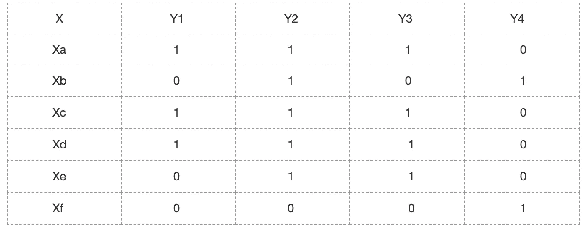

# ***方法 1:二元关联***

这是最容易和最简单的技术，其中我们将每个标签视为单独的单类分类问题，从而产生 4 个不同的单独的二元分类。

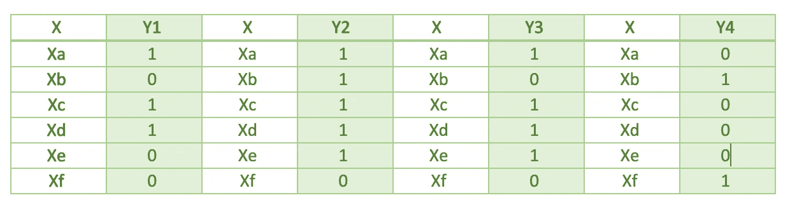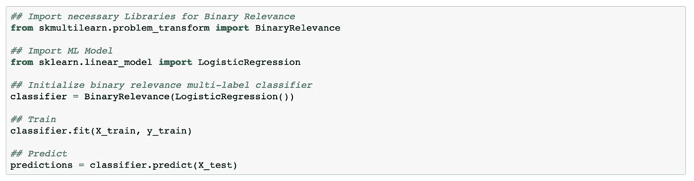

我使用线性回归只是作为一个例子，随意用任何其他分类算法来代替它。

> **优点:**
> 当标签数量相对较少时，工作起来像魔术一样，因为要建立的二进制分类模型的数量相当少。
> 
> **缺点:**当我们有大量的标签要预测时，二元相关性就完全失效了。比方说，我有 42000 个标签。我需要建立 42，000 个不同的二元分类模型，这是非常困难的。

# 方法 2:分类器链

一个非常有趣的技术试图帮助多标签分类。这种方法还包括为“n”个不同的标签构建“n”个模型。尽管与二进制相关性相比，构建的模型数量是相同的，但在这里，构建模型的模式是完全不同的。

我们使用输入实例将模型 A 构建为二进制分类模型，我们尝试仅预测 1 个标签作为输出。接下来考虑输入实例以及模型 A 的输出作为模型 B 的输入来预测另一个标签。这个链继续下去，直到我们以(n-1)个标签的输入实例作为输入单元，第 n 个标签作为要预测的输出而结束。

因此，它非常类似于二元相关性，唯一的区别是它形成链以保持标签相关性。

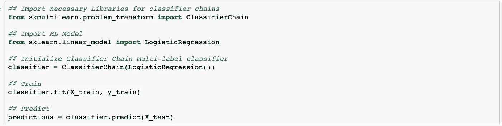

> **优点:**
> **1。我们可以保持标签相关性。
> ②**。**当标签数量相对较少且相关时，效果非常好。**
> 
> **缺点:**
> ***1。当我们有大量的标签需要预测时，我们会感到不适。比方说，我有 42000 个标签。我需要建立 42，000 个不同的分类模型，这非常困难。
> **2。**当标签没有任何相关性时，使用这种方法是没有用的。***

# 方法 3:标记 Powerset

前两种方法涉及利用二元分类进行多标签分类。这种方法致力于使用多类分类技术来解决这个问题。

在数据中找到的所有独特标签组合上训练多类分类器。

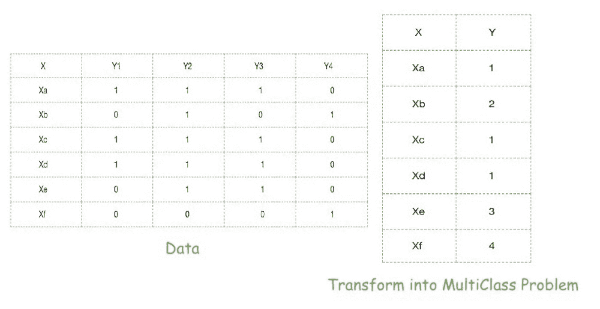

我们观察到 Xa，Xc & Xd 有相同的标号。因此，如上所示，Label Powerset 将这个问题转化为一个单一的多类问题。

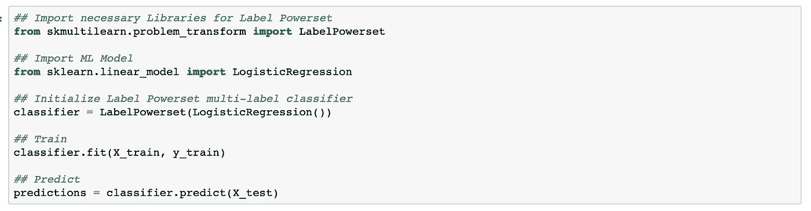

> **优点:**
> **1。**与二元分类方法相比的最佳模型。
> **2。**标签数量相对较少时效果很好。
> 
> **缺点:**
> **1。**随着输出标签数量的增加，不同的二进制字符串的数量也会增加，导致类的数量激增。这直接影响了性能，因为大多数类需要训练的数据点较少(几乎没有 1 或 2 个)。

# 方法 4:自适应算法

顾名思义，调整算法以直接执行多标签分类，而不是将问题转化为不同的问题子集。

有一种称为 mlk nn(kNN 的多标签版本)的 K 近邻版本。它的工作方式类似于 kNN，聚合(从基于简单计数到高度统计的方法)邻近的 k 个数据点中存在的标签，以预测输出标签。

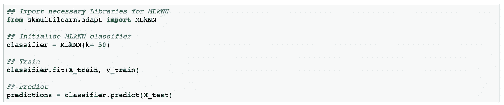

> **优点:**
> 与二元&多类分类方法相比的最佳模型。
> 
> **缺点:**
> 较大的数据集导致空间复杂度问题，多数情况下导致内存错误。

# 案例研究:堆栈溢出标记预测器

理解的本质可以通过对现实世界问题的练习来增强。我将根据 [Kaggle](https://www.kaggle.com/c/facebook-recruiting-iii-keyword-extraction/data) 提供的数据集预测堆栈溢出问题的标签。

# **第一步:数据集概述**

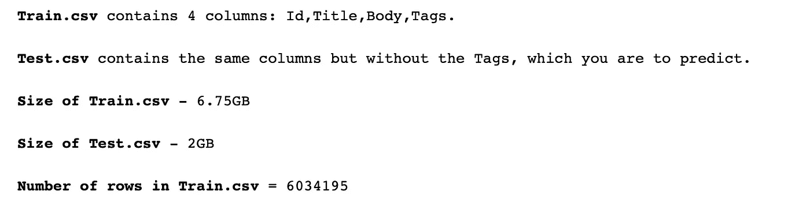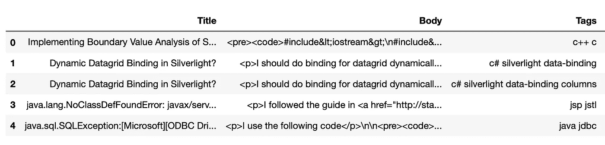

# 步骤 2:绩效指标

1.  微 F1 分数—通过计算总的真阳性、假阴性和假阳性来计算全局指标。当我们有阶级不平衡时，这是一个更好的衡量标准。
2.  宏观 F1 分数—计算每个标签的指标，并找出它们的未加权平均值。这没有考虑标签不平衡。
3.  [汉明损失](https://www.kaggle.com/wiki/HammingLoss) —汉明损失是被错误预测的标签的分数。

# 第三步:数据分析

1.  大约 30%(18，27，881)的数据点是重复的。
2.  对当前标签的简单分析。

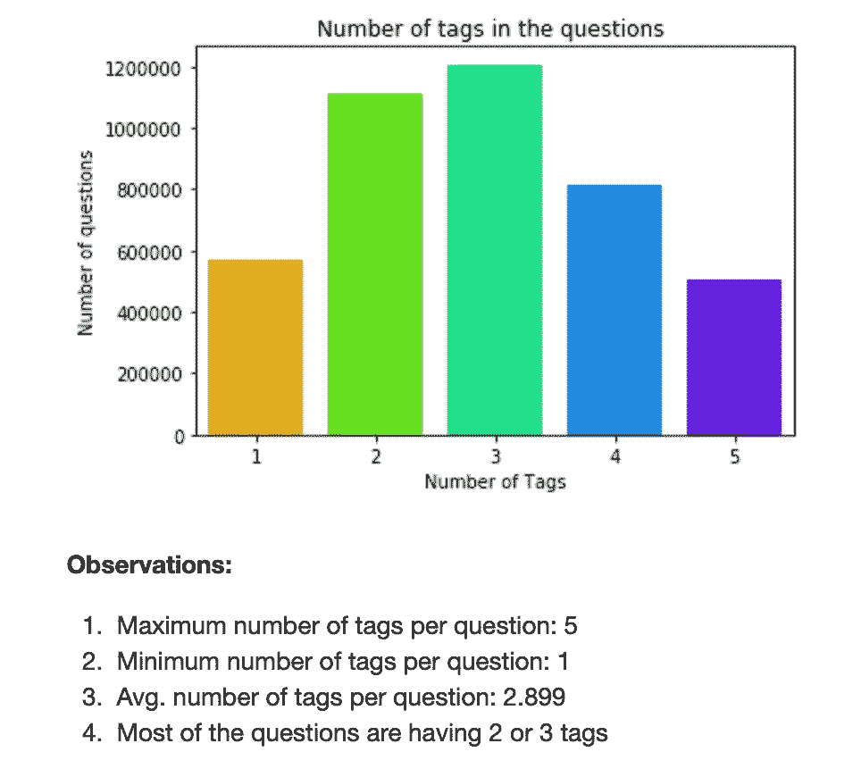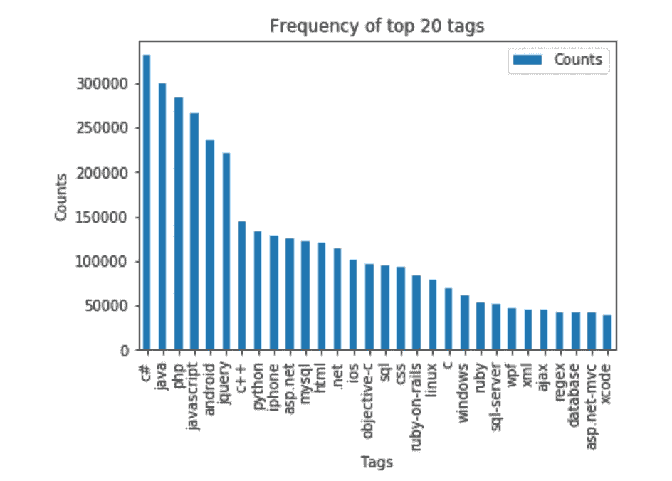

3.我们知道 C#、java 和 php 是大多数问题的标签。

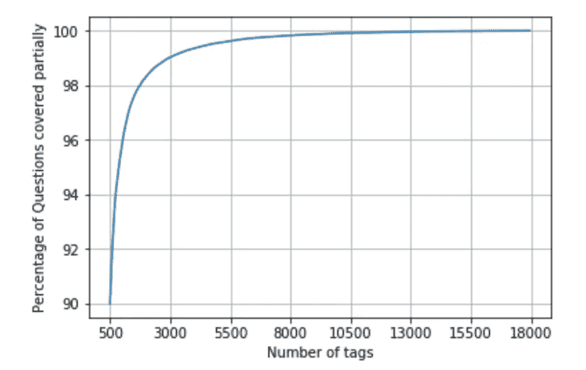

4.仅使用 15% (5500/35415)的标签，我们就覆盖了大约 99.025 %的问题。

# 步骤 4:数据建模(包括改进性能的技巧)

1.  输入标题和正文句子已经过 TFIDF(词频逆文档频率)、BOW(单词袋)矢量化，考虑了单字、双字、三字和四字。
2.  给定标签的数量= 35415，这是非常高的。我们不能轻易地建立大约 35k 的二进制分类模型。为了解决这个问题，我使用了一个技巧，我们可以只考虑 15%(5500 个)的标签，因为分析显示大约 99%的问题都包含在这个范围内。近 30k 标签几乎不构成总问题的 1%。浪费时间建立 30，000 个二元分类模型是没有意义的。
3.  我也给标题增加了 3 倍的权重。对于栈溢出的任何查询，它的标题描述了任何给定查询的主题。Tfidf 基本上是对计数起作用的，所以只要简单地重复标题上的文字，就可以实现这一点。
4.  如上所述，我尝试实现 MLkNN，结果正如所料。它未能执行，因为存在的数据集是压缩的稀疏矩阵，将其转换为密集矩阵以执行 MLkNN 在计算上非常庞大。导致内存错误。
5.  幸运的是，使用 SciKit Learn OnevsRest 分类器我们可以实现二元相关性。我使用逻辑回归(具有对数损失的 SGD 分类器)和线性 SVM(具有铰链损失的 SGD 分类器)来训练我的模型。
6.  使用 Tfidf 矢量器，我们最终会得到高维数据，基于决策树的模型(如随机森林、梯度增强决策树)的性能不会很好。在这种情况下，总是建议采用线性模型。

# 第五步:最佳模式

使用 GridSearchCV 对逻辑回归和线性 SVM 模型的“alpha”值进行超参数调整。

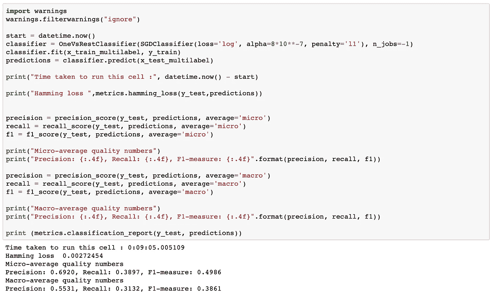

# 哪里会遇到多标签分类问题？

一般来说，多标签分类可以应用于任何二进制或多类分类问题，以加强问题陈述并达到更生动的预测。从更广的角度来看，这种分类技术支持丰富的数据分类。

> *1。图像分类
> 2。物体检测
> 3。文本分类
> 4。音频分类
> 5。基因分类*

# 摘要

我向您介绍了多标签分类的概念。提到了解决此类问题的经典方法，以及您可能必须使用 python 中的 ScikitMulti-learn 库来处理它的实际用例。还展示了一个使用 Stackoverflow 数据预测标签的真实案例研究。当你面临类似的问题时，我希望这篇文章能给你带来优势。如果你有任何疑问/建议，欢迎在下面联系我！

一如既往，我要感谢我的读者们宝贵的时间和兴趣。我用我最喜欢的一句话来结束这篇文章:

***人不可貌相。它们就像厨师的沙拉，好的东西和坏的东西被切碎，混合在一起，放在一种混乱和冲突的调味汁里。”*** —莱蒙尼·斯尼克特(阴森的洞穴)

Photo by [Eiliv-Sonas Aceron](https://unsplash.com/@eilivaceron?utm_source=unsplash&utm_medium=referral&utm_content=creditCopyText) on [Unsplash](https://unsplash.com/t/food-drink?utm_source=unsplash&utm_medium=referral&utm_content=creditCopyText)

Enjoyed the article? Click & Hold the ❤ below to recommend it to other interested readers!