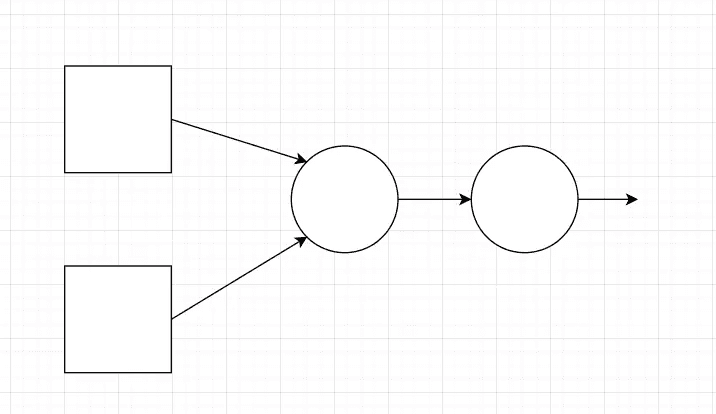
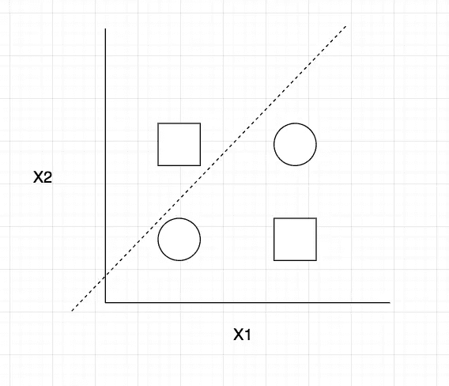
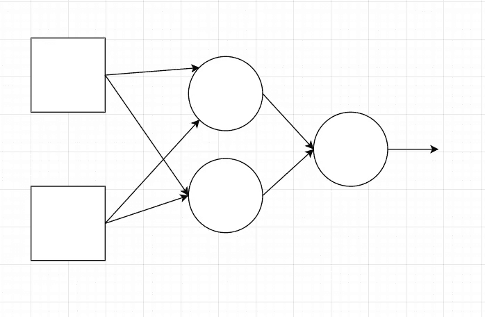
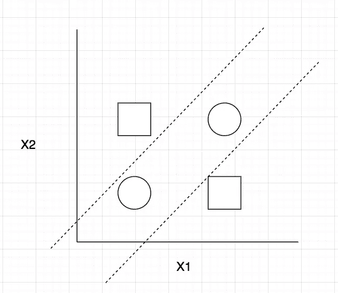
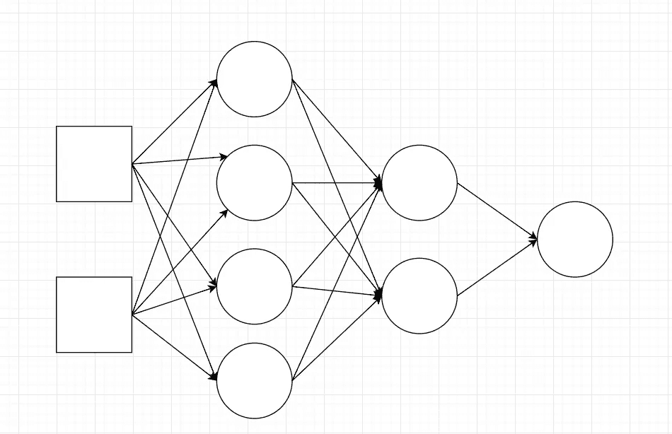
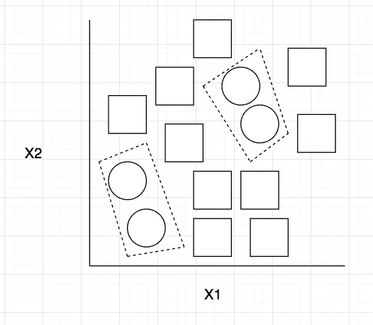

# 多层网络

> 原文：<https://medium.datadriveninvestor.com/multi-layer-networks-62c93370fd12?source=collection_archive---------15----------------------->

本文的想法是帮助提供多层网络中的隐藏节点如何学习复杂函数来分类凸区域中的实例的直觉。我们将看到两个具有一个隐藏层的网络，一个具有一个隐藏节点，另一个具有两个隐藏节点，然后我们将看到一个具有两个隐藏层的更复杂的网络，第一层有四个节点，第二层有两个节点。我们将展示这些不同的网络能够对哪些类型的数据集进行分类。

# 一个隐藏层，一个节点

Illustration of One Hidden Layer Network with One Node, below we see what kind of function this network can learn

With one hidden layer, the network can only learn one line to separate these instance. This is a famous problem known as the XOR logic problem illustrating a problem limiting single layer networks

# 一个隐藏层—两个节点

Illustration of a network with one hidden layer, but two nodes in the network. This network is able to learn more complex functions as illustrated below:

With two nodes, this network is able to separate instances from the XOR problem

# **两层——第一层，4 个节点，第二层，2 个节点**

Beautiful, Multi-layer network, 4 hidden nodes in the first hidden layer, 2 hidden nodes in the second hidden layer

With the additional hidden layers, the network is able to learn these convex, closed regions that separate the circles from the squares. The task above would be impossible for the two network architectures described above.

# **结论**

总之，这些插图显示了神经网络中隐藏层的渐进复杂性如何学习不同的功能。我们看到复杂的网络如何容易过度拟合，以及过于简单的网络如何无法学习凸函数。我希望这篇文章能帮助你获得堆叠神经单元如何学习功能的直觉。感谢阅读！

# [CShorten](https://medium.com/@connorshorten300)

Connor Shorten 是佛罗里达大西洋大学计算机科学专业的学生。对计算机视觉、深度学习和软件工程感兴趣。