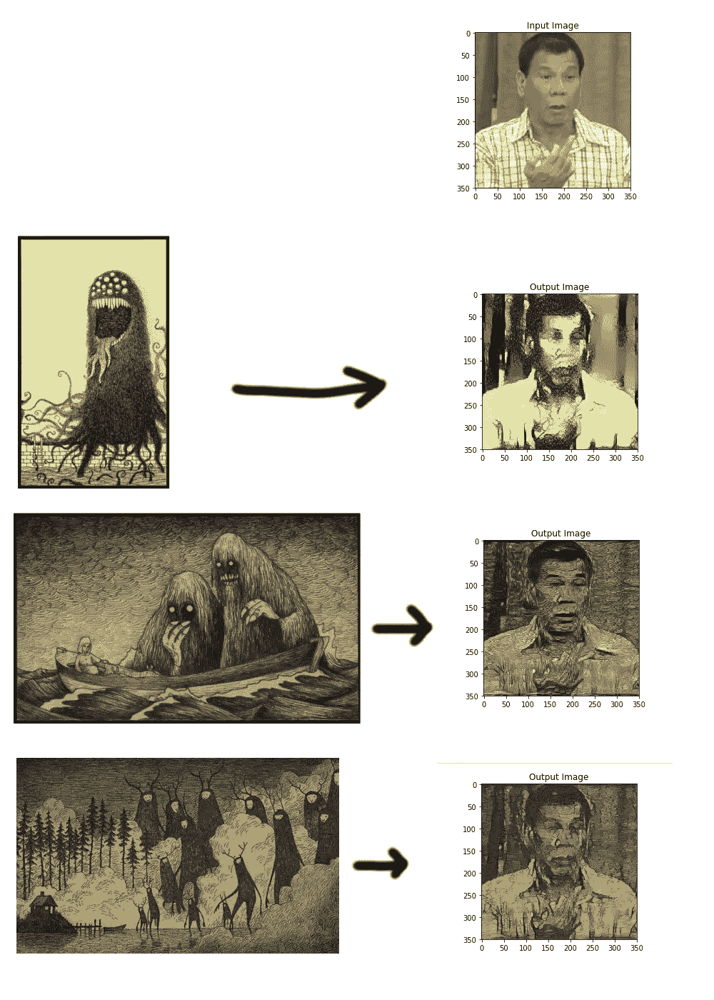
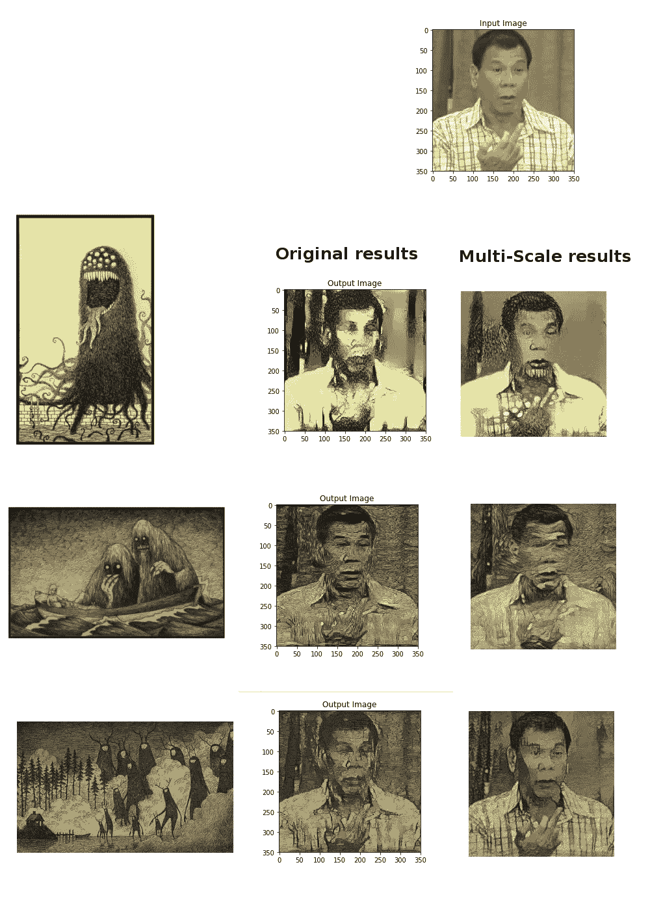

# 多尺度风格传递和纹理合成

> 原文：<https://medium.datadriveninvestor.com/multi-scale-style-transfer-and-texture-synthesis-f4bcc139d4a7?source=collection_archive---------16----------------------->

# **平庸风格转移结果**

[风格转移](https://deepart.io/)，众所周知，超级酷。我试着用每个人都喜欢的菲律宾总统[的照片](https://en.wikipedia.org/wiki/Rodrigo_Duterte)和唐·肯的一些更有质感的画自己做了一些。不过，结果并没有真正公平地对待他们两个人:

如果你想看的话，这背后的代码就在这里[但是基本上我觉得我需要更多地了解幕后发生的事情，以便获得更好的结果。](https://github.com/Lewington-pitsos/transfer_2)

# 在后台

目前，神经类型转移可以被认为在 3 个粗略的步骤中起作用:

1.  使用神经网络提取关于内容图像的**内容**的一些高级数据(在这种情况下，杜特尔特表达了他的不满)。这通常只是一些层的特征地图/特征激活，通常是浅层。
2.  使用神经网络提取一些关于风格图像(在我们的例子中是 Don Kenn 艺术)的**纹理**的高级数据。通常，这种高级数据最终会成为整个网络中几个图层的要素地图，并以忽略绝对空间数据的方式进行处理(即，通常选择每个图层上所有要素地图的 gram 矩阵)。这给我们留下了图像的所有非空间方面的高级表示，如颜色、对比度和特征之间的相关性。
3.  生成内容图像(称为**样本图像**)的副本，通过网络传送，并以与上述相同的方式计算其**内容**和**纹理**。然后，计算出这个示例图像的内容与内容图像的内容有多大的不同，以及它的纹理与样式图像的纹理有什么不同，并稍微更新它，使它与两者都匹配得更好一些。你只要一直这样做，直到样本图像看起来不错。

基本上，我觉得内容被忠实地复制了，但是事情的纹理方面让我失望，所以我更深入地研究了第 2 步。

# 更好的纹理信息

我发现了一篇论文，高分辨率多尺度神经纹理合成，它提出了一种从图像中提取纹理数据的更有效的方法，而不仅仅是使用同样无聊的旧 gram 矩阵。我最近写了一篇[总结文章](https://medium.com/@lewington/implementation-of-high-resolution-multi-scale-neural-texture-synthesis-df119f9a8211)，为任何感兴趣的人解释这种方法如何从图像中提取有意义的纹理数据。基本上，虽然，经过大量的折腾，我得到了多尺度方法的工作，并将其应用到步骤 **2。**我的风格转移设置代替香草纹理程序。我收到了稍微好一点的结果:

Check out the trees in the background of bottom right.

仍然没有什么值得大书特书的，但肯定更好。至少你现在可以清楚地理解杜特尔特的姿态。

# 结论

在[分辨率多尺度神经纹理合成](https://wxs.ca/research/multiscale-neural-synthesis/)中的一个建议是，测试在风格转换中使用的方法是否产生了好的结果。我想我已经帮助暗示了，是的，很有可能。

伙计们，旅途愉快。