# 使用人物再识别的多目标跟踪

> 原文：<https://medium.datadriveninvestor.com/multiple-object-tracking-using-person-re-identification-f9b7360cda1a?source=collection_archive---------1----------------------->

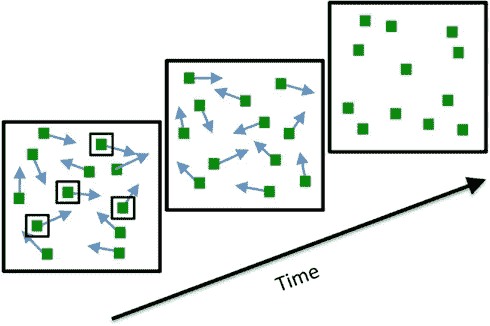

今天我们将讨论人员跟踪和重新识别。让我们从定义一些关键术语开始。

***多目标跟踪*** 是在一系列帧(视频)中定位多个目标的过程。MOT 问题可以被视为一个数据关联问题，其目标是将视频序列中各帧的检测关联起来。

多目标跟踪是许多跟踪场景的总称。目标可以是人、动物、汽车等。视频可以从一个或多个摄像机流式传输。此外，目标可以合并或分裂(例如细胞跟踪)。

因此，我们有 N 个相机流，应该随时确定我们的目标对象/主题的位置。

这对于零售业的客流量分析非常有用。客流量也称为“走进”,基本上是在一天、一周、一个月等时间段内走进零售店的人数。随着技术和物联网的发展，零售商更容易更准确地跟踪客流量属性。它让零售商了解他们的营销策略和品牌力量的成功。分析脚步及其属性有很大的好处。

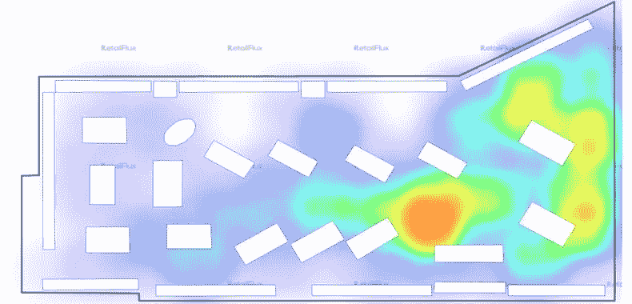

此外，人员跟踪还用于公共安全领域，以识别特定模式，用于监视分析和信息收集。这些信息包括年龄和身高检测、性别识别、人脸识别和个人识别。

# 多目标跟踪框架

# 侦查

首先，我们决定看看跟踪框架的对象检测部分。对象检测是一种与计算机视觉和图像处理相关的计算机技术，它处理在数字图像和视频中检测某类对象(如人、建筑物或汽车)的实例。

对于检测，我们使用[更快的 R-CNN](https://arxiv.org/pdf/1506.01497.pdf) ，因为这个模型有很好的准确性，性能符合我们的目的。更快的 R-CNN 是一个端到端的框架，由两个阶段组成。第一阶段提取特征并为第二阶段提出区域，以在提出的区域中对对象进行分类。该框架的优点是参数在两个阶段之间共享，从而创建了用于检测的有效框架。

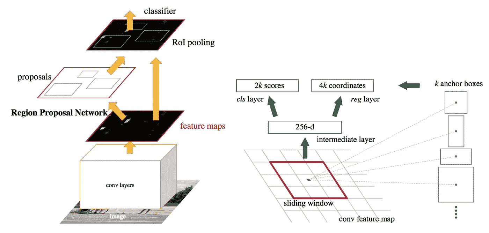

Faster R-CNN

正如我们所说，快速 R-CNN 有两个网络:区域建议网络(RPN)用于生成区域建议，另一个网络使用这些建议来检测对象。这里与快速 R-CNN 的主要区别在于，后者使用选择性搜索来生成区域建议。当 RPN 与目标检测网络共享大部分计算时，RPN 中生成区域建议的时间开销比选择性搜索小得多。简而言之，RPN 对区域框(称为锚点)进行排序，并提出最有可能包含对象的区域框。

# 重新鉴定

人物再识别(ReID)是将不同摄像机或同一摄像机在不同时间点拍摄的同一个人的图像相关联。换句话说，在多摄像机设置中为一个人分配一个稳定的 ID。通常情况下，重新识别被限制在一个小的时间段和摄像头覆盖的小区域内。

对于 ReID，我们使用从[开始的具有三重损失的模型来防御人员重新识别、姚宅、荀国、、李](https://arxiv.org/abs/1809.05864)的分类损失。通常，在监督学习中，我们有固定数量的类，并使用 softmax 交叉熵损失来训练网络。然而，在某些情况下，我们需要能够拥有可变数量的类。例如，在人物识别中，我们需要能够比较两幅未知人物的图像，并判断它们是否包含同一个人。

在这种情况下，三元组丢失是学习每个对象的良好嵌入的一种方式。在嵌入空间中，来自同一个人的图像应该靠近在一起并形成分离良好的聚类。

然而，我们不希望将每个标签的训练嵌入折叠成非常小的集群。唯一的要求是:当给定两个同一类的正例以及一个负例时，负例要比正例远一些的余量。这与支持向量机中使用的边距非常相似，这里我们希望每个类的聚类由边距分隔。

image from [https://github.com/omoindrot/tensorflow-triplet-loss](https://github.com/omoindrot/tensorflow-triplet-loss)

为了使这一要求正式化，损失将通过嵌入的三元组来定义:

*   一个锚
*   与锚同级别的正片
*   另一类的底片

对于嵌入空间 dd 中的某个距离，三元组(a，p，n)(a，p，n)的损失为:

L=max(d(a，p)d(a，n)+margin，0)L=max(d(a，p)d(a，n)+margin，0)

我们最小化这个损失，把 d(a，p)d(a，p)推到 0，d(a，n)d(a，n)大于 d(a，p)+margin(a，p)+margin。nn 一变成“易负”，损失就变为零。

但是我们的经验表明，神经网络在其训练数据中需要各种各样的图像。这是因为它基于大小和颜色构建嵌入，所以如果给定图像上的人不完全可见，或者帧具有不同的亮度或对比度，则该模型将是不准确的。

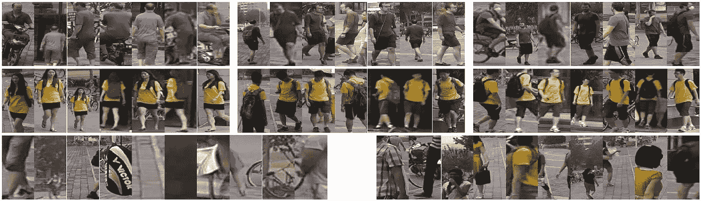

Market 1501 dataset

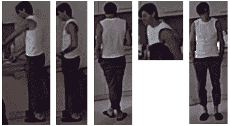

Custom dataset

所以我们采用在[市场-1501](http://www.liangzheng.org/Project/project_reid.html) 上预训练的基于三元组的网络，它具有 30.6%的地图精度，不太好。接下来，我们从办公室收集了额外的数据并做了标记。一周后，我们有 37 个人拍了大约 1000 张照片。之后我们对网络进行了微调，实现了 67.7 地图。

# 跟踪

下一个合乎逻辑的步骤是使用跟踪。因为我们正在处理一系列帧，所以我们可以使用来自先前帧的信息来改进对当前帧的检测和重新识别。我们使用了[深度排序框架](https://arxiv.org/pdf/1703.07402.pdf)并添加了我们的检测和 reID 模型来完成这个任务。

简单在线和实时跟踪(SORT)是一个简单的框架，它使用带有边界框重叠的匈牙利方法执行卡尔曼图像空间和逐帧数据关联。这种简单的方法在高帧速率下实现了良好的性能。想法是使用一些现成的模型进行对象检测，然后将结果插入到具有深度关联度量的排序算法中，该深度关联度量匹配跨帧的检测到的对象。此外，两个经典但非常有效的方法，卡尔曼滤波器和匈牙利方法被用来分别处理跟踪问题的运动预测和数据关联部分。这种跟踪的最小公式化提高了在线跟踪的效率和可靠性。

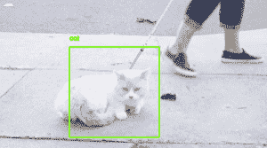

解决预测的卡尔曼状态和新到达的测量值之间的关联的传统方法是建立分配问题，该问题可以使用匈牙利算法来解决。在这个问题的表述中，作者通过结合两个适当的度量来整合运动和外观信息:一个用于运动信息，另一个用于关联问题本身。他们使用加权和将两个指标结合起来。作者没有在全局分配问题中解决测量到航迹的关联，而是引入了一个级联来解决一系列子问题。

# MOT 评估范例

由于不同的最终用户具有不同的需求，因此已经设计了应用特定的措施来满足这些需求。原则上不可能建立一个在所有情况下都能让最终用户满意的单一性能指标。

考虑下面的例子，嫌疑人通过机场。部署了三个跟踪器，我们的任务是向机场安全部门推荐一个跟踪器。
在入口处，嫌疑人被每个追踪器标记为 ID1，而每个追踪器在某个时候错误地将标签 ID2 分配给嫌疑人。根据这些混淆的频率或长度，有两种评估范式脱颖而出。

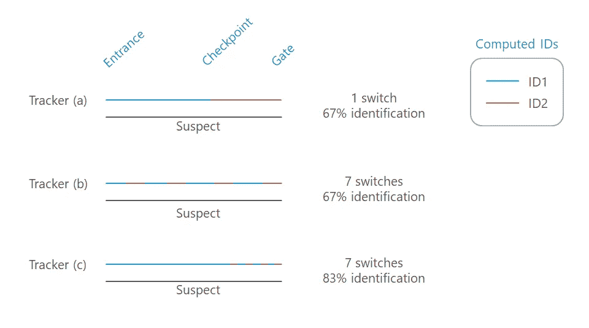

# 范例#1

第一种评估范式检查目标丢失或重新获得的频率。它通过身份转换、分段和合并错误的总和来度量错误。这种范式有助于研究人员理解追踪者在哪里以及为什么会出错。根据这种范式，追踪器 a 是最佳选择(1 个开关)，b 和 c 同样好(7 个开关)。

# 范例 2

相反，第二种范式评估目标被正确识别的频率，而不管它被丢失或重新获得的频率。

根据这个范例，追踪器 c 是最好的，具有 83%的识别召回率/精确度，而 a 和 b 同样好，具有 67%的识别召回率/精确度。这种评估模式对最终用户更有用，在这种情况下是机场安检，他们更喜欢 tracker c，因为它更经常正确地推断出谁在哪里。

有关评估模式的更多详情，请访问[http://vision.cs.duke.edu/DukeMTMC/IDmeasures.html](http://vision.cs.duke.edu/DukeMTMC/IDmeasures.html)

# 摘要

跟踪器提高了整个框架的准确性。这种精度上的提升使我们可以开始在现实应用中使用该系统。

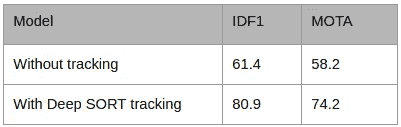

正如我们所看到的，多目标跟踪不是一项简单的任务。而我们需要把它分解成部分，一步一步的解决。

激发我写这篇文章的视频。

还有些结果:

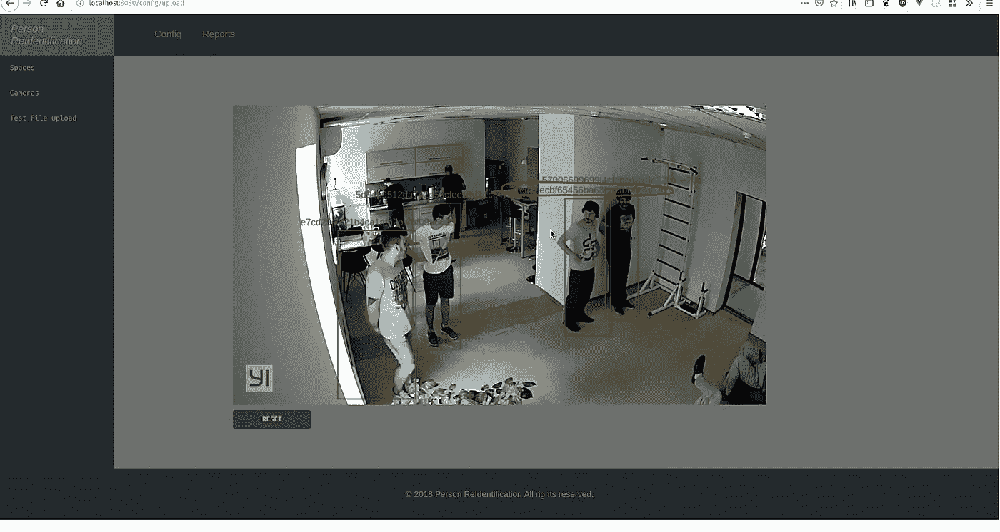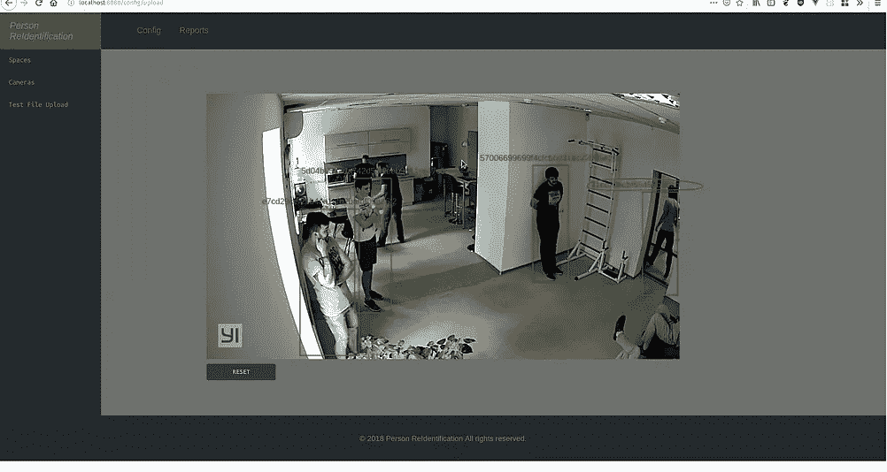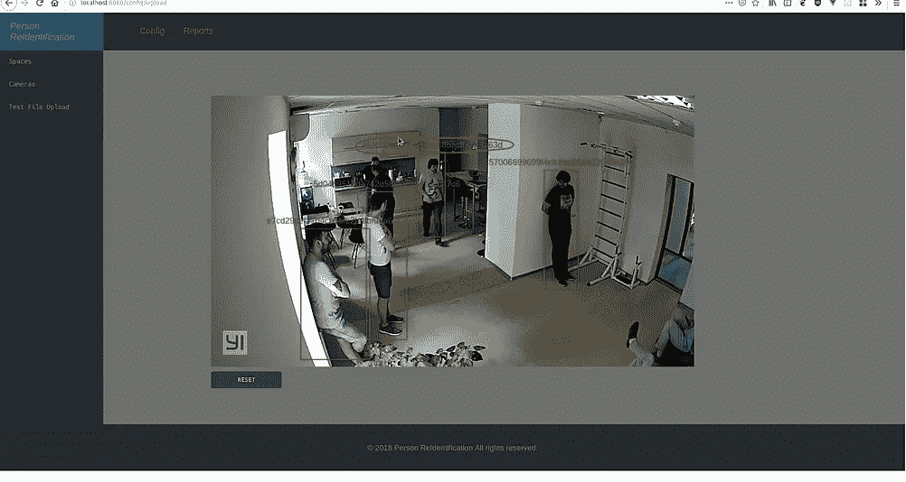

*撰稿*[Klym Yamkovyi](http://www.linkedin.com/in/kyamkovyi) *校对*[*nadia Pyvovar*](https://www.linkedin.com/in/nadiia-pyvovar/)*[*Cherepanov Oleksandr*](https://www.linkedin.com/in/oleksandr-cherepanov/)*

**原载于 2019 年 1 月 14 日 www.quantumobile.com***。***