# 使用门控递归单元的多元时间序列-GRU

> 原文：<https://medium.datadriveninvestor.com/multivariate-time-series-using-gated-recurrent-unit-gru-1039099e545a?source=collection_archive---------0----------------------->

[](http://www.track.datadriveninvestor.com/1B9E)

在这篇文章中，我们将了解 RNN 的一个变种，叫做 GRU 门控循环单位。我们为什么需要 GRU，它是如何工作的，LSTM 和 GRU 之间的差异，最后用一个将使用 LSTM 和 GRU 的例子来总结

***先决条件***

[递归神经网络 RNN](https://medium.com/datadriveninvestor/recurrent-neural-network-rnn-52dd4f01b7e8)

***可选读***

[使用多变量时间序列的带 keras 的 RNN](https://medium.com/datadriveninvestor/multivariate-time-series-using-rnn-with-keras-7f78f4488679)

***什么是门控循环单元——GRU？***

*   GRU 是递归神经网络(RNN)的简易版本
*   解决 RNN 的消失梯度问题。
*   GRU 有能力学习长期依赖

[](https://www.datadriveninvestor.com/2019/02/08/machine-learning-in-finance/) [## 金融中的机器学习——数据驱动的投资者

### 在我们讲述一些机器学习金融应用之前，我们先来了解一下什么是机器学习。机器…

www.datadriveninvestor.com](https://www.datadriveninvestor.com/2019/02/08/machine-learning-in-finance/) 

[RNN](https://medium.com/datadriveninvestor/recurrent-neural-network-rnn-52dd4f01b7e8) 是具有环路的神经网络，有助于保持信息。RNN 遭受爆炸梯度或消失梯度问题。

***什么是爆炸和消失渐变？***

在反向传播期间计算神经网络的梯度。

在 RNN 有更深的神经层，并在不同的 RNN 细胞间共享权重，我们对每个时间步的梯度求和。当梯度由于链式法则而经历**连续矩阵乘法时，它们或者**指数收缩并且具有称为消失梯度**的小值，或者它们**放大到非常大的值，这被称为爆炸梯度****

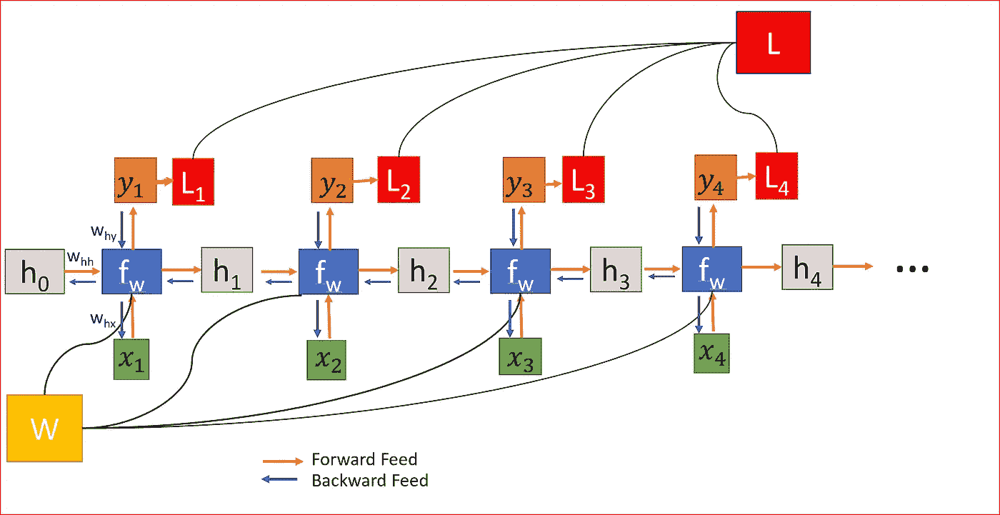

如何解决渐变消失或爆炸的问题？

使用 ***渐变剪辑*** 可以解决爆炸渐变。在梯度裁剪中，我们设置一个预定的梯度阈值，当梯度超过该阈值时，我们将梯度缩放到该阈值。

消失梯度被寻址到[长短期记忆(LSTM)](https://medium.com/datadriveninvestor/recurrent-neural-network-rnn-52dd4f01b7e8) 或门控循环单元(GRU)。

我们将在这里讨论 GRU

GRU 如何解决渐变消失的问题？

为此，我们需要首先了解 GRU 是如何工作的。

***GRU 像 LSTM 一样有能力学习长期依赖*** 。

***GRU 和 LSTM 都有一个门控机制来调节信息的流动*** 就像记忆多个时间步长的上下文一样。他们记录了过去的哪些信息可以被保留，哪些可以被遗忘。为了实现这个**T5，GRU 使用了更新门和复位门**

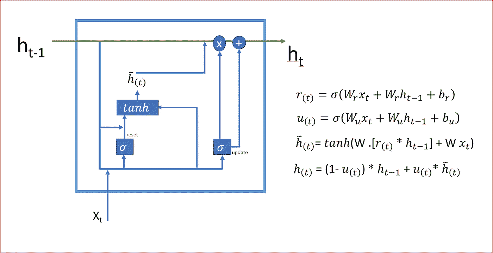

Gated Recurrent Unit- GRU

***更新和复位门在记忆长期依赖关系中的作用是什么？***

**更新门**

*   保留多少以前的记忆。决定保留什么，扔掉什么。
*   您将更新多少单元格状态
*   将具有介于 0 和 1 之间的值
*   如果更新单位的值接近 0，那么我们记住先前的状态
*   如果更新单元的值是 1 或接近 1，那么我们会忘记以前的值并存储新值
*   更新门的作用类似于 LSTM 的输入和遗忘门

**复位门也称为关联门**

*   重置门决定忘记多少信息
*   允许模型丢弃与未来无关的信息
*   确定要保留多少以前的内存

让我们一步一步来，了解 GRU 是如何工作的

***第一步:*** **把无关信息丢给未来**

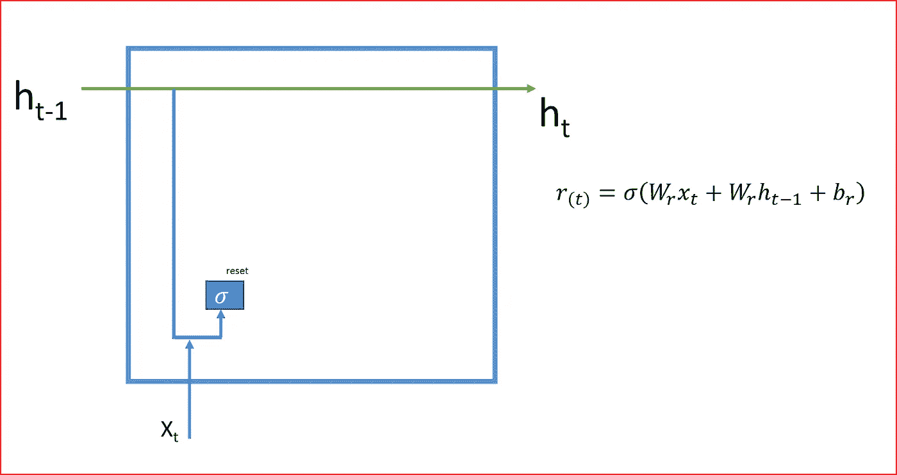

Reset Gate

**复位门接收输入 Xt 和之前隐藏的状态 ht-1，并应用一个 sigmoid 激活函数**。

重置门确定当前状态是具有新信息还是仍然具有先前的信息

如果复位门的值接近 0，则忽略先前的隐藏状态。这意味着以前的信息是不相关的，我们希望丢弃它并存储新的信息。

***第二步:*** **要存储多少以前的记忆**

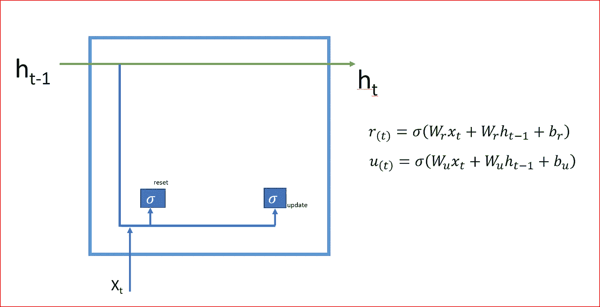

Step 2: Update Gate

**更新门获取输入 Xt 和先前隐藏的状态 ht-1，并应用 sigmoid 激活函数。**

更新门决定了要保留多少以前的内存，它决定了保留什么和丢弃什么。

如果更新单位的值接近 0，那么我们记住先前的状态。

***第三步*** : **要存储的最终存储器**

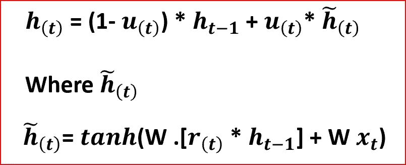

Final hidden state or final memory

当复位门 **rt** 接近 0 时，先前的隐藏状态被忽略，仅用当前输入 **xt** 复位。

隐藏状态将删除任何与未来无关的信息。这是一个紧凑的表示。

更新门控制有多少信息从先前的隐藏状态延续到当前的隐藏状态。

如果更新单元的值接近 0，那么我们记住了先前的隐藏状态。如果更新单元的值是 1 或接近 1，那么我们忘记先前的隐藏状态并存储新值

GRU 有单独的重置和更新门，每个单元将学习捕捉不同时间尺度上的依赖关系。学会捕捉**短期依赖性的单元将倾向于具有频繁激活的复位门**。捕获**长期依赖的单元将拥有最活跃的更新门**

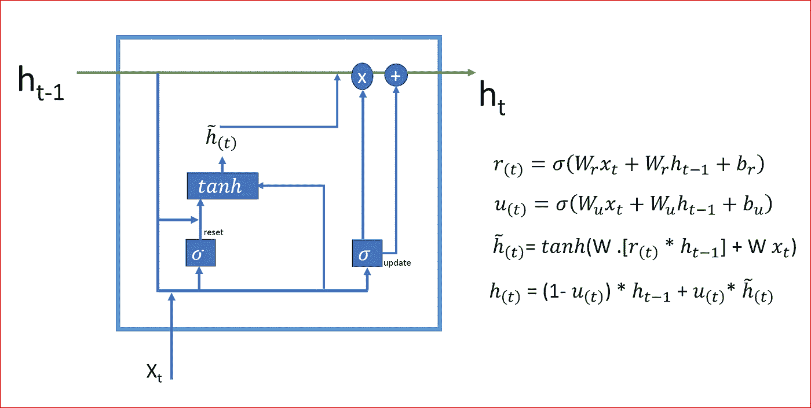

GRU with all the steps

***既然我们已经理解了 GRU 的工作，我们再来看看 GRU 是如何解决渐变消失问题的。***

在消失梯度中，梯度变小或为零，很容易消失。

GRU 和 LSTM 的门控机制有助于解决渐变消失的问题。当计算梯度时，关闭更新门实质上跳过了层。门根据需要在内存中保存信息，并且仅在必要时用新信息更新它。

使用门的组合允许通过或阻止，因此无论我们的神经网络或输入序列有多深，网络都可以记住梯度。

直观上，误差是相加的，而不是相乘的，因此更容易保持在合理的范围内。忘记 LSTM 的门或更新 GRU 的门有助于长期依赖

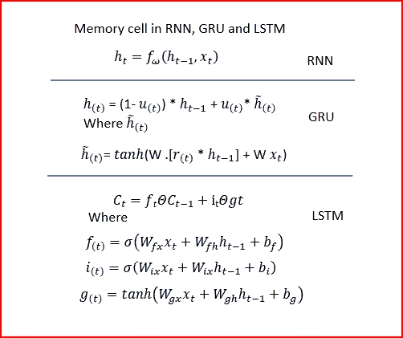

Memory cell is additive in LSTM and GRU and multiplicative in RNN

***让我们了解一下 LSTM 和 GRU 的共性和差异？***

## **LSTM 和 GRU 的共性**

*   LSTM 和 GRU 都有从 t 到 t + 1 的具有附加分量的更新单元，这在传统的 RNN 中是缺乏的。
*   LSTM 单位和 GRU 都**保留现有内容并在其上添加新内容**
*   GRU 的更新门和 LSTM 的遗忘门取当前状态和新计算状态之间的**线性和**
*   LSTM 和 GRU **解决 RNN 出现的渐变消失和爆炸问题**

## LSTM 和 GRU 的区别

*   GRU 有两个门，重置门和更新门。LSTM 有三个门，输入、忘记和输出。GRU 不像 LSTM 那样有输出门。GRU 的更新门做 LSTM 的输入和遗忘门的工作
*   与 LSTM 相比，GRU 有更少的参数，因此计算效率更高，需要的数据更少
*   LSTM 保持内部存储状态 c，而 GRU 没有单独的存储单元
*   **GRU 没有任何机制来控制其状态或存储器内容被暴露的程度**，但是每次都暴露整个状态或存储器内容。LSTM 可以控制想要暴露多少内存内容。

***最后，我们以一个将使用 LSTM 和 GRU*** 的例子结束

这里我使用了[电力消耗数据集](https://www.kaggle.com/uciml/electric-power-consumption-data-set)。

导入所需的库

```
import pandas as pd
import numpy as np
from math import sqrt
from numpy import concatenate
from matplotlib import pyplot
from pandas import read_csv
from pandas import DataFrame
from pandas import concat
from sklearn.preprocessing import MinMaxScaler
from sklearn.preprocessing import LabelEncoder
from sklearn.metrics import mean_squared_error
from keras.models import Sequential
from keras.layers import Dense
from keras.layers import LSTM, GRU
import tensorflow as tf
from datetime import datetime
```

读取数据集，解析日期，并将日期格式推断为日期时间。我们也用 0 填充 Nan。

```
dataset = read_csv("c:\data\power_consumption.csv",
                   **parse_dates**={'dt' : ['Date', 'Time']},
                   **infer_datetime_format=True**, 
                   index_col= 0,
                   **na_values=['nan','?']**)
**dataset.fillna(0, inplace=True)**
values = dataset.values# ensure all data is float
values = values.astype('float32')
```

查看数据集的样本数据

```
dataset.head(4)
```

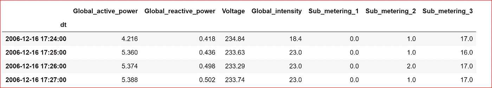

由于输入要素的比例不同，我们需要对这些要素进行归一化。我们使用最小最大标量

```
# normalizing input features
scaler = MinMaxScaler(feature_range=(0, 1))
scaled = scaler.fit_transform(values)scaled =pd.DataFrame(scaled)
```

查看标准化后的数据

```
scaled.head(4)
```

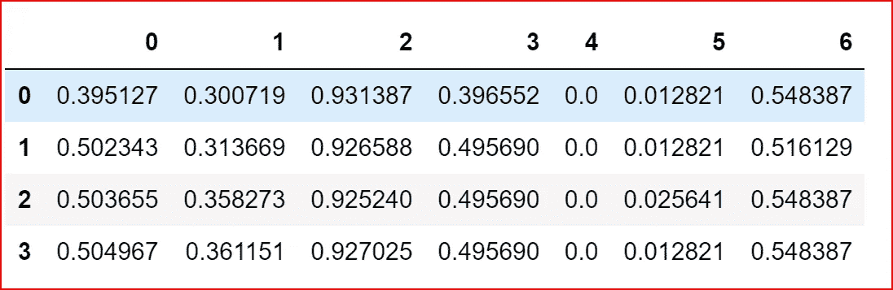

Normalized data

我们定义一个函数来创建时间序列数据集。我们可以指定回看间隔和预测列

```
def create_ts_data(dataset, lookback=1, predicted_col=1):
    temp=dataset.copy()
    temp["id"]= range(1, len(temp)+1)
    temp = temp.iloc[:-lookback, :]
    temp.set_index('id', inplace =True)
    predicted_value=dataset.copy()
    predicted_value = predicted_value.iloc[lookback:,predicted_col]
    predicted_value.columns=["Predcited"]
    predicted_value= pd.DataFrame(predicted_value)

    predicted_value["id"]= range(1, len(predicted_value)+1)
    predicted_value.set_index('id', inplace =True)
    final_df= pd.concat([temp, predicted_value], axis=1)
    #final_df.columns = ['var1(t-1)', 'var2(t-1)', 'var3(t-1)', 'var4(t-1)', 'var5(t-1)', 'var6(t-1)', 'var7(t-1)', 'var8(t-1)','var1(t)']
    #final_df.set_index('Date', inplace=True)
    return final_df
```

我们现在通过回顾一个时间步长来创建时间序列数据集

```
reframed_df= create_ts_data(scaled, 1,0)
reframed_df.fillna(0, inplace=True)

reframed_df.columns = ['var1(t-1)', 'var2(t-1)', 'var3(t-1)', 'var4(t-1)', 'var5(t-1)', 'var6(t-1)', 'var7(t-1)','var1(t)']print(reframed_df.head(4))
```

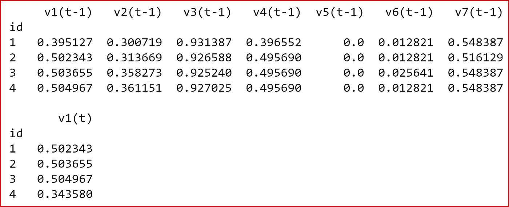

Time series data set with one time step of look back

将数据集分为测试数据集和训练数据集

```
# split into train and test sets
values = reframed_df.values
training_sample =int( len(dataset) *0.7)train = values[:training_sample, :]
test = values[training_sample:, :]# split into input and outputs
train_X, train_y = train[:, :-1], train[:, -1]
test_X, test_y = test[:, :-1], test[:, -1]
```

使用样本大小、回望时间步长和输入要素将数据集重塑为 3D。

```
# reshape input to be 3D [samples, time steps, features]
train_X = train_X.reshape((train_X.shape[0], 1, train_X.shape[1]))
test_X = test_X.reshape((test_X.shape[0], 1, test_X.shape[1]))print(train_X.shape, train_y.shape, test_X.shape, test_y.shape)
```


我们现在创建的 LSTM 模型有三个 LSTM 层和一个密集层。我们使用 Adam optimizer 编译该模型。使用平均绝对误差(MAE)计算损失

```
**model_lstm = Sequential()**
**model_lstm.add(LSTM(75, return_sequences=True,input_shape=(train_X.shape[1], train_X.shape[2])))**
**model_lstm.add(LSTM(units=30, return_sequences=True))
model_lstm.add(LSTM(units=30))
model_lstm.add(Dense(units=1))**

**model_lstm.compile(loss='mae', optimizer='adam')**
```

让我们看一下 LSTM 模式摘要

```
**model_lstm.summary()**
```

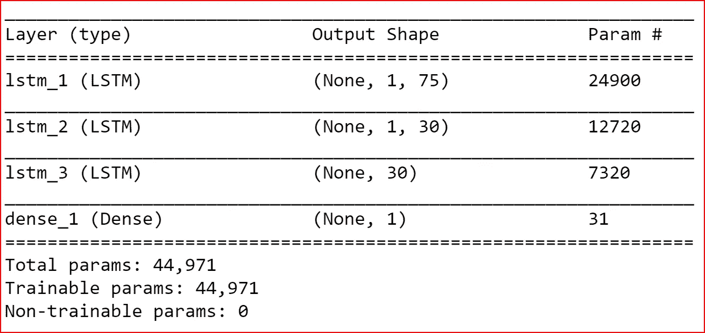

拟合 LSTM 模型

```
# fit network
**history_lstm = model_lstm.fit(train_X, train_y, epochs=10, batch_size=64, validation_data=(test_X, test_y),  shuffle=False)**
```

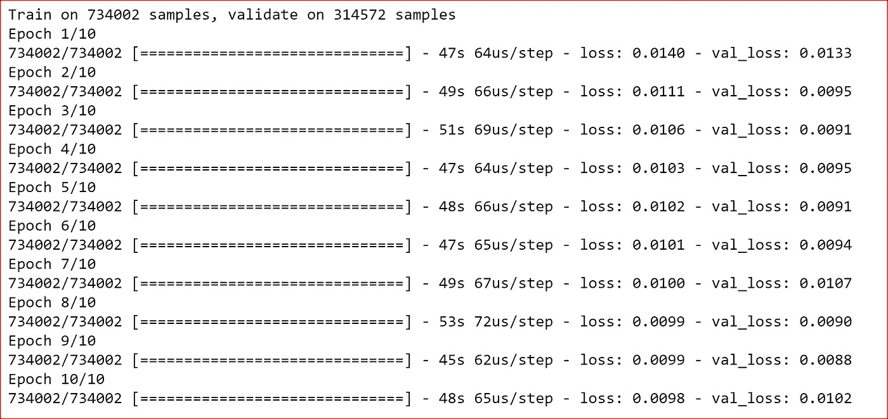

我们现在用类似 LSTM 的图层创建 GRU

```
**model_gru = Sequential()
model_gru.add(GRU(75, return_sequences=True,input_shape=(train_X.shape[1], train_X.shape[2])))
model_gru.add(GRU(units=30, return_sequences=True))
model_gru.add(GRU(units=30))
model_gru.add(Dense(units=1))** **model_gru.compile(loss='mae', optimizer='adam')**
```

让我们看一下 GRU 模式摘要

```
**model_gru.summary()**
```

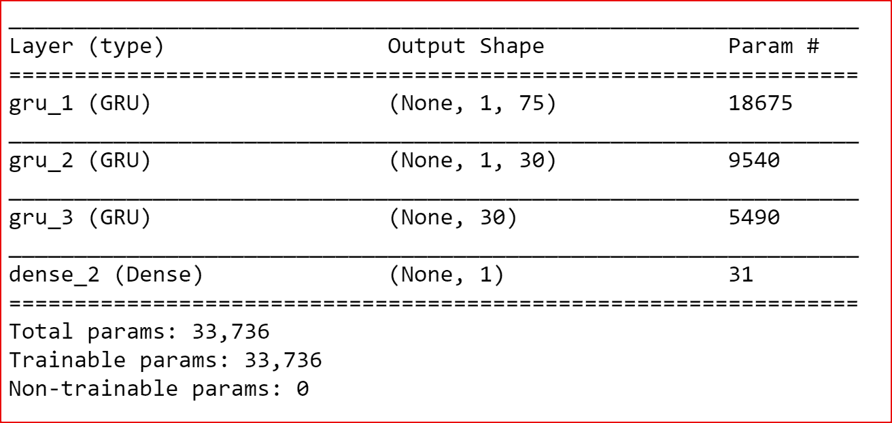

我们可以看到，LSTM 和 GRU 具有相同的架构，但是 LSTM 的参数数量是 44，971，而 GRU 的 GRU 是 33，736。与有三个门的 LSTM 相比，GRU 是一个有两个门的简单模型。由于 GRU 有较少的参数，它的计算效率比 LSTM 高。

拟合 GRU 模型

```
# fit network
**gru_history = model.fit(train_X, train_y, epochs=10, batch_size=64, validation_data=(test_X, test_y), shuffle=False)**
```

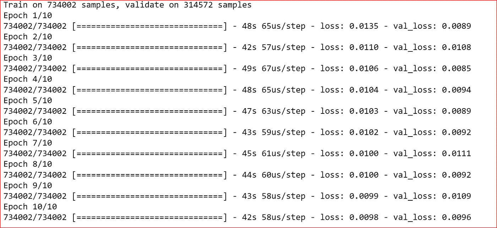

为了理解损失在 LSTM 和 GRU 是如何变化的，我们绘制了损失图

```
pyplot.plot(history_lstm.history['loss'], label='LSTM train', color='red')
pyplot.plot(history_lstm.history['val_loss'], label='LSTM test', color= 'green')pyplot.plot(gru_history.history['loss'], label='GRU train', color='brown')
pyplot.plot(gru_history.history['val_loss'], label='GRU test', color='blue')pyplot.legend()
pyplot.show()
```

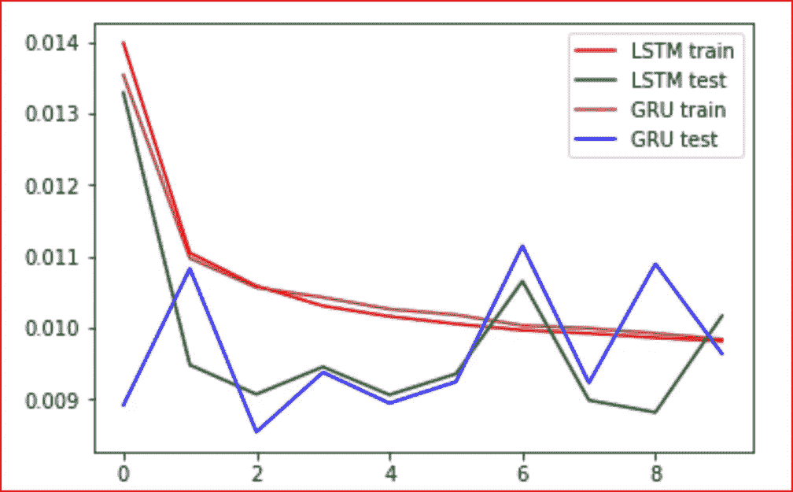

**我在创建模型的过程中学到了什么**

具有空值的坏数据导致准确性和损失为 NAN。要解决这个问题，请确保数据中没有任何空值

## 参考资料:

[门控递归神经网络对序列建模的经验评估](https://arxiv.org/pdf/1412.3555v1.pdf)

[使用用于统计机器翻译的 RNN 编码器-解码器学习短语表示](https://arxiv.org/pdf/1406.1078v3.pdf)

[](http://www.wildml.com/2015/10/recurrent-neural-network-tutorial-part-4-implementing-a-grulstm-rnn-with-python-and-theano/) [## 递归神经网络教程，第 4 部分——用 Python 和 Theano 实现 GRU/LSTM RNN

### 这篇文章的代码在 Github 上。这是第 4 部分，递归神经网络教程的最后一部分。的…

www.wildml.com](http://www.wildml.com/2015/10/recurrent-neural-network-tutorial-part-4-implementing-a-grulstm-rnn-with-python-and-theano/)