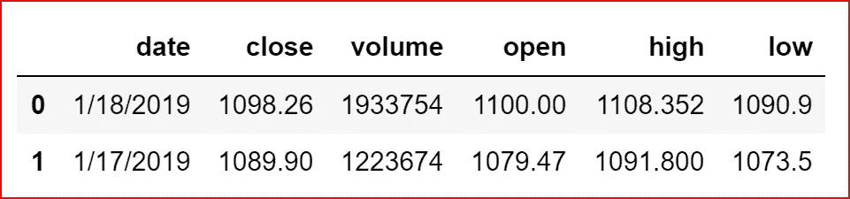
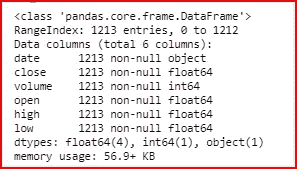
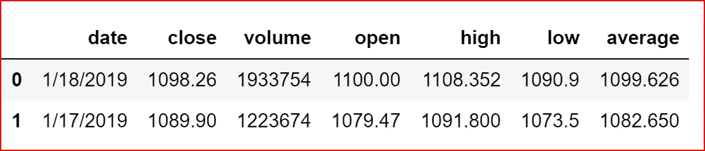
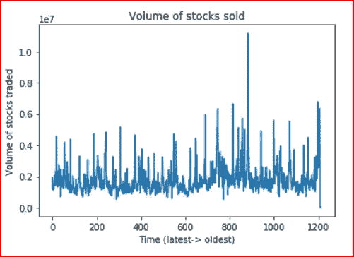
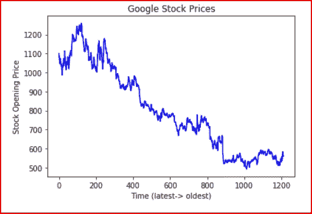
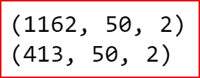
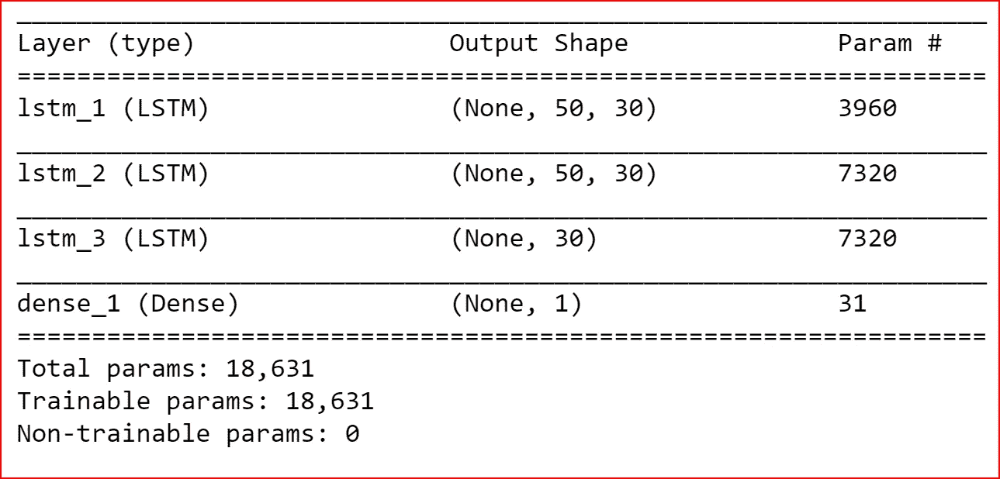
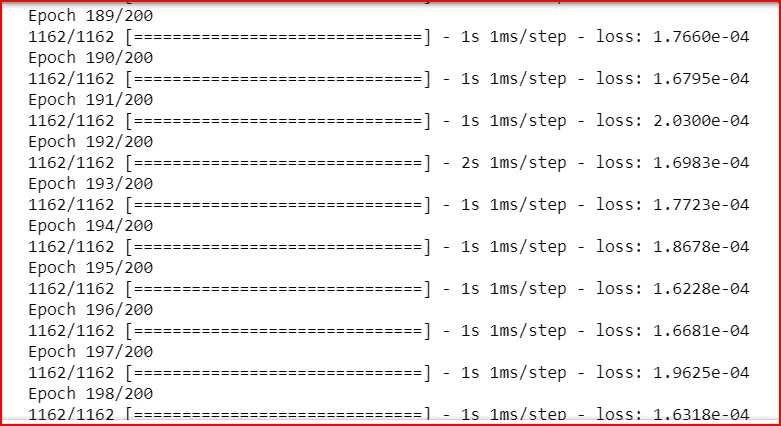
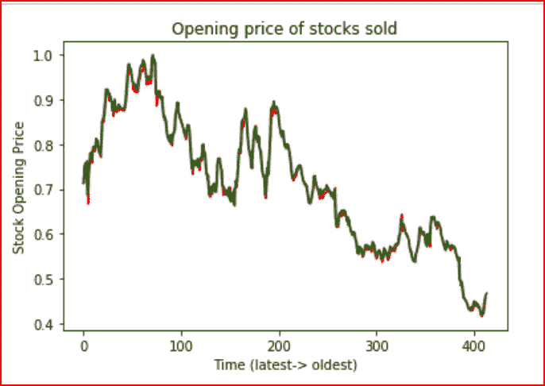

# 使用 RNN 和 Keras 的多元时间序列

> 原文：<https://medium.datadriveninvestor.com/multivariate-time-series-using-rnn-with-keras-7f78f4488679?source=collection_archive---------0----------------------->

[](http://www.track.datadriveninvestor.com/1B9E)

在本帖中，我们将使用时间序列进行谷歌股票预测。我们将使用 Keras 和递归神经网络(RNN)。

**先决条件:**

[递归神经网络](https://medium.com/datadriveninvestor/recurrent-neural-network-rnn-52dd4f01b7e8)


我已经将过去 5 年的谷歌股票价格从[https://www.nasdaq.com/symbol/goog/historical](https://www.nasdaq.com/symbol/goog/historical)下载到一个 csv 文件 Google 2014 到 2019.csv 中

首先导入基本库并从 CSV 文件中读取数据

```
import numpy as np
import pandas as pd
import matplotlib.pyplot as plt
%matplotlib inlinestock_data = pd.read_csv("D:\\Machine Learning\\Google2014to2019.csv")
```

让我们打印数据集中的 2 行数据

```
stock_data.head(2)
```



stock_data.head(2)

还打印关于数据集的信息

```
stock_data.info()
```



我们将取谷歌股票当天的最低价和最高价以及当天的交易量的平均值来预测股票价格。

```
import mathstock_data["average"] = (stock_data["high"] + stock_data["low"])/2stock_data.head(2) 
```



让我们将成交量和平均股价作为输入特征，并将其存储在 input_data 中

```
input_feature= stock_data.iloc[:,[2,6]].values
input_data = input_feature
```

我们将绘制当天谷歌股票交易量的数据

```
plt.plot(input_feature[:,0])
plt.title("Volume of stocks sold")
plt.xlabel("Time (latest-> oldest)")
plt.ylabel("Volume of stocks traded")
plt.show()
```



Volume of Google stocks traded

我们现在绘制谷歌股票当日平均价格的数据

```
plt.plot(input_feature[:,1], color='blue')
plt.title("Google Stock Prices")
plt.xlabel("Time (latest-> oldest)")
plt.ylabel("Stock Opening Price")
plt.show()
```



Average Google stock price

使用 MinMaxScaler 对输入数据进行归一化，使所有输入要素都在 0 到 1 的范围内

```
from sklearn.preprocessing import MinMaxScalersc= MinMaxScaler(feature_range=(0,1))
input_data[:,0:2] = sc.fit_transform(input_feature[:,:]) 
```

这是一个时间序列问题。如果我们需要正确预测谷歌股价，那么我们需要考虑前几天的股票交易量以及前几天的平均股价。

**我们将创建过去 50 个工作日的预测数据。**

此外，我们将采用 30 %的最新数据作为我们的测试数据集。

为了让 RNN·LSTM 预测数据，我们需要转换输入数据。

输入数据的形式是:[ *股票交易量，平均股价* ]我们需要创建一个时间序列数据。

今天的时间序列数据应该包含过去 50 天的[*股票交易量、平均股价 T13，目标变量将是谷歌今天的股价等等。*

**由于股票价格预测是基于多个输入特征的，因此是一个多元回归问题。**

我们遍历所有的样本，每天我们回溯过去 50 个交易日，将股票交易量与平均股价相加。

```
**lookback= 50**

test_size=int(.3 * len(stock_data))
X=[]
y=[]
for i in range(len(stock_data)-lookback-1):
    t=[]
    for j in range(0,lookback):

        **t.append(input_data[[(i+j)], :])
    X.append(t)
    y.append(input_data[i+ lookback,1])**
```

**LSTM 期望输入数据以特定的 3D 格式测试样本大小、时间步长、输入特征数量。**

在我们的例子中，时间步长是 50，输入特征的数量是 2(股票交易量和平均股票价格)。

**我们可以使用 numpy.reshape()将输入数据转换成 LSTM 期望的结构。我们需要首先将输入数据 X 转换成一个数组，然后使用 shape()**

```
**X, y= np.array(X), np.array(y)**
X_test = X[:test_size+lookback]**X = X.reshape(X.shape[0],lookback, 2)
X_test = X_test.reshape(X_test.shape[0],lookback, 2)**
print(X.shape)
print(X_test.shape)
```



Dimension of the training data and test data- No. of sample, time steps and no. of input features

我们的数据现在已经准备好了，我们可以建立 RNN LSTM 模型并拟合数据。

导入所需的 keras 库以构建 LSTM 网络

```
from keras import Sequential
from keras.layers import Dense, LSTM
```

我们添加了 30 个 RNN 单元，它们将在 RNN 中一个接一个地堆叠，实现了一个高效的堆叠 RNN。

**return_sequences** 为真返回输出序列中的最后一个输出。

**input_shape 将是测试样本大小、时间步长、输入特征数量的 3D 格式。**

最后，输出将只有一个单位，因为这是一个回归问题

```
model = Sequential()
model.add(LSTM(units=30, return_sequences= True, input_shape=(X.shape[1],2)))
model.add(LSTM(units=30, return_sequences=True))
model.add(LSTM(units=30))
model.add(Dense(units=1))model.summary()
```



LSTM model summary

**我们现在使用 adam 优化器编译模型，损失函数将是回归问题的均方误差**

```
model.compile(optimizer='adam', loss='mean_squared_error')
```

现在，我们使用 32 和 100 个历元的 batch_size 将数据拟合到输入数据

```
model.fit(X, y, epochs=200, batch_size=32)
```



我们最后预测测试数据的股票价格

```
predicted_value= model.predict(X_test)
```

我不是在做一个反标量函数。我直接画出了股票价格和预测价格。

为了根据预测的股票价格绘制实际的股票价格，我们需要从回顾行开始，直到测试数据的大小

```
**plt.plot(predicted_value, color= 'red')****plt.plot(input_data[lookback:test_size+(2*lookback),1], color='green')**plt.title("Opening price of stocks sold")
plt.xlabel("Time (latest-> oldest)")
plt.ylabel("Stock Opening Price")
plt.show()
```



Actual and predicted Google stock prices

预测价格用红色表示，实际股票价格用绿色表示。

我们看到，使用具有多输入特征的 LSTM，我们在股票预测方面做得相当不错