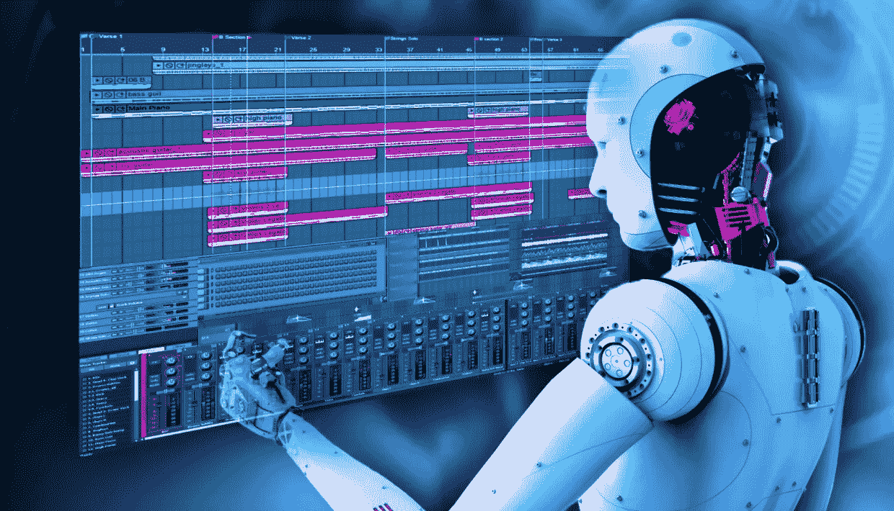

# 未来的音乐监督者；你的工作是安全的

> 原文：<https://medium.datadriveninvestor.com/music-supervisors-of-the-future-your-jobs-are-safe-7d24591236de?source=collection_archive---------21----------------------->

随着关于人工智能、机器学习和自动化的讨论无处不在，自然随之而来的是一场关于所有行业某些角色衰落的对话。在数字化时代，自动化及其提高效率的承诺对于更灵活的创业文化(簿记、高水平计算、体力劳动等)至关重要，你可能会看到一些这种情况，但现在这种对话正在蔓延，包括创造性角色也被取代的可能性。这引起了我们的兴趣。

你必须追溯到 60 年代末，才能找到机器人在汽车生产线上取代人类的第一个例子，但执行更复杂和创造性任务的复杂算法的开发只是在最近几年才真正加速。尽管我们许多人都是雄心勃勃的未来主义者，但不可避免地会有人谈论机器人/人工智能在未来的创意产业中能做些什么。我们能自动化什么？我们如何将人类排除在循环之外，以节省金钱和时间？

**关键问题**

那么，音乐监制会失业吗？人工智能会最终完全取代我们，让我们都去争夺 O2 最后剩下的调酒师职位吗？随着更多的发展，音乐监督员日常工作的几个方面可能会由人工智能/复杂的算法来执行。因此，这里的关键问题是，随着机器学习变得越来越复杂，我们所知的音乐主管是否会失业，或者在这个反乌托邦的技术未来中，我们是否还有空间。这里要关注的三个关键领域是创意(商业)音乐研究、定制作品和乐谱的制作，以及更模糊的许可、咨询和项目管理领域。

**电脑音乐**

当谈到音乐创作时，马是非常不寻常的。Pierre Barreau 在卢森堡创立的 AIVA 是未来音乐制作的众多范例之一，包括由谷歌和 IBM 资助的项目。AIVA 甚至注册为职业作曲家，并发行了一张专辑([创世纪](https://soundcloud.com/user-95265362/sets/genesis))……但这仍然是一套精心编程的算法，而创世纪虽然是由计算机作曲，却是由真人在录音室录制的。谷歌通过他们的 NSynth 项目，创造了一种机器学习算法，*“使用深度神经网络来学习声音的特征，然后根据这些特征创造出一种全新的声音”*，与上面的 Genesis 一样，在这个阶段它仍然依赖人类音乐家使用该工具并将其转化为音乐，但多久之后这不再是必要的？

**发现弱点**

当谈到为电影或活动寻找完美的商业曲目时，我们已经能够利用音乐流媒体平台让公众与音乐互动和发现音乐的方式的快速和突破性变化。当我们第一次开始为品牌电影、商业广告和电视节目挑选歌曲时，我们仍然在翻看我们的音乐收藏、我们的 CD、我们的硬盘，里面装满了成千上万个精心组织的(咳咳)文件夹，甚至是我们的“黑胶唱片”。现在，许多研究人员的第一站是使用 Spotify / Apple Music 来获得声音/艺术家的初始调色板。虽然这可能适用于非常简单的歌词搜索或广泛的流派搜索，但它的创作范围非常狭窄，因为你必然会受到他们特定算法发回的内容的限制；依靠它在艺术家之间建立的基于收集的用户数据的联系，而不是基于对电影中将起作用的东西的直观理解。在这个过程中(除非一个罕见的偶然时刻)，几乎没有什么能够取代灵感的火花，这种火花揭示了一条完全“不简短”但却有效的轨道，并赢得了工作。此外，对于经验丰富和值得信任的主管来说，在很多情况下，当你的客户明确或不明确地说“我们不知道我们想要什么”时，你会在流程开始时被带进来。。你的经验、知识和创造力可以帮助构建音乐纲要，或者通过指导、探索甚至提出你知道不会有助于关闭某些门的曲目来缩小关注范围。你可以看看 Spotify 的“Fans Also Like”部分，找到听起来与你的参考曲目相似的东西，但你在哪里能找到完全不同的东西，以同样的方式讲述这个故事呢？

那么当前的人工智能能在哪里增值呢？

在我们可以举出的其他例子中，IBM 资助的名为 Watson 的算法取得了有趣的进展，该算法分析*“大量的非结构化数据，如文章、社交媒体、采访和粉丝情绪”*以发现合适的合作艺术家。【https://www.ibm.com/watson/music/ 

有了正确的焦点，这将是一个非常强大的工具，品牌希望与特定的音乐个性合作。

问题仍然是，目前的人工智能无法处理视听产品中利益相关者之间的微妙沟通。导演和创意人员正在寻找支持他们的视觉内容讲故事的音乐，这通常需要多轮反馈和修改…为此，你需要智能沟通。

**推纸**

那么，说到许可。在今年的未来音乐论坛上，我们与伊莫金·希普[详细讨论了她对未来的愿景](http://myceliaformusic.org)，每个专业音乐人都有一个在线的“[创作护照](http://myceliaformusic.org/creative-passport/)”,可以在全球范围内访问，并详细记录他们对自己演奏、合作创作或制作的每首歌曲的贡献。这里有开发自动许可能力的潜力，但这将涉及国际版权组织之间前所未有的交流，或者在所有全球信息被成功且无可争议地吸收之前创建一个全球版权组织。此外，仍然必须有一个批准过程，这个过程一直是由版权所有者和艺术家管理人管理的，如果全球对同步的态度没有转变，很难想象这种变化。

自动许可的问题是，在报价阶段代表客户需求的音乐主管的真正价值将会丧失，因为大部分工作涉及深入媒体计划/首选媒体，并建议简化/删除请求中不必要的部分。它真的是全球在线的吗？还是你把你的付费媒体瞄准了特定的区域？你能地理锁定你的特定市场来帮助降低费用吗？需要存档术语吗？客户在任何时候都可能想看电视吗？我们可以内置选项吗？这些问题(以及更多更多的问题)有助于指导客户，同时也有助于他们想出应该问客户什么问题。问题当然可以自动化，但人们只希望使用自动化服务，如果它们能让他们的生活更轻松。与能够查看媒体计划/内容类型等并本能地快速知道要问哪些问题的专业主管相比，制作人不得不在自动化服务上经历一百个“是或否”的问题更不可取。你可以通过查看一个创意立即判断它是用于社交媒体还是非电影(例如)，但自动化服务不会进行这种区分，因此用户可能需要浏览数百个毫无意义的问题。

**所以……**

…人工智能会取代音乐监督者吗？我们不这么认为。会改变他们吗？大概吧。最终。我们认为在一部作品中有太多重要的领域无疑需要一个有经验的监督者来完全摆脱我们。无论发生什么，我们都在奋力拼搏，并期待着我们的未来。

*这篇文章由托比·斯莱德·贝克和亚历克斯·洛奇共同撰写*

**参考文章**

[https://www . the verge . com/2018/8/31/17777008/人工智能-taryn-southern-amper-music](https://www.theverge.com/2018/8/31/17777008/artificial-intelligence-taryn-southern-amper-music)

[https://www.ibm.com/watson/music/](https://www.ibm.com/watson/music/)

[https://magenta.tensorflow.org/](https://magenta.tensorflow.org/)

[https://nsynthsuper.withgoogle.com/](https://nsynthsuper.withgoogle.com/)