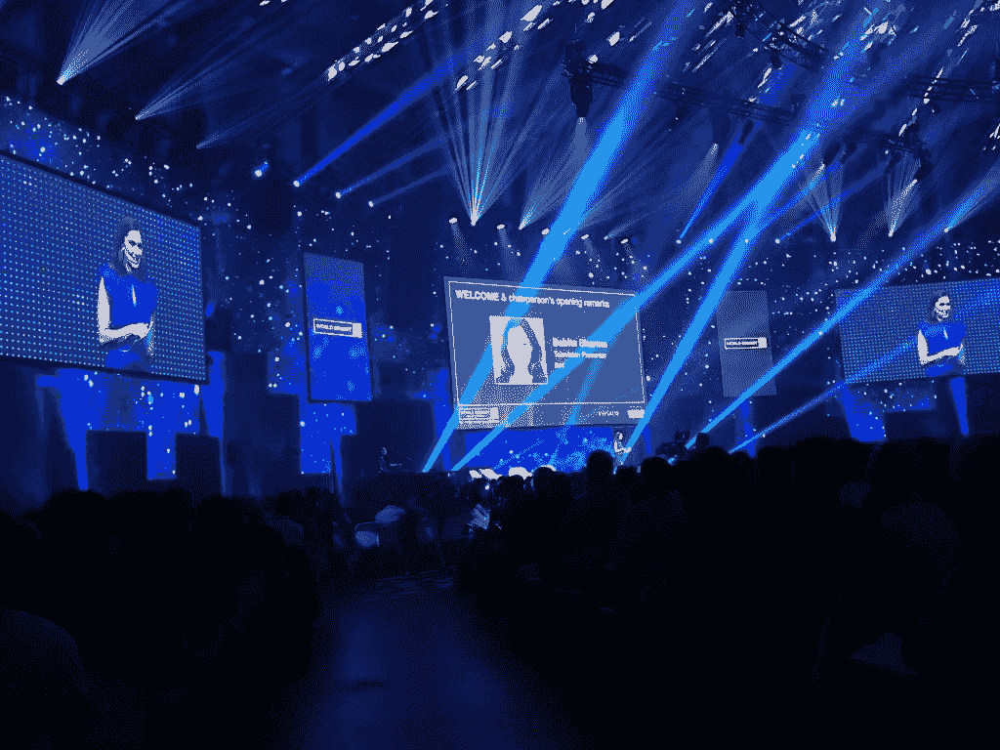
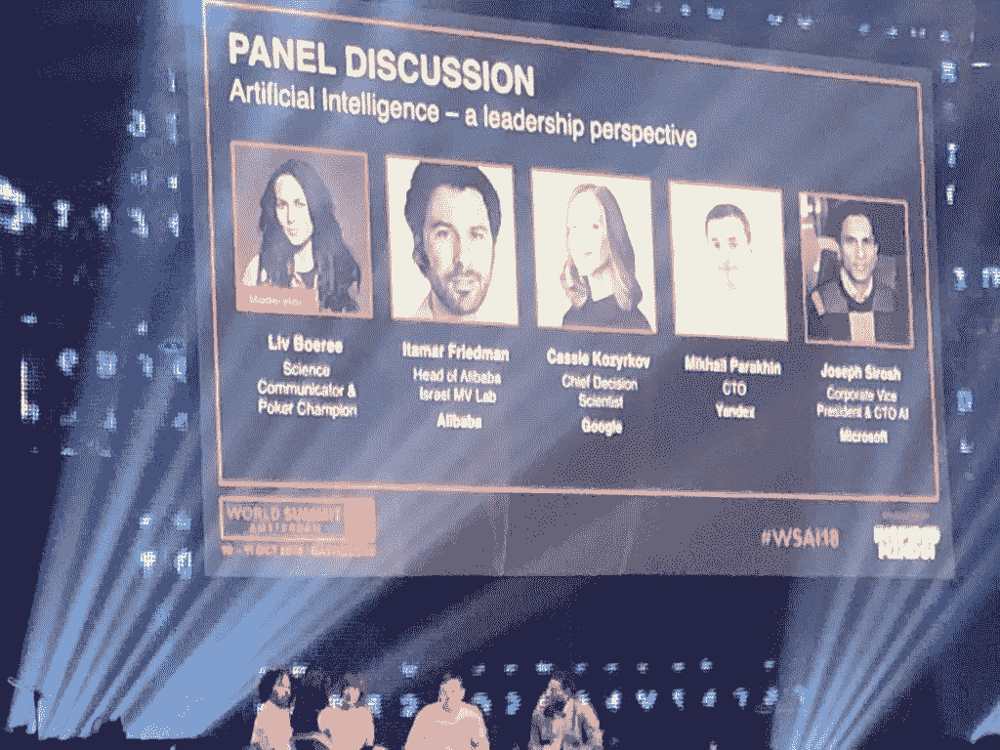

# 阿姆斯特丹(和 2018 年人工智能世界峰会)后的思考

> 原文：<https://medium.datadriveninvestor.com/musings-after-amsterdam-and-the-world-summit-ai-2018-3bbc9f591491?source=collection_archive---------21----------------------->

几周前，我参加了在阿姆斯特丹举行的 2018 年人工智能世界峰会。

我来自一个非技术背景的人(我最初是作为一名医学博士接受培训的)，并且作为一名管理顾问，最近一直在与各种初创公司合作(包括[conscience tai](https://conscient.ai))，我渴望从商业角度了解更多关于人工智能的知识。

WSAI 2018 是一次令人惊叹的聚会，来自 160 个国家的 6000 多名与会者对人工智能解决各种挑战的潜力充满热情。回想各种演讲者、研讨会和喝咖啡时的谈话，我想分享我的想法和学习。

**当前的趋势是什么？**

*人工智能的民主化*是一个出现了几次的主题，并反映在出席峰会的主要技术提供商的产品定位上，包括谷歌、微软和 IBM。信息很明确——当健壮、可扩展和安全的*引擎*可以通过 API 和其他工具访问时，不要花费时间和资源试图*重建引擎*。大多数人的努力，特别是从商业的角度来看，应该是利用领域的专业知识来定义实际的问题，并微调*引擎*来解决这些问题。然而，我不认为这意味着不需要专业的技术知识，或者这些工具将适合所有场景，例如当需要扩展/特定的功能或灵活性时。重要的是继续投资于人工智能研究，并改进核心人工智能技术，以继续迄今取得的进展。

相关的一点是关于*技术解释者的重要性。*许多公司正在投入巨资建立拥有双重技能的创新团队和个人。首先，对行业领域以及如何识别和构建业务问题有很好的理解。其次，对技术和人工智能有广泛的理解，能够与人工智能工程师进行明智的讨论，以确保模型解决真正的业务问题。我们[conscience tai](https://conscient.ai/)正在开发一个时尚分析平台，它强调了获取领域专业知识的重要性，以确保您的解决方案对行业具有相关性和重要性。

另一个重要趋势是*云人工智能*的出现，人工智能所需的*繁重任务*和处理集中完成，允许许多智能设备拥有更多功能。想到医疗保健领域的许多应用，这尤其令人兴奋——包括帮助人们看得更清楚的设备，以及帮助人们过上更正常生活的假肢。

**你如何从人工智能中获得最大价值？**

让 AI *引擎*运转的*油*就是数据。与石油类似，数据可以是不同的等级，这对产出有着巨大的影响，因此也影响了人工智能增加的价值。我们从在[conscience tai](https://conscient.ai)的各种项目中获得的经验得知，这通常是一个具有挑战性的领域，无论是获得足够数量的*培训*数据，还是围绕数据治理的问题。保护数据*供应链*并思考数据可用性的变化(以及如何相应地修改模型)将是人工智能计划中越来越重要的未来战略考虑。

与其他技术项目类似，测试和实现是非常重要的元素(可能会被更令人兴奋的模型构建所掩盖)。由于人工智能的本质，尤其是基于深度学习的技术，通常很难准确记录模型如何得出输出。这并不意味着不应该进行受控测试来验证在许多受控场景中的预期输出。这将特别重要，并将在金融服务和医疗保健等行业强制执行——事实上，我正在与一位参与为医院开发基于人工智能的解决方案的人交谈，他正在通过医疗设备所需的 [*CE 认证*](https://europa.eu/youreurope/business/product/ce-mark/index_en.htm) 。与其他转型计划一样，实施应注意不要照常中断业务，功能的增量实施可以实现微调和降低风险。

人工智能将影响许多工作角色和我们的工作方式，这是毫无疑问的。阅读了许多关于人工智能将对就业产生负面影响的危言耸听，从更平衡的角度理解它令人耳目一新。压倒性的观点是，人工智能不会取代人类，但会补充他们的能力。还讨论了人工智能如何自动化工作中更*平凡*的元素，使人类能够专注于更复杂、因此更有回报的元素，从而提高工作满意度。在医疗保健领域，在巴比伦等人工智能解决方案的背景下，就这一问题进行了多次讨论，讨论了它们在英国 NHS 等医疗保健系统中的地位以及医生对它们的接受程度，我知道这不会那么直接。然而，我认为我们需要进行基于事实的公开讨论——这将是解决这个无疑会激起许多情绪的领域的唯一途径。

**未来会怎样？**

人工智能领域所需的技能随着核心技术和商业分析技能的融合而不断发展。例如， [Cassie Kozyrkov](https://www.linkedin.com/in/cassie-kozyrkov-9531919/) 谈到谷歌员工正在接受*决策智能*的培训，这是一种应用人工智能、机器学习、统计和分析技能的混合物，用于解决商业问题。

对人工智能的治理进行更多的思考和关注——我认为这有几个因素。首先，将有一个巨大的焦点放在为人工智能*引擎*提供数据，以及如何使用人工智能来做出影响我们工作和生活的决策(即医疗诊断、保险决策等)。第二，将有检查点和保证框架来确保产出的有效性。其中一个优点(或者当输出不正确时的缺点)是 AI 可以被缩放的容易程度——我们需要确保它在小规模下工作，然后在大规模下放大问题。

我的儿子去年开始上学，我有时发现自己在思考并试图预测我需要做什么，以确保他在最好的地方获得正确的教育和技能。从我自己的职业经历和在 WSAI 强化的东西来看，感觉焦点正在从特定的(技术)技能和发展特定的职业(从第 1 步到第 10 步计划)上转移。感觉上，一些与批判性思维、终身学习/灵活性和好奇心相关的更一般化的技能，加上适量的创造力(不一定是传统的艺术性质)，将成为成功的关键决定因素。

总之，2018 年 WSAI 是一场非常有趣的活动，让我更多地思考人工智能的未来趋势，以及我们需要做些什么来保持相关性。有很多对话要跟进，还有科伦坡城市分会。AI 建立！

欢迎随时给我发短信，janak @ conscient . ai——总是很乐意聊天。