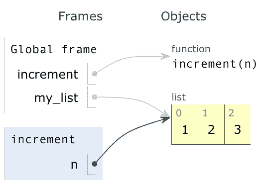
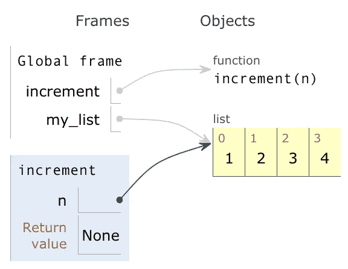
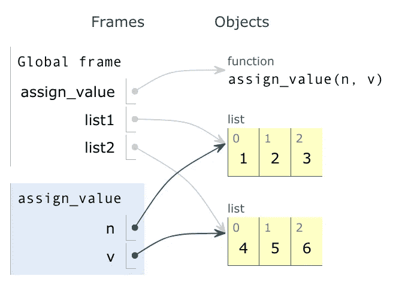
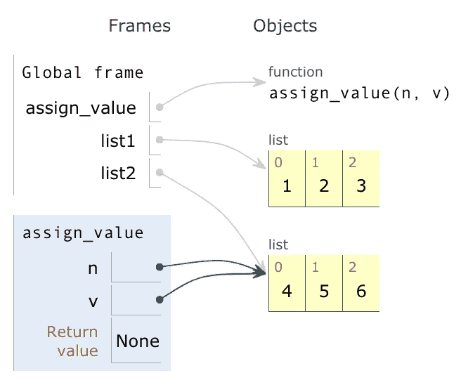
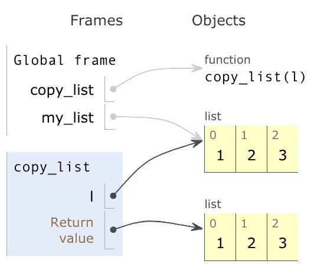

# Python 中的可变性和不变性——让我们来分解一下

> 原文：<https://medium.datadriveninvestor.com/mutable-and-immutable-python-2093deeac8d9?source=collection_archive---------0----------------------->

[](http://www.track.datadriveninvestor.com/1B9E)

Mutability or immutability

# **你曾经不知道或者不想修改一个变量吗？**

在本文中，我们将通过介绍 id 和类型、可变对象、不可变对象、为什么它很重要、Python 如何区别对待可变和不可变对象、参数如何传递给函数以及这对可变和不可变对象意味着什么来解决这个问题。我在 Python3 中包含了一些例子。


Who are you, who am I? Photo Attribution: [https://www.flickr.com/photos/saulalbert/37545736336](https://www.flickr.com/photos/saulalbert/37545736336)

# **什么是 id？**

```
id()
```

Id 是 Python 中的内置函数。它让我们能够检查对象的唯一标识符。让我们来看看这是如何工作的。

```
>>> a = 1
>>> a
1
```

我们看到 a 是一个包含值 1 的对象。现在让我们检查该对象的 id，即唯一标识符。

```
>>> id(a)
10105088
```

唯一标识符指向内存中的一个位置，它是一个对象。让我们试试另一个。

```
>>> b = 2
>>> b
2
>>> id(b)
10105120
```

你可以看到 id(a)不同于 id(b ),但是我们也可以运行一个测试。

```
>>> a = 1
>>> b = 2
>>> id(a) == id(b)
False
```

让我们将另一个变量赋给 2，并检查 id。

```
>>> a = 1
>>> b = 2
>>> c = 2
>>> c
2
>>> id(c)
10105120
```

嗯，id(c)看起来和 id(b)一样。这是为什么呢？我们来做个测试。

```
>>> id(c) == id(b)
True
```

它们有相同的唯一标识符，因为 c 引用了一个包含值 2 的对象，b 也引用了包含值 2 的**相同对象。好吧，让那件事发生一会儿。哇，对吧？**

它们都指向同一个包含值 2 的对象。

```
>>> id(c)
10105120
>>> id(b)
10105120
```

对象 10105120 是唯一的标识符。它是内存中的位置。对象可以有多个变量。如果你正在调试一个程序，这可能是一个有用的功能。现在让我们用绳子试试。

```
>>> a = "strawberry"
>>> b = "strawberry"
>>> id(a) == id(b)
True
>>> a = "strawberry"
>>> b = "Strawberry"
>>> id(a) == id(b)
False
```

这里发生了什么？在上面的第二个例子中，我们在变量 b 的对象中使用了大写的 S。所以它是假的。

让我们看更多的例子。

```
>>> a = 256
>>> b = 256
>>> id(a) == id(b)
True
>>> a = 260
>>> b = 260
>>> id(a) == id(b)
False
```

为什么 256 为真，260 为假？

原因是 Python 为-5 到 256 之间的所有整数保留了一个 integer 对象数组。当您在该范围内创建一个整数时，您会得到一个对已经存在的对象的引用。

它通过两个宏`NSMALLNEGINTS`和`NSMALLPOSINTS`来实现这一点。如果值`ival`满足介于-5 和 256 之间的条件，则调用函数`get_small_int`。

```
#ifndef NSMALLPOSINTS
#define NSMALLPOSINTS           257
#endif
#ifndef NSMALLNEGINTS
#define NSMALLNEGINTS           5
#endif#define CHECK_SMALL_INT(ival)
    do if (-NSMALLNEGINTS <= ival && ival < NSMALLPOSINTS) {
        return get_small_int((sdigit)ival);
    } while(0)
```

注意:您也可以使用“is”来检查两个变量是否有相同的对象 id。

```
>>> list1 = [1, 2, 3]
>>> list2 = list1
>>> list1 is list2
True
```

再介绍一些术语吧。

上面同一个列表有两个不同的名字，list1 和 list2，我们可以说是**别名**。变量指的是对象，如果我们将一个变量赋给另一个变量，两个变量指的是同一个对象。这就是别名的含义。

再来说说**克隆**。如果我们想修改一个列表并保留一个原始列表的副本，我们需要制作一个列表的副本。这个过程叫做克隆。获取列表的任何一部分都会创建一个新列表。

```
>>> list1 = [1, 2, 3]
>>> list2 = list1[:]
>>> list1
[1, 2, 3]
>>> list2
[1, 2, 3]
>>> list1 is list2
False
>>> id(list1) == id(list2)
False
```


Types

# **什么是类型？**

```
type()
```

在 Python 中，所有数据都以对象的形式存储。一个对象有三样东西:id、类型和值。

type 函数将提供作为其参数的对象的类型。

```
>>> type(2)
<class 'int'>
>>> type(-6.25)
<class 'float'>
>>> type(2,)
<class 'tuple'>
>>> type("hello")
<class 'str'>
>>> type('A')
<class 'str'>
>>> type('346.789')
<class 'str'>
>>> type([2, 3, 4])
<class 'list'>
>>> type({'category': 'produce', 'count': 200})
<class 'dict'>
>>> type(print)
<class 'builtin_function_or_method'>
>>> type(type)
<class 'type'>
```

和 id()一样，type()对于调试也很有用。

# 什么是可变对象？

```
PythonMutable objects:
list, dict, set
```

程序将数据存储在代表计算机内存存储位置的变量中。在程序执行的任何给定点，内存位置的内容被称为程序的**状态**。

Python 中有些对象是可变的，有些是不可变的。首先，我们将讨论可变对象。可变对象是可变对象，它的状态可以在创建后修改。

```
>>> my_list = ['cat', 'dog', 'bunny']
>>> my_list
['cat', 'dog', 'bunny']
>>> print('Address of my_list is: {}'.format(id(my_list)))
Address of my_list is: 139929780579208
```

如果我们想改变列表中的第一个值并打印出来，我们可以看到列表改变了，但是列表的内存地址是一样的。**它改变了地方价值。这就是易变的意思。**

```
>>> my_list[0] = 'sugar glider'
>>> my_list
['sugar glider', 'dog', 'bunny']
>>> print('Address of my_list is: {}'.format(id(my_list)))
Address of my_list is: 139929780579208
```

现在让我们看看列表的**值的内存地址，看看在我们改变列表第一个元素的值之前和之后发生了什么。**

```
>>> my_list
['sugar glider', 'dog, 'bunny']
>>> id(my_list)
139929780579208
>>> my_list[0]
'sugar glider'
>>> id(my_list[0])
139905997708792
>>> my_list[0] = 'rabbit'
>>> id(my_list[0])
139905997708400
>>> id(my_list)
139929780579208
```

当第一个元素的值为‘sugar glider’时，my_list[0]的 id 为 139905997708792。在我们将值更改为' rabbit '后，my_list[0]的 id 是 139905997708400。注意它们是两个不同的 id。

当我们修改一个列表并适当地改变它的值时，列表保持相同的地址。但是，您更改的值的地址将具有不同的地址。

我的 _list 的 id 仍然保持不变，仍然是 139929780579208。

# 什么是不可变对象？

```
PythonImmutable objects:
integer, float, string, tuple, bool, frozenset
```

不可变对象是不可改变的对象，并且其状态在创建后不能被修改。

在 Python 中，字符串是不可变的。您不能覆盖不可变对象的值。

但是，您可以再次分配该变量。

```
>>> phrase = 'how you like me now'
>>> phrase
how you like me now
>>> phrase = 'do you feel lucky'
>>> phrase
do you feel lucky
```

它没有修改字符串对象；它正在创建一个新的字符串对象。

为了更详细地了解这一点，我们可以利用我们之前学过的 id 函数。回想一下 id()函数打印出的内存地址。

```
>>> phrase = 'how you like me now'
>>> print('Address of phrase is: {}'.format(id(phrase)))
Address of phrase is: 139929793080104
>>> phrase = 'do you feel lucky'
>>> print('Address of phrase is: {}'.format(id(phrase)))
Address of phrase is: 139929792606832
```

因为字符串是不可变的，所以它创建了一个新的字符串对象。内存地址不匹配。

让我们试着改变这个短语的一个字符。

```
>>> phrase[0] = 'D'
...
TypeError: 'str' object does not support item assignment
```

我们得到一个 TypeError，因为字符串是不可变的。我们不能改变字符串对象。

我们也来说说元组。

元组的不变性只是部分正确。不能修改元组本身，但是可以修改元组引用的对象。如果元组有一个像字符串一样的不可变字段，那么元组就不能被修改，这有时被称为“非传递不变性”但是像列表这样的可变字段是可以编辑的，即使它嵌入在“不可变”的元组中。

# 为什么可变和不可变对象很重要，Python 对它们的处理有多大不同？

数字、字符串和元组是不可变的。列表、字典和集合是可变的，就像你用类编码的大多数新对象一样。

不变性可以用来确保一个对象在整个程序中保持不变。可变对象的值可以在任何时间和地点被改变，不管你是否期望。

您可以更改可变数据类型的单个值，但不会更改其内存地址。但是，您不能更改不可变类型的单个值。它将抛出一个错误。

# 参数是如何传递给函数的，这对可变和不可变对象意味着什么？

Python 编译器处理函数参数的方式与函数参数中的对象是可变的还是不可变的有关。

如果一个可变对象在函数中被引用调用，原始变量可能会被改变。如果你想避免改变原来的变量，你需要把它复制到另一个变量。

当不可变对象在函数中被引用调用时，它的值不能被改变。

让我们看看这个 Python 脚本，猜猜它会打印出什么:

```
def increment(n):
    n += 1

b = 9
increment(b)
print(b)
```

思考一下，然后继续阅读寻找答案。

变量 b 引用值为 9 的对象。当我们将 b 作为函数参数传递给 increment(n)函数时，局部变量 n 指的是同一个对象。然而，**整数是不可变的**所以我们需要创建一个值为 10 的新对象，并将它赋给变量 n。变量 n 指向的对象与 b 指向的对象不同。现在，n 引用了一个值为 10 的对象，但是 b 仍然引用了一个值为 9 的对象。当我们打印(b)时，我们得到答案 9。

答案是:9

让我们看看另一个 Python 脚本，猜猜它会打印出什么:

```
def increment(n):
    n.append(4)

my_list = [1, 2, 3]
increment(my_list)
print(my_list)
```

想一想，或许画一个可视化，然后继续阅读寻找答案。

变量 my_list 引用了一个 list 对象，该对象包含对三个整数的引用。列表是可变的，但是整数是不可变的。当我们将 my_list 作为函数参数传递给 increment(n) function 时，函数让局部变量 n 引用 my_list 引用的同一个对象。



因为列表是可变的，所以。append()方法能够就地修改列表。没有创建新的对象，当我们打印 my_list 时，我们得到答案[1，2，3，4]。

答案是:[1，2，3，4]



让我们看另一个 Python 脚本来了解更多关于函数参数的信息，以及为什么可变性和不可变性很重要。

```
def assign_value(n, v):
    n = v

list1 = [1, 2, 3]
list2 = [4, 5, 6]
assign_value(list1, list2)
print(list1)
```

思考一下，然后继续阅读寻找答案。

我们将这两个列表作为函数参数传递给 assign_value(n，v)函数。函数让局部变量 n 引用 list1 引用的同一个对象，局部变量 v 引用 list2 引用的同一个对象。



函数体将 n 重新分配给 v 所指的对象。现在 n 和 v 指的是同一个物体。



变量 n，v，list2 都指向列表对象[4，5，6]，而 list1 仍然指向列表对象[1 2，3]。这就是为什么当我们打印 list1 时，我们得到了答案:[1，2，3]

答案是:[1，2，3]

我们如何编写一个函数来返回一个列表的副本？这是做这件事的一种方法。我们来看看 copy_list(l)函数。

```
def copy_list(l):
    return l[:]

my_list = [1, 2, 3]
new_list = copy_list(my_list)
```



我们将 my_list 作为函数参数传递给 copy_list(l)函数。该函数使用局部变量 l 引用 my_list 引用的同一个对象。当我们使用 slice 操作[:]时，它创建了一个列表的副本，当我们返回该副本时，我们返回了对该副本的引用。现在，new_list 引用了一个不同于 my_list 引用的对象。

```
>>> def copy_list(l):
...    return l[:]
...    
>>> my_list = [1, 2, 3]
>>> new_list = copy_list(my_list)
>>> my_list
[1, 2, 3]
>>> new_list
[1, 2, 3]
>>> my_list == new_list
True
>>> my_list is new_list
False
>>> id(my_list) == id(new_list)
False
```

我知道我们在这里讲了很多，所以深呼吸，练习，重复，你很快就能向其他人解释这些概念。感谢阅读！