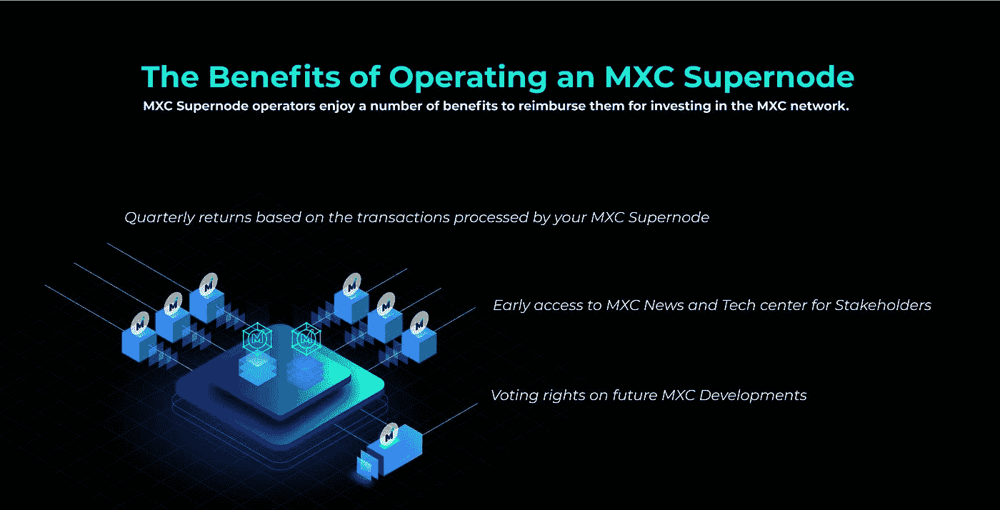
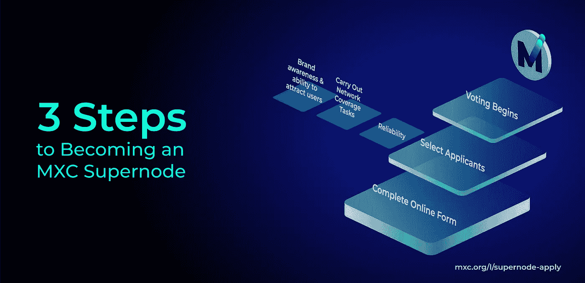

# MXC 超级节点在这里！！了解更多！！！数据驱动的投资者

> 原文：<https://medium.datadriveninvestor.com/mxc-supernode-is-here-learn-more-about-it-d906c87b83c9?source=collection_archive---------5----------------------->

对于那些不知道的人来说，超级节点是一种轻量级节点，甚至可以在低规格的计算机上运行。超级节点的主要目的是收集、验证、处理各种交易，并保持系统强大和快速，同时确保其保持效率和最佳性能。

最近，总部位于柏林的 MXC 基金会推出了 [MXC 超级节点计划](https://blog.mxc.org/3-steps-to-mxc-supernode/)，其使命是利用 LPWAN 和区块链技术激发快速、高效、分散的数据交换。

MXC 超级节点将负责确保“MXC 数据网络”保持完整、活跃、安全，并成为利益相关者、交易员和数据卖家的活跃场所。除此之外，MXC 超级节点将在 MXC 数据网络中发挥核心作用。MXC 超级节点是一个平台，它使用 MXProtocol 在志同道合的对等体之间建立网络，从而使用相同的共享 MXProtocol 共识将它们聚集在一起。

与其他设置高门槛的超级节点项目不同，MXC 以一个非常简单和低门槛的项目脱颖而出。要成为 MXC 超级节点，你只需要
**-一台双核服务器
- 4GB 内存
-20GB 存储，每月能发送 1000GB 数据**

听起来很有趣，你可以在这里了解更多

这些都是需要的，你加入很好。

## 所以现在的问题是，我为什么要加入？

除了第一个获得最新的 MXC 新闻并拥有 MXC 发展的投票权外，**你还将获得 70%的超级节点利润**。剩余的 30%将按以下方式分配:
-10%返还给赌注参与者
-10%返还给 MXC 基金会
-10%代币燃烧

这将每个月支付。(小提示——超级节点的活跃度越高，收益就越高)。

你可以在这里阅读更多关于这个[的内容](https://blog.mxc.org/how-supernodes-generate-profit/)

## 感兴趣，那么现在如何成为 MXC 超级节点？

## 第一步:填写在线表格

是的，导航到 [MXC 申请表](https://www.mxc.org/l/supernode-apply)并填写所有细节

## 第二步:初步审查和投票入围

运行超级节点有很多好处，但也有很多责任。初步筛选后，每个成功的申请人都需要运行他们的超级节点至少一年，以便社区有机会评估节点性能

## 第三步:社区投票

最初，MXC 将在全球推出 21 个超级节点。MXC 持有者在公众投票中选择所有 MXC 超级节点(是的，向民主问好)。超级节点的选择将基于它们的可靠性、它们执行数据网络覆盖任务的能力、它们的品牌知名度以及吸引更多用户到它们各自的超级节点的能力。这些是选民在选择他们喜欢的超级节点时可能会考虑的几个项目。

这只是 MXC 超级节点计划的开始。随着 MXC 继续成为全球最大、最值得信赖的物联网经济体，supernode 进程将在未来几个月和几年内继续发展。

 [## 数据驱动的投资者|技术、金融和创业方面的专家观点

### 数据驱动投资者致力于揭示普通人如何最好地利用数据，使更好，更准确的…

www.datadriveninvestor.com](https://www.datadriveninvestor.com/)