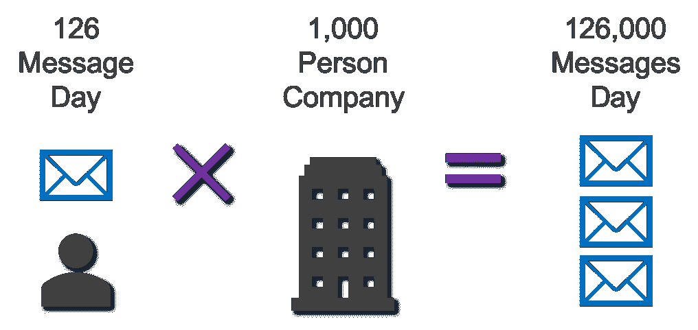

# mxHero 向 TAM 介绍电子邮件技术创新和未来工作前景

> 原文：<https://medium.datadriveninvestor.com/mxhero-addressing-the-tam-for-email-technology-innovation-and-perspectives-for-the-future-of-work-3df8ea709554?source=collection_archive---------5----------------------->

电子邮件技术是最普遍的商业交流平台，为创新提供了巨大的市场机会。

总可用市场(TAM)通常被初创企业使用，尤其是在融资过程中，以向风险资本家和投资者展示应用程序潜在增长轨迹的广泛市场潜力。也许更重要的是 TAM 的子组件，通常称为可服务的可获得市场，它是 TAM 的子集，可能是新解决方案或应用程序可能有机会渗透或抓住的更有针对性的市场细分。让我们探讨一下这些见解，因为它与企业中最普遍的 it 平台:电子邮件有关。

根据技术市场研究公司 Radicati Group 进行的独立研究，并利用其跟踪用户数量、席位数量、企业采用和 IT 使用情况(自 1993 年以来)的全球数据库以及基于地理的调查数据，一些深刻的要点可供 IT 领导者考虑。据 Radicati 集团称，全球电子邮件的使用继续以健康的速度增长。

 [## 技术颠覆和就业的未来——数据驱动的投资者

### 随着技术颠覆和自动化与日俱增，关于……问题的争论也越来越激烈

www.datadriveninvestor.com](https://www.datadriveninvestor.com/2018/10/23/technological-disruption-and-the-future-of-jobs/) 

2015 年，全球电子邮件用户数量将超过 26 亿，到 2019 年底，这一数字预计将超过 29 亿[电子邮件统计报告，2015–2019，Radicati]。因此，到今年年底，超过三分之一的世界人口将使用电子邮件。虽然该报告强调了全球电子邮件使用的增长，但也承认即时消息、社交网络和其他形式的通信的使用也在继续扩大。

然而，这些创新平台也依赖于用户的“密钥”,因为每一项服务都依赖于拥有电子邮件地址的最终用户。这也包括新的创新，如电子商务，网上银行，所有这些都需要一个活跃的电子邮件地址。在 2015 年至 2019 年期间，全球电子邮件用户的数量以每年约 3%的速度增长，其中包括企业和消费者级别的电子邮件帐户。仅在 2015 年，全球每天发送和接收的电子邮件就超过 2050 亿封，预计到当前日历年(2019 年)年底将超过 2460 亿封。

> *对于 mxHero Mail2Cloud 来说，可获得的 TAM 和可服务市场可谓意义深远*

对于 [mxHero](https://mxhero.com) 来说，鉴于我们对企业 Mail2Cloud 平台解决方案的全面关注，包括协作、用户采用、固有内容保留和网络安全优势，我们知道我们在全球电子邮件基础设施的一个子集上运营，即业务特定的电子邮件帐户。因此，研究表明，如果增长预测保持不变，平均每个企业用户每天发送和接收大约 122 封电子邮件(2015 年的数据)，到 2019 年底，每个用户每天发送和接收的邮件将超过 126 封。对于一家专注于未来工作的全球性企业来说，例如拥有 10，000 名员工，这相当于每天收发约 126 万封电子邮件，或者一年收发 4.6 亿封电子邮件。进一步的细分表明，在预计每个用户每天发送和接收的 126 封电子邮件中，大约 96 封是入站电子邮件(77 封是合法的，大约 19 封预计是垃圾邮件)，每天大约 30 封电子邮件被指定为“已发送”电子邮件。全球每天发送/接收的电子邮件总数超过 2465 亿封，研究表明，这些全球电子邮件总数中约 52%直接适用于“业务相关”电子邮件或每天约 1288 亿次电子邮件交易。

Based on available research, a 1,000 person company traffics a whopping 126,000 email messages a day

## 对未来工作的看法

对于像 mxHero 这样完全专注于电子邮件平台创新以推动协作、工作流自动化、平台采用、内容策略实现和威胁载体减少的企业来说，TAM 和可服务的可获得市场可谓意义深远。鉴于电子邮件对于未来企业的无处不在的性质，事实是我们都依赖于电子邮件通信，以及它为我们提供的特定于内容和特定于我们如此依赖的社交和企业应用程序边界套件的“可访问性”的固有“钥匙”。

鉴于全球企业级电子邮件使用的广度，进一步研究显示带有附件有效载荷的电子邮件的百分比(%)将是一个更有洞察力和更深刻的领域，可以从分析角度或研究角度进行探索。Radicati research 估计，收发的商务电子邮件中有 24%带有文件附件。[Email Statistics Report，2009–2013，Radicati]这一数字意义深远，不仅体现在附件有效负载的数量上(53 封带附件的邮件/天/用户)，还体现在内容大小(通常有限制)、内容存储要求以及基于分类、机密和通常会影响监管的电子邮件附件的交换所存在的固有不安全性上。

如果未来的工作不仅要利用右上象限的最佳新技术，公司高管也将面临挑战，以确保“现有”IT 平台和解决方案满足和/或超过其已安装系统(包括电子邮件)的安全性、协作、工作流自动化和价值主张目标。不解决最深刻、最普遍的 IT 基础设施工具的创新问题，将会阻碍这些企业的未来发展。

在 mxHero，我们正在正面应对这一全球性机遇和技术挑战。我们的 Mail2Cloud 智能平台为考虑上述主题的企业高管提供了显著的创新水平。鉴于企业中基于电子邮件的通信的激增以及这些通信交换所固有的相应内容负载，改善协作、工作流自动化以及扩展企业对其投资的内容管理平台解决方案的价值主张是未来工作的关键考虑因素。从安全角度来看，鉴于与武器化附件和安全问题相关的威胁载体，在 IT 创新堆栈的电子邮件领域进行创新的理由可能更加深刻。安全不再是简单的防火墙或作为企业安全主题的最终用户培训。在 mxHero，我们相信“安全性”是企业 IT 生态系统所有级别的 IT 堆栈考虑因素，通过自动删除电子邮件内容和附件有效负载，支持新兴的基于云的内容管理平台(如 Box)的更安全优势，我们正在推动工作的未来。虽然 TAM 和可服务的可获得市场在全球范围内对这种解决方案来说是非常广泛的，但我们相信包括 mxHero 的 Mail2Cloud 在内的新技术的价值将为每个企业(从 5-10 人的小型 SMB 公司到世界上最大的企业)提供显著的优势，我们对推动工作的未来感到兴奋。

[www.mxhero.com](https://mxhero.com)