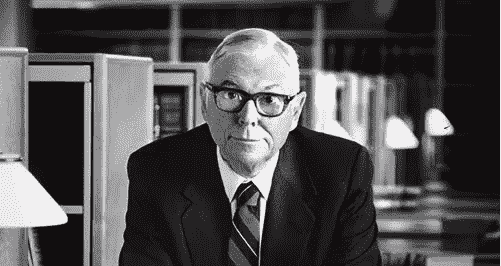

# 我从查理·芒格在 2019 年日报公司股东大会上学到的 10 点

> 原文：<https://medium.datadriveninvestor.com/my-10-learnings-from-charlie-munger-from-the-2019-daily-journal-corporation-shareholder-meeting-b966c7f8b126?source=collection_archive---------14----------------------->

查尔斯·科氏说他想站在巨人的肩膀上，而我周六晚上站在一个坐轮椅的 95 岁老人的肩膀上。

我就是这样度过周六晚上的。在我的起居室里，看着查理·芒格讲了两个小时，我自己放声大笑。对于那些不熟悉的人来说，查理芒格是伯克希尔哈撒韦公司的副董事长。除此之外，他还是日报公司的董事长。很奇怪，你点击阅读这篇文章，却不知道查理·芒格是谁，但如果你是这样的少数人之一，那么欢迎你。我希望这能成为你人生转捩点的入口。

 [## 区块链会引发全球金融体系的动摇吗？-数据驱动型投资者

### 2008 年的金融危机表明(对一些人来说),大型金融机构需要被密切关注和…

www.datadriveninvestor.com](https://www.datadriveninvestor.com/2019/01/11/will-blockchain-trigger-a-shakedown-of-the-global-financial-system/) 

以下是我从查理的演讲中获得的一些重要信息。在 95 岁的时候，他确实重复了许多核心原则，但正是通过这样的重复，我希望将他的原则铭刻在我自己的心中。我试着把这些组织成 10 个关键的学习。希望你觉得它有足够的价值，点击完整的采访观看和学习。查理的直接引语在下面用*斜体标出。*我添加了自己的评论，为一些人添加了背景，但许多人并不需要。

**1)关于投资多元化:**

*“寻求多元化，同时试图拥有优势，就像一遍又一遍地做不可能的任务。”*

*   芒格在伯克希尔哈撒韦公司、日报、好市多和陆离的亚洲基金都有投资(这是查理 95 年来唯一一次让除他之外的人管理他的钱)。这 4 项持股让他超越了大多数人。大多数人最好停止用不必要的行动来补偿他们的存在。正如亚当·斯密(Adam Smith)所打赌的那样，不断的买卖是投机者的方式，而不是投资者的方式。

**2)现代金融的愚蠢:**

*“如果你看看现代世界，有人试图教你积极炒股。我认为这相当于诱导年轻人开始吸食海洛因。这真的很愚蠢。当你已经很富有了，你还鼓励年轻人通过交易致富。”*

这人有一匹好马。这是一匹了不起的马。但是偶尔这匹马会变得危险和凶残。他带着马去看兽医，问他“我该对这匹马做些什么？”兽医说'这是一个非常简单的问题，我很高兴能帮助你。下次你的马表现好的时候，卖掉它。想想这有多不道德。我刚才不是描述了私募股权要做的事情吗？当私人股本不得不出售一些麻烦的东西时，它们会聘请一名投资银行家。投资银行家是做什么的？他做了一个投影。我从未见过投资银行家有如此专业的预测能力。没有什么生意是糟糕到不能得到一个好的投影的。但这是一种很好的谋生方式吗？做虚假的预测，用它从你看着的人身上赚钱？我会说不"

*   现代商业的不幸现实是，不可信的人总是想方设法欺骗大多数人。解决办法是变得明智，避开他们，不与他们交往。

**3)选择诚实。人们很少这样做。**

*“彼得·考夫曼说，如果骗子们知道诚实能赚多少钱，他们的行为就会不同。”*

“沃伦有一句很棒的话，那就是:‘如果你走大路，它永远不会拥挤’。”

如何不过糟糕的生活。反转我的朋友！

*“莫扎特过着糟糕的不幸生活，因为两件事英年早逝。他小心翼翼地超支。那是愚蠢的。他充满了怨恨和嫉妒。那两个人会过着糟糕的不幸生活，英年早逝。向莫扎特学习。”*

查理不会雇用埃隆·马斯克

*“永远不要低估高估自己的人。这些高估自己的古怪家伙偶尔会把事情搞砸..这是现代生活中不幸的一部分。我已经接受了这个事实。在我的个人生活中，我不想要那个偶尔大获全胜的妄想状态的人。我要审慎的人”*

**6)决策和机会成本**

“如果我们能做一些我们能做得更多的事情，那么我们对做得更好没有兴趣。”

*   贴现率是机会成本。因此，你的折扣率应该基于你的下一个最佳机会。如果摆在你面前的选择并不比你现在做的更好，那为什么还要追求它呢？

赖以生存的美德

*“试了就对了。所有那些古老的美德，他们工作。”*

*   毫不奇怪，查理是斯多葛派、爱比克泰德、马可·奥勒留及其全部作品的忠实粉丝。

成功的组织原则

发问者:*“既然伯克希尔公司取得了明显的成功，为什么其他公司没有效仿它的组织原则？”*

查理:*“主要原因是这对大多数人来说看起来不可能。对他们来说太难了。伯克希尔如此成功的原因之一是总部几乎没有人。我们消除了官僚主义。如果运行它的人是明智的人，那么没有官僚主义是一个巨大的优势"*

**9)关于投资**

*“如果你想轻松成功，你应该和吉姆·克拉姆谈谈”*

*   每个人都想要有保证的、立竿见影的大胜利。财经电视上的脱口秀主持人就是这样赚钱的。吉姆·克莱姆的股票可能不是最好的投资。相反，他们可能是过度拥挤的人。几周前，当 Shopify 上了 Jim Cramer 的节目时，我的朋友给我发消息说“看来是时候做空 Shopify 了。”没有简单、快速的胜利。

*“我说找好市多，不是退场”*

*   针对他如何退出公司。他在上世纪 60 年代收购了伯克希尔和好市多，并一直持有。投资者的重点是找到最好的投资机会，并有节制地长期持有它们。重点不在于销售，因为你永远无法把握市场时机，也不知道一家公司的“正确”估值是多少。估值是相对于你的下一个最佳机会的。

说出显而易见的事情。

*“人们所说的常识，其实是不寻常的常识。”*

发问者:*“简单的生活显然是正确的答案，但大多数美国人最终都像莫扎特一样。负债和超支。你如何发展纪律来对抗诱惑，过简单的生活？”*

“我是天生完美。”

[**链接至 2019 日报社年会全文**](https://www.youtube.com/watch?time_continue=6&v=X1Oi3esiry8)

*原载于【www.oldmandan.com】**。***