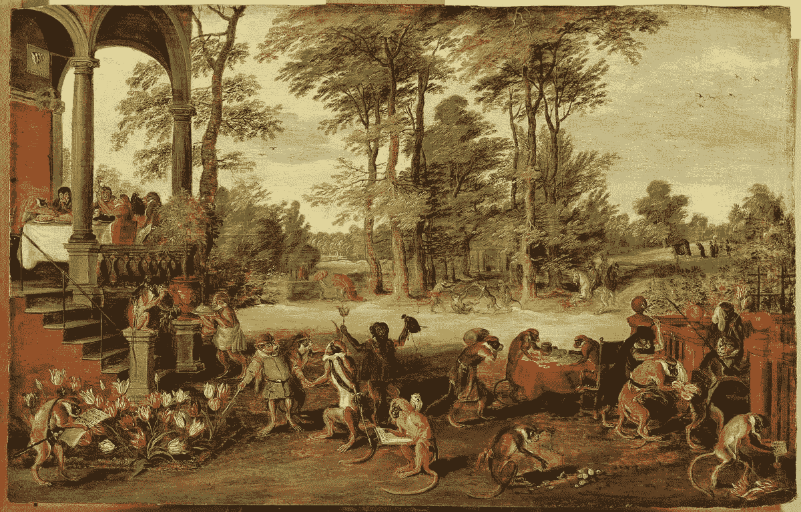
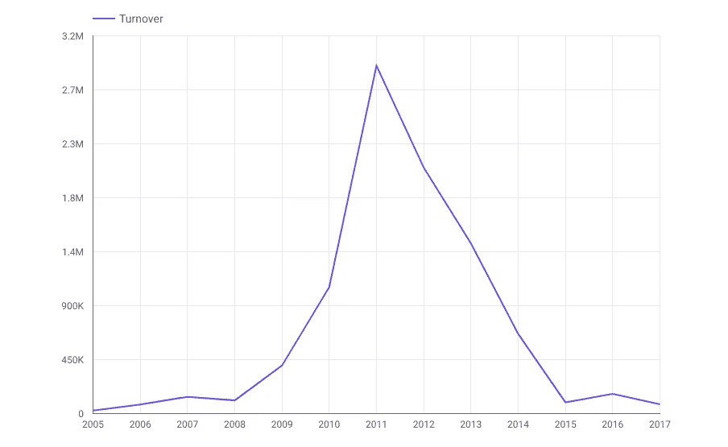
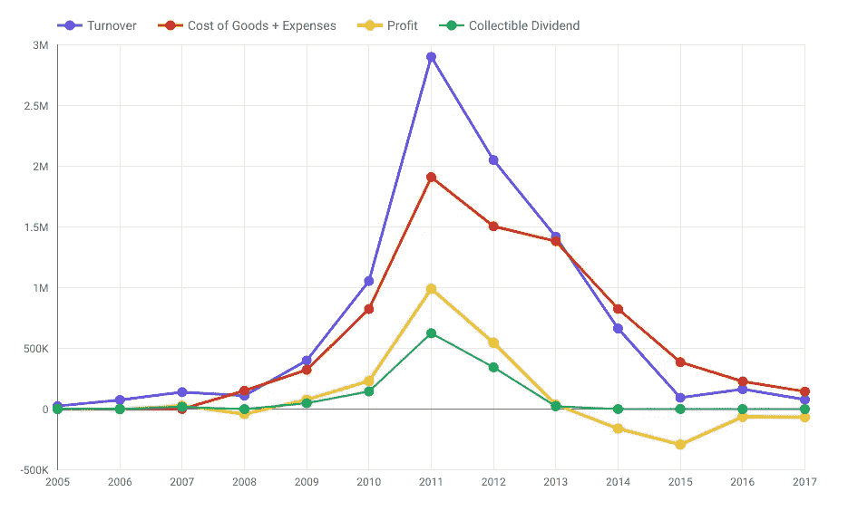
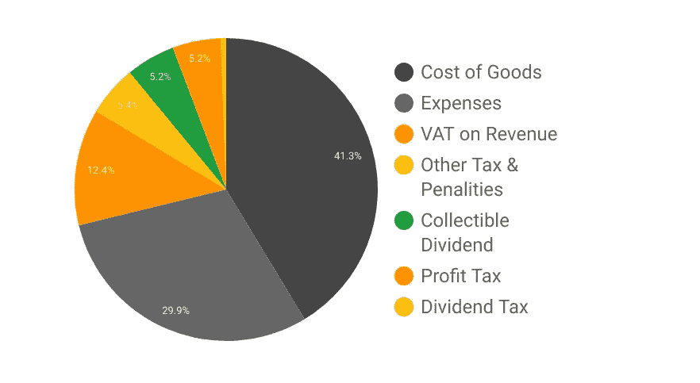

# 我在埃塞俄比亚科技行业的 13 年历程

> 原文：<https://medium.datadriveninvestor.com/my-13-year-odyssey-through-the-ethiopian-tech-industry-a867641e027a?source=collection_archive---------1----------------------->

作为一名计算机科学专业的应届毕业生，我在亚的斯亚贝巴大学工作了两年，之后我决定在羽翼未丰的 IT 私营部门闯出一片天地。2005 年，我和我的朋友兼联合创始人成立了一家私人有限公司(PLC ),提供一系列 IT 服务。

唉，13 年后，在经历了令人抓狂的 6 个月官僚地狱后，我即将结束对我公司的清算。

我写这篇文章的主要目的(实际上是事后分析)是给出一个内部人士对埃塞俄比亚技术部门或埃塞俄比亚总体私营部门的看法。我将尝试用财务报表来支持我的主张和声明，但请记住，这些是我自己的主观意见，应该持保留态度。

我不相信埃塞俄比亚对商业开放！

你可能会问，“那你为什么在商界呆了这么久？”我会用一个问题来回答，说“为什么人们会停留在糟糕/虐待的关系中？”

一些原因可能是:

*   希望(假希望？)
*   (对替代方案的)恐惧
*   对清算过程的恐惧
*   缺乏选择
*   [沉没成本陷阱](https://www.investopedia.com/terms/s/sunk-cost-trap.asp)
*   惰性、骄傲/羞耻、优柔寡断等…

## 起源

早在 2005 年，当我们成立公司时，我们的目标是提供服务，如软件开发和相关的 IT 服务。我们相信我们拥有必要的技能(或者可以在旅途中学习这些技能),可以做得和当时少数几家 IT 公司一样好，甚至更好。

事情并没有像预期的那样发展——作为一家科技公司，生存和发展比我想象的要困难得多。

几年后，我的搭档离开了，搬到了另一个国家。该公司处于低迷状态。那时，我们只为一些公司和一两个政府机构做了几个网站。

大约在第四年的时候，我发现了一种硬件设备，似乎可以满足埃塞俄比亚的需求。我获得了进口许可证，在中国找到了一家供应商，开始进口和销售这些设备。一开始很慢，但我围绕产品建立了一个生态系统，在接下来的几年里，该产品的收入增长到了数百万。

大多数产品都有一个生命周期(引入、成长、成熟和衰退)，这个也是如此。我未能正确预测产品寿命的终结，也没有努力用另一个来源来替代其收入的下降。我变得自满了。这意味着公司的收入也在下降。然后在 2014 年，该公司被审计，并被打了一个巨大的税单。这被证明是一场完美的风暴，只有毁灭性的税单、不断下降的收入和[无法获得外汇](https://addisfortune.net/columns/forex-crunch-choking-businesses-in-ethiopia-2/)才能共同创造。那是末日的开始。

Like most things in life, the turnover of the company represents a bell curve

## 审计

我们都听说过“证明有罪前无罪”和“证明无罪前有罪”这样的话，但在埃塞俄比亚税务当局看来，你永远都是有罪的。似乎没有人认真考虑过这种有害政策的可能后果。这几乎是 T4 恶性循环的一个完美例子。打破这种破坏性死亡螺旋的唯一可能方式是消除最初的假设，即每个企业都参与逃税。

其影响之一是让人想起被称为"一罪不二审"的刑事诉讼程序。试想一下，一旦被告已经因从未犯过的违法行为受到惩罚，他/她会做出什么事来。感觉这个系统实际上是在确保非逃税者的灭绝！

已经被审核了两次，我想说更多的经验，但我说不出话来。我能说的是，这是可能发生在你和你的生意上的最糟糕的事情，你应该从第一天就做好准备！

## 数字

你会接受一个合伙人吗？这个人可能是你的大股东，但不增加任何价值，阻碍你开展业务活动，总的来说让你的生活很痛苦。我不这么认为，但事实就是如此。那个不受欢迎的股东就是政府。

总的来说，在该公司运营的 13 年中，政府在财务上受益最大。如果我们把增值税也考虑在内，那么政府的收入是我作为一个完全所有者的 8 倍。这还不包括他们从个人所得税和养老金中收取的资金。

请看下图，了解该公司 13 年来的总收入是如何分配的。金融界人士和会计师可能不同意这种粗糙的描述，但是；它让你充分理解政府如何从你的小企业中获得不成比例的更好的收益。

整个饼图代表产生的总收入，黑色部分是运营成本，橙色是政府污水坑，最后绿色是可收取的股息(仅占饼图的 5.2%)

This is how the pie is divided. Who is the major shareholder of your business? You or the government?

## 挑战

实在是太多了，无法一一列举，但我会试着把重点放在那些我曾经近距离接触过的、与科技行业更相关的问题上。

一个残酷镇压的税收制度，税收太高，惩罚太重，是令人难以置信的无能和巨大的时间浪费，更不用说它对你的人性、善意和对你的国家的看法的影响。

它的规则和条例充其量是不合逻辑的，并与纳税人进行了最糟糕的打地鼠游戏，最终没有人会成为赢家。雪上加霜的是，当你想提出申诉时，税务机关既是检察官又是法官。当假定有罪时，证明自己无罪实际上是不可能的。一个人没有能力完成这项任务。

企业需要有一个可预测的法律和监管体系，才能茁壮成长。如果没有这一点，创业就会变成一场轮盘游戏。

**租金**或者说它的负担不起可能是埃塞俄比亚商业目前面临的三大挑战之一。这无疑是私有企业营业额高的最大原因。

在互联网上快速搜索证明，大多数来源同意以下说法。

> *“根据你卖的东西的不同，标准的总租金百分比可以从不到 1%到超过 13%，大多数行业的租金都低于 10%*

我担心在亚的斯亚贝巴，这一比例可能平均高达 70%。

我所熟悉的一种特殊的商业类型，网吧，是这些现象的主要受害者。网吧业务是相当独特的，因为人们可以在很大程度上确定性，计算预期收入。这是可能的，因为你可以根据座位的数量和你可以向客户收取的每分钟互联网使用费来计算收入。

由于租金和互联网等主要费用已经为人所知，人们可以创建一个 excel 表格，调整数字，看看这样的风险投资是否可行。遗憾的是，在当前的租金水平下，答案是否定的！除非你拥有这个地方。

这使我想到了另一个相关的问题，即私人拥有的地点和政府拥有的地点之间缺乏统一的租金。这给了政府所有的场地租赁者不公平和不应该的优势，并极大地扭曲了市场。增值税应用中同样缺乏统一性，这也对市场造成了严重破坏，对中小型企业造成了毁灭性影响。

自举是在资源非常有限的情况下启动业务的最佳方式之一。这在技术领域尤其常见，因为人们通常需要的只是一个好主意和众所周知的“[车库](http://www.businesspundit.com/11-famous-garage-startups-that-rule-the-world/)”，在那里他/她将应用他们的编程技能来创建一个创收的产品/服务。

举个例子，当我们成立公司的时候，我们只需要在表格上写下我的家庭住址，而且直到几个月后我们找到第一份工作后才需要租一间办公室。如果我们不得不租一间办公室，并按照现在的规则从一开始就进行装修，我们可能负担不起，也可能永远不会起步。

然而，就目前的情况而言，一个人需要租赁(房东通常要求预付三个月或六个月的租金)或拥有一个位置，提供所述位置，拥有一定数量的员工(根据每个部门的“能力”规则和规定)，拥有各种类型的设备，购买昂贵的收银机，拥有你声称作为资本的现金等。当你把所有的加起来，它会高达数千，这不是每个人都能拿出来的。这基本上将很大一部分人拒之门外，使他们无法从头开始创业。

**外汇或者缺乏外汇可能是埃塞俄比亚数千家企业倒闭的原因。我的公司也不例外。如果美元可以用于进口，它可能会改变公司的进程。**

可悲的是，政府的每一次低效和失职都会导致更多的问题，因为这些反过来又为腐败、贪污和规避规则打开了无限的通道。

基础设施显然对发展很重要。然而，信息技术的缺乏或不足对所有企业的影响并不相同。如果你没有可靠的、负担得起的互联网和电力来驱动，你根本无法创建一个科技企业。

在某些时候，我们每月的宽带上网费用是房租的两倍还多！如果你不是埃塞俄比亚人，你会相信这种事吗？

一种禁而不止的心态和工作方式完全渗透到了埃塞俄比亚的大多数政府机构，甚至普通大众。看看我们的科技行业，你会有一种怪异的感觉，就像回到了 90 年代初。

## 关键要点

在这 13 年里，我学到了很多，也成长了很多。虽然不能列出所有的教训，但我会列举一些我认为对其他人有益的。

*   **产品生命周期**很重要。注意阶段，未雨绸缪。
*   围绕产品/服务建立一个**生态系统**。这将允许您进行追加销售、交叉销售，并从总体上最大化您的产品/服务收入。
*   **照顾好你的顾客**。不要总是追求金钱，大多数时候，选择客户的幸福。它会以你当时可能无法察觉的方式带来回报。
*   尝试**创建能创造经常性收入的业务**这样你将有一个持续和可预测的收入来源。
*   你的**员工**，尽管他们可能很伟大，但永远不会/取代你，或者**永远不会像你一样对企业有感觉**。
*   **尽可能增加价值**。你提供的每一个附加值都很重要，即使是那些看似微不足道的。利用你最重要的附加值。
*   **从问题入手**想出解决方案。不要试图向市场推销你的产品。
*   尝试**避免不可扩展的产品/服务**。如果一项服务的成功交付依赖于你或你的存在，如果一个产品不容易被创造/制造，如果一个业务流程不可复制，那么你应该重新考虑它。
*   关注你的财务状况，期待意想不到的事情。预计会遭遇不公平的税收和罚款。最小化你的经常性成本。
*   **位置并不代表一切**。古老的谚语“造一个更好的捕鼠器，世界会找到你的门路”确实成立，至少现在是这样。总的来说，我认为这适用于像埃塞俄比亚这样的卖方市场。如果你打造了一个足够重要/有价值/革命性的产品，人们确实会来找你。
*   在埃塞俄比亚几乎找不到优秀的人才。你可以随意将此归咎于过去几十年来错误的教育政策、年轻人卑劣的职业道德、贫困等等。你可能会听到一些人滔滔不绝地谈论埃塞俄比亚将如何成为下一个外包目的地——让我低调一点，说他们错了！
*   **广告**，除非在传统媒体上，**在埃塞俄比亚这里**不起作用。
*   永远不要赊销！当我们这么做的时候，为了避免诱惑，甚至不要打印赊销收据。
*   不要和竞争对手打价格战。一开始就没有竞争对手。自成一格。

## 结论

老实说，如果 13 年前我在一家中型企业或非政府机构找到一份相当不错的工作，现在我的经济状况可能会更好。这是最终的启示，由数字支持，最终导致我决定清算。

一个同样重要的因素可能对这个结果有很大的贡献，那就是我不愿意参与平庸的项目。我敢说，这些年来我试图遵循的大多数途径都是独一无二的。总的来说，我喜欢创造新的趋势，提出新颖的解决方案并富有创造力。如果不是这种倾向，该公司本可以追求更主流的业务，并可能蓬勃发展。

这也让我意识到，市场可能还没有为创新解决方案做好准备，商业环境也不允许你花时间为你的解决方案培养和发展市场。

我想重申，我并不是想把我生意的失败归咎于税收之类的东西。就此而言，如果我决定继续下去，我可能会靠不断减少的储蓄和担忧来谋生。再说一次，并不是破产，而是意识到我会过得更好才导致了清算的决定。

我的主要主张是，在埃塞俄比亚建立一个****成功的*** 企业存在结构性问题/障碍。*

*这些问题很多，主要有:*

*   *税法，*
*   *荒谬的许可规则和条例，*
*   *由错误的经济政策导致的昂贵租金，*
*   *采购问题，*
*   *缺乏外汇，*
*   *腐败部分是由过多的监管官僚机构造成的，如令人眼花缭乱的部、局、当局、机构等。*

*所有这些因素交织在一起，使得一个人不得不努力投入到商业模拟中。这就是为什么我要说，你最好投身于其他的努力；尤其是如果你有市场需要的技能或良好的教育。*

*中小企业本应是经济的支柱，然而在这里，它们却被视为国家的敌人。尽管大多数埃塞俄比亚人认为企业主是富有和成功的个人，但事实远非如此。大多数人对他们的业务没有真正清晰的洞察力，通常无法告诉你他们是否长期盈利。大多数人度过了许多不眠之夜，担心下一场灾难会不知从哪里冒出来，偷袭他们。*

*我当然不后悔当初自己创业的决定。我积累的经验和技术知识是无价的，拥有它们我现在过得更好。我们折中一下，称之为很长的硕士:-)*

*很难想象已经过去了 13 年，但环顾四周，我一只手就能数出有两位数历史的科技公司。如果你开始关注你在日常生活中遇到的各种业务，你会发现周转率非常高。一两年后，很难在同一个地方找到一家商店(甚至是现存的)。*

*众所周知，许多企业不是靠奉献精神、创造力和服务质量，而是靠贪污、渎职、偷工减料和剧本中的其他各种伎俩继续生存和发展的。尽管如此，我不会建议任何人在埃塞俄比亚开始创业之旅，至少现在不会！*

*现在，你会在市场的独立承包商角落里找到我！*

*请随时联系。我的推特账号是@nahomt*

****P.S:*** *有人请对每个行业的企业的寿命进行比较研究，并分析它们消亡的各种原因。这将是理解埃塞俄比亚商业环境及其问题的良好开端。**

****编辑于 2018 年 11 月 22 日:****

**这篇文章最终在 Twitter(*[*@ nahomt*](https://twitter.com/nahomt)*)上引起了一些兴趣和讨论，我决定写一篇后续文章，列出一些政策“建议”。下面是文章:**

* [## 如何让埃塞俄比亚的创业更友好——明天？

### 虽然我不愿意武断地说需要什么来修复埃塞俄比亚破碎的商业环境(我只是…

medium.com](https://medium.com/@nahomt/how-to-make-ethiopia-startup-friendlier-tomorrow-706571c2445e) *