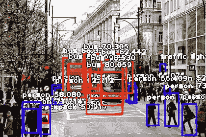

# 用张量流进行实时目标检测的方法

> 原文：<https://medium.datadriveninvestor.com/my-approach-to-real-time-object-detection-using-tensorflow-608a7260efa7?source=collection_archive---------7----------------------->

Detection objects with Tensorflow

在葡萄牙大学攻读信息学硕士学位时，我不得不研究张量流，并想办法提高自动驾驶汽车的使用效率。其中一个问题是物体的预测和检测。这是一条研究路线，允许机器观察它们的环境，它们的上下文，评估和呈现数据，以便可以为车辆定义行动。

有些知识必须先解决。我从 Python 编程开始，然后使用 Anaconda 平台和 Jupyter 笔记本。随后你需要数据科学和统计学方面的知识。
在这种情况下，技术学谈论的是拥有机器学习的知识和关于神经网络、深度学习的知识。

一些算法已经可用，并且有预先训练的模型，允许我们在创建我们的编程场景时安全和流畅地前进。

预训练模型 Tensorflow 检测模型 zoo- COCO 数据集提供了在 COCO 数据集上预训练的检测模型的集合。
如果您对 COCO 中已经存在的类别感兴趣(如人类、汽车等)，这些模型可用于开箱即用的推断。在新数据集上进行训练时，它们对于初始化模型也很有用。

我在这里介绍我用摄像机探测物体的工作。

为此，我克隆了 Github 存储库 [lbeaucourt](https://github.com/lbeaucourt/Object-detection) ，以使用一个示例进行研究。
我研究了来自 tensorflow 的例子，在 [Github 上:](https://github.com/tensorflow/models/tree/master/research)见 Jupyter 笔记本上的 object_detection_tutorial.ipyn。

在这里获得了一些关于 www.pyimagesearch.com[的研究。
我工作成果的视频可以在](https://www.pyimagesearch.com/2015/12/21/increasing-webcam-fps-with-python-and-opencv/)[链接上找到。](http://www.youtube.com/watch?v=zuY0BeTELt4E)

使用这个小例子，下一个测试将是使用我的汽车中的开发，制作一条穿过城市的路线。在下一篇文章中，我会写下我的经历。

你可以在 [Github 上查看我的开发。](https://github.com/MRobalinho/Real_time_object_detection_using_tensorflow)