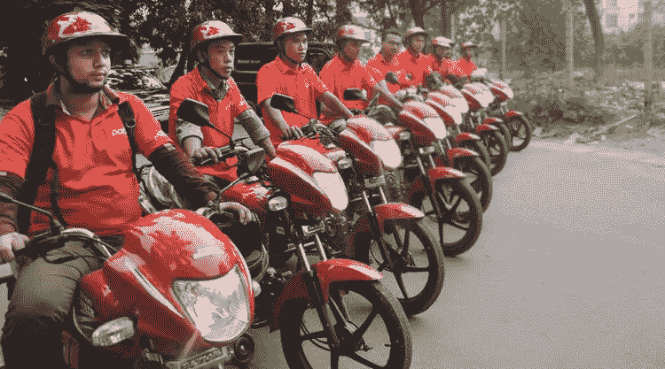

# 作为一名企业家，我最大的教训来自于进入一个我不知道存在的市场。事情是这样发生的

> 原文：<https://medium.datadriveninvestor.com/my-biggest-lesson-as-an-entrepreneur-came-from-entering-a-market-i-didnt-know-existed-72f94c534e6?source=collection_archive---------0----------------------->

在世界任何地方创业都是一项艰巨的任务。

尤其是在美国和欧洲，某些市场开始感到饱和。除了优步和 Lyft，美国消费者真的想要另一个拼车应用吗？你的个人理财应用真的能与 Venmo 或 Paypal 竞争吗？

这并不意味着你需要放弃创建一个成功的企业和过上肾上腺素驱动的企业家生活方式的梦想。

> 相反，你可能只需要在世界其他地方寻找市场。

在发展中国家，这种未开发的潜力比比皆是。想想你的商业想法在你生活的地方可能是万里挑一的，但在发展中国家却是独一无二的。不仅如此，在美国或欧洲根本行不通的商业模式在世界其他地方可能有巨大的潜力。

这是我在孟加拉国与人合伙创办的摩托车出租车公司第一手发现的。

# **当我开始研究孟加拉国的商业机会时，我并不关注摩托车出租车行业。**

2015 年，我在孟加拉国的达卡创办了 Pathao，作为一项按需送货服务。

当时，我们关注的是物流，而不是运输。但在见到一位在印度尼西亚的摩托车出租车领域取得了惊人成功的投资者后，我们决定将 Pathao 推向同一个方向。

这种服务在许多其他发展中国家很受欢迎，在这些国家，摩托车是快速穿过高度拥挤的城市的最简单的方式。尽管达卡是世界上交通最繁忙的城市，但我们是第一个将这一模式引入孟加拉国的城市。不管出于什么原因，摩托车出租车并不是文化的一部分。

> 我不确定我们是否能够向孟加拉国人推广摩托车出租车。

这确实花了一些时间——起初，人们不太愿意坐在陌生人的摩托车后座上。只是没有完成。但随着时间的推移，我们赢得了人们的支持。

我们开始时有 100 辆摩托车和 100 名司机，现在我们有一支由 10 万名自由职业出租车司机组成的车队，他们都有自己的自行车。我们甚至看到人们购买摩托车只是为了为我们工作，这导致我们在街上行走两年后，孟加拉国的摩托车销量增长了 100%。

这是我和 Pathao 团队的一个重大成功，但更大的成功是 Pathao 对孟加拉国的影响。每天有成千上万次乘坐通过 Pathao 完成，有助于创建一个更高效的交通系统，并最终提高生活质量。

孟加拉国人现在更有可能依赖拼车服务，而不是用更多的汽车挤满街道，就像我们在优步和 Lyft 已经彻底改变个人交通的国家看到的那样。

> 看到 Pathao 的成功后，我和我在 Adventure Capital 的团队正在哥伦比亚和尼日利亚等国家开发其他摩托车出租车服务。

当然，向美国或欧洲这样的第一世界国家扩张是不可能的。摩托车出租车不符合我们的安全法，也不符合我们庞大的大规模基础设施。同样，电动滑板车公司——在美国得到数十亿美元的资助——在达卡或拉各斯是行不通的，原因很简单:路上坑坑洼洼。

# 当我遇到那位有影响力的投资者时，我根本不知道摩托车出租车市场的存在。

但当我看到 Pathao 变得如此成功时，我决定扩大业务，并在尼日利亚创建了一家类似的公司——go kada。

据我所知，一个国家的问题可能是企业家的机会。尼日利亚的奥卡达斯(他们对摩托车出租车的称呼)在通过一项法律时面临问题，该法律禁止 200cc 以下的自行车在主要道路或桥梁上行驶。这项法律的基础是奥卡达斯以开快车和鲁莽著称。他们不被视为一个安全的选择。

由于奥卡达斯在 T2 都低于 200cc，这项法律给 800 万摩托车出租车司机制造了一个大问题。

但是在 Gokada，我们认为这是一个引入超过 200cc 的自行车车队的机会。这意味着我们的自行车可以去任何地方，穿越城市。我们训练我们的司机，并确保他们以车手感到舒适的速度驾驶。我们正在努力改变人们对奥卡达斯的看法，让顾客知道，当他们骑上我们的自行车时，他们会得到很好的照顾。

# **在 Gokada 之后，我还投资了一家名为 Picap 的哥伦比亚摩托车出租车服务公司，该公司也面临监管挑战。**

在哥伦比亚，人们不认为骑摩托车出租车是危险的，至少不会发生交通事故。

相反，问题是有很多犯罪与摩托车有关——最明显的是抢劫和驾车暗杀。为了打击这些犯罪，哥伦比亚政府通过了一项法律，在该国首都波哥大的部分地区，超过特定发动机规格的摩托车搭载 14 岁以上的男性乘客是非法的。

> 这给 Picap 带来了严峻的挑战——如果他们不设法解决这个问题，他们要么以拒绝大量客户而告终，要么就违反了法律。

因此，Picap 创建了一个系统，根据性别和摩托车引擎大小将司机和乘客匹配起来，以确保每次乘坐都是合法的。

通过 Pathao、Gokada 和 Picap，我们提供了一种以前很多人无法使用的交通方式。通过这样做，我们不仅创造了可行的、有利可图的企业，而且我们还向有需要的国家介绍了解决问题的产品，并雇佣了数千人。

因此，与其与美国和欧洲饱和的市场竞争，也许是时候看看发展中国家了，这些国家充满机遇，等待企业家的头脑来解决改变生活的问题。