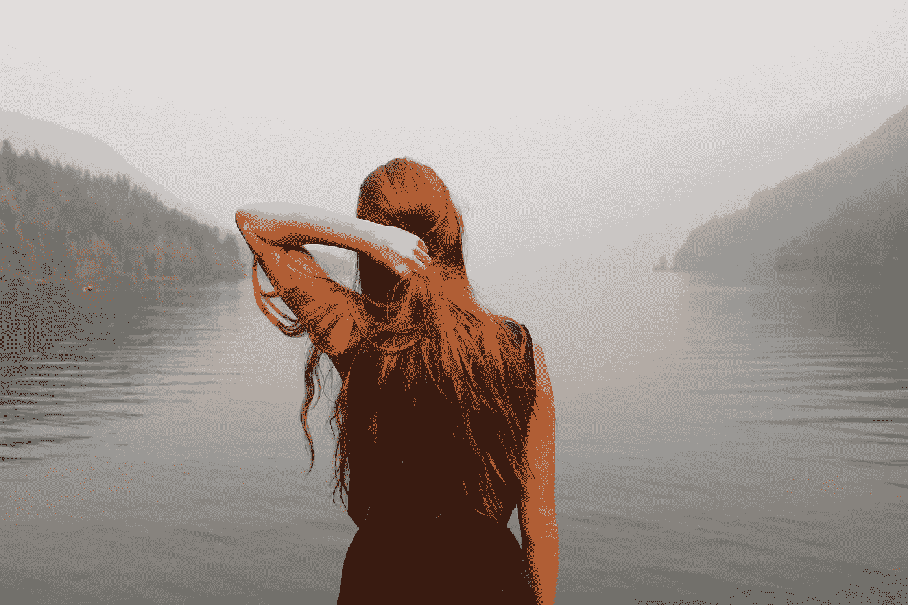

# 我不再试图充实地过好每一天

> 原文：<https://medium.datadriveninvestor.com/my-breakup-with-trying-to-live-each-day-to-the-fullest-6f7eed1abd68?source=collection_archive---------7----------------------->

“无论你在哪里，都在那里。”——吉姆·埃利奥特

Photo by [KaLisa Veer](https://unsplash.com/photos/9G3Wg1BRYqQ?utm_source=unsplash&utm_medium=referral&utm_content=creditCopyText) on [Unsplash](https://unsplash.com/search/photos/nature-woman?utm_source=unsplash&utm_medium=referral&utm_content=creditCopyText)

我正在浏览我的新闻订阅，像每一天一样，它充满了如何充实生活的建议。显然，我的目标应该是过上更充实的生活，并且不缺少如何最好地实现这一目标的指导。

建议的范围从激烈的，如“预订一个异国情调的假期”，到更容易管理的目标，如“创建一个愿景板”。还有很多模糊的建议，比如“设计你的理想生活”。我找到了列表、书籍、播客和几千张激励海报，建议我如何从生活中挤出最后一点充实。

问题是，我试过了。我看过书，买过票，看过博文，下载过励志桌面壁纸。

## 如果可以从可下载的桌面壁纸中得到改变，我会是金色的。不幸的是，通常没那么容易。

当[鲍勃·戈夫](http://bobgoff.com)、演说家、爱情爱好者、 [*【爱情做*](https://amzn.to/2SX4pU0)[*的畅销书作者，大家总是*](https://amzn.to/2Y0gawG) *、*发言时，我会认真倾听。

正如他敏锐地指出的:

> "很容易把大量的活动和有目的的生活混淆起来。"

# 忙碌不是目标

不久前，我陷入了一个常见的陷阱，让自己的生活充满了活动，徒劳地试图过得更充实。我对自己承诺过多，在应该说“不”的时候说了“是”，混淆了忙碌和有意义的生活。

正如你所料，我并没有更快乐或更有成就感，而且由于我无法设定健康的界限，人际关系也受到了影响。经过一段时间的自省，加上与我亲近的人进行的自我反省，我意识到了自己的错误。

 [## 为“黄金时间”平衡工作和生活——数据驱动的投资者

### 30 年来，Sabrina Cadini 作为一名活动和婚礼设计师和策划人表现出色并获奖。她逼自己…

www.datadriveninvestor.com](https://www.datadriveninvestor.com/2019/02/13/balance-work-and-life-for-a-golden-hour/) 

我认为充实的生活是值得追求的。相反，我需要做的是退后一步，承认我的生活已经很充实了。

Photo by [Tim Goedhart](https://unsplash.com/photos/vnpTRdmtQ30?utm_source=unsplash&utm_medium=referral&utm_content=creditCopyText) on [Unsplash](https://unsplash.com/search/photos/life?utm_source=unsplash&utm_medium=referral&utm_content=creditCopyText)

# 完成转变

> 我需要把我的注意力转移到现在我已经非常充实的生活上。

如果我能把上面的单词同时加粗、斜体、高亮和下划线，我会的。它们很重要。

因为事情是这样的，就我个人而言，我不需要计划一个假期，养一只宠物，或者去冒险。这些事情当然很棒，而且绝对会增加我的生活，但是我发现我越是专注于充实地过好每一天，我就越不会真正享受和感激我已经很棒很充实的生活。

具有讽刺意味的是，虽然我积极地努力让生活过得充实，但我经常关注我所缺少的东西，而不是意识到并敬畏我的生活实际上是多么充实。

因此，我不再试图充实地度过每一天，而是努力享受生活的每一刻。无论我是在工作、和朋友喝咖啡、在拼车队伍中，还是只是做家务，我的目标都是深呼吸，关注此时此地。

**因为事实证明，人类并不擅长一心多用。一次专注一件事，全心全意做那一件事，真的是我所知道的活在当下最好的方式。**

还有其他简单、直观的方式来欣赏当下。致力于感恩实践，花时间在大自然中，并确保我每天进行某种形式的锻炼，这些都有助于我活在当下，并意识到我的生活有多充实。

一旦我停止追逐让生活充实的难以捉摸的目标，我就能清楚地知道我能做些什么来改善我的生活。我又开始画画，坚持每天练习 barre，并开始写更多的东西。所有这些事情，尽管是有意和全心全意地做的，却极大地改善了我的生活。

Photo by [Hoang Minh](https://unsplash.com/photos/5Mrcxnq3Nhg?utm_source=unsplash&utm_medium=referral&utm_content=creditCopyText) on [Unsplash](https://unsplash.com/search/photos/life?utm_source=unsplash&utm_medium=referral&utm_content=creditCopyText)

因为虽然“尽情享受生活”是一个很棒的 t 恤口号，但我怎么知道自己什么时候到了呢？总会有我能做的事情让我的生活更加充实吗？最终目标，恐怕是相当模糊的。

你不加入我吗？放弃永无止境的追求，让生活过得充实。**相反，做我所做的，认识到你已经繁荣的存在的繁荣和富足。**

我开始以我所知道的最好的方式呈现，其余的不可避免地随之而来。

不管你同意还是不同意，我都想听听你的想法！请留下评论，我一定会回复。