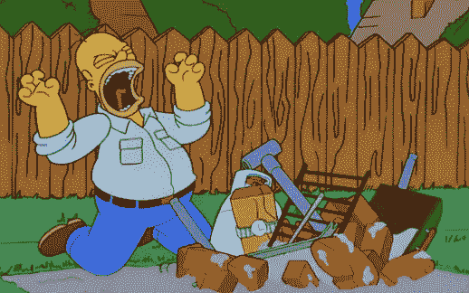
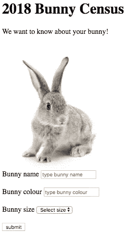

# 我的编码之旅:第 4 周 HTML 的启示

> 原文：<https://medium.datadriveninvestor.com/my-coding-journey-week-4-an-html-revelation-24acdf6cf139?source=collection_archive---------5----------------------->

上周，我记录了我使用稍微更有野心的 CSS 动画的经历。虽然我取得了一定程度的成功(在某种程度上，炸掉卡通兔子的头可以被认为是成功的)，但和往常一样，我也有相当多的沮丧，与响应有关。我想我知道*我需要做什么*来解决这个问题(相对于预爆炸兔子头的尺寸来设置段落尺寸)，但是我还不知道*如何*去做。总的来说，这有点像荷马在组装烤肉。

Why. Won’t. You. Just. Resize?! Why. Must. Life. Be. So. HARD??

尽管我很想解决这个问题，并让我的兔子不管大小都有威胁性，但我决定现在继续努力提高我的 HTML 技能。我发现了这个非常有益的视频:

它向我展示了如何:

-在网页上插入间隙。

-添加下拉列表。

-添加一个文本框。

-插入许多其他有用的表单元素并设置其样式-所有这些都只需要 HTML！

看过视频后，我决定用我新发现的知识来测试一下，并创造一种我自己的形式。如你所知，我总是喜欢把我的编码技能用在与日常生活相关和适用的事情上，所以我决定创建一个这个世界一直缺少的唯一的网络表单……一个兔子普查问卷。

结果是这样的:

Ground-breaking data capture tool.

我不得不说，我对 HTML 本身所能取得的成就感到惊讶，并渴望在未来再次使用这些技术。不过，我意识到这种技术有它的局限性，所以接下来我将探索通过引入 Bootstrap 甚至 jQuery 来设计表单样式的方法…

注意这个空间。