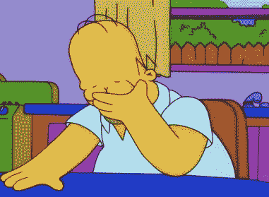
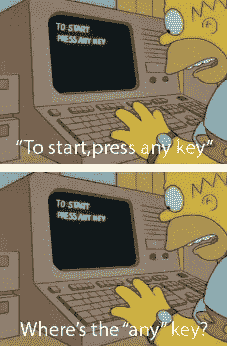

# 我的编码之旅:第 5 周——大杂烩

> 原文：<https://medium.datadriveninvestor.com/my-coding-journey-week-5-a-mixed-bag-12faf81ba0fd?source=collection_archive---------20----------------------->

这是一个有趣的编码周。它包括一些这样的内容:

当我最终弄清楚如何将文本大小设置为相对于视口大小时(当我重新完成了我的[爆炸兔子头](https://codepen.io/LKRR/pen/rZRKyJ)的所有 2356 个元素时，在未来的帖子中要遵循的代码——原始代码变得混乱)。

当我设法停止所说的兔子头在悬停时闪烁的问题时，也有很多“呜呜呜”(同样，当 RabbitHead 2.0 完成时，我会做一个大的揭示)。

还有很多这样的例子:

当我尝试了又失败，尝试了又失败，又尝试了又失败，用 CCS 来集中我的兔子头。

但最重要的是，这一周发生了太多这样的事情:

当试图理解 Javascript 时，当试图理解 React 时，当试图理解除 Flexbox 之外的任何东西时，这似乎足够简单(尽管我还没有尝试实际使用它，所以我可能会在以后收回我的话)。

但是正如我的 t .著名的说的，**“真的，你不会输，直到你停止尝试。”**考虑到这一点，我马上回到这个话题:

希望下周我能分享一些更具体的进展。

祝我好运！