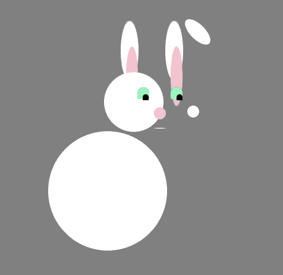
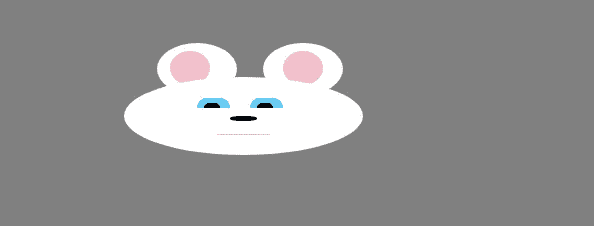
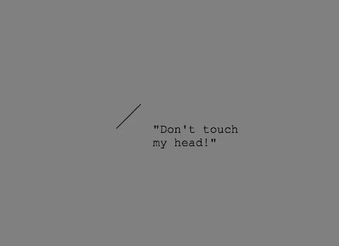
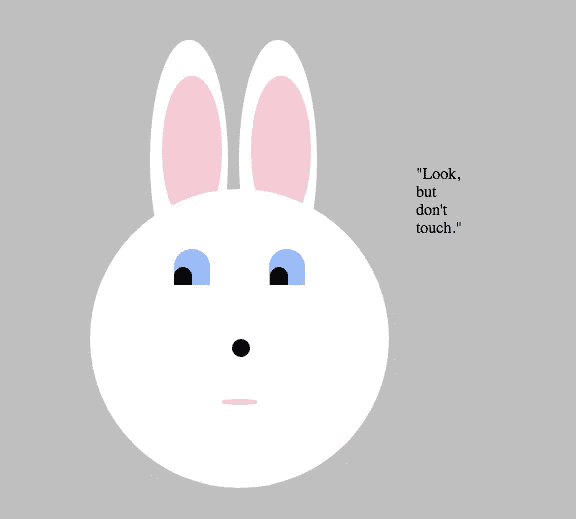

# 我的编码之旅:第 6 周——CSS 的启示

> 原文：<https://medium.datadriveninvestor.com/my-coding-journey-week-6-a-css-revelation-46a549d756f2?source=collection_archive---------16----------------------->

在第二周第一天，我欣喜若狂地发现，我可以通过使用百分比而不是像素来定义它的 div 的大小，从而给我的 HTML/CSS 兔子一定程度的响应能力(这里的代码是)。

这对于用像素设置尺寸是一个巨大的改进。我是说，它阻止了这个:

Artistic, but not what I was aiming for.

我在我的第二个项目“爆炸兔子头”中使用了同样的方法。但问题是，只有当视口设置为正方形时，兔子的真实形状(即圆形)才会保留。导致这一结果的任何其他因素:

Smoosh-face option 1

或者这个:

Smoosh-face option 2

我遇到的另一个问题是，我无论如何也想不出一种方法来快速地将兔子的头居中。我知道，从理论上讲， **margin: auto** 就是全部。然而，实际上，这并没有发生。

喝了很多咖啡和谷歌搜索之后，我最终发现 **margin: auto** 不能处理设置为 absolute 的元素，这是一个问题，因为我已经将所有的元素都设置为 absolute。当时，我认为这是把它们放在我想放的地方的最简单的方法，哦，我错了。

“没问题”，我想，“我只要把它们都设置成亲戚，一切就都是 AOK 的了。”所以我尝试了一下，结果是这样的:

于是，我艰难地发现了**百分比大小+位置:相对等于消失的 div**。

所以我去了，对着枕头尖叫了一会儿，在此期间，我想到我可能需要研究一下**位置:绝对**和**位置:相对**之间的实际区别。

谢天谢地，我找到了这个救命的视频:

一个下雨的周三早晨带来了进一步的突破:发现了 vh 尺寸选择。通过根据视口高度设置兔子头部的大小，我可以相应地调整它的大小，而不会产生笑脸效果(因为不再考虑视口的宽度)。这也意味着我可以使用 **margin: auto** 来集中它。

Yay for centralised, consistently circular rabbit heads!

我做了一些改进，我将在另一篇文章中谈到，到周五，我终于准备好推出我的杰作 ExplodingRabbitHead3.6:

总之，我对本周的编码进展很满意。有时候我觉得在理解 CSS 的游戏中，我输了。但借用 WBC 世界重量级拳王、我丈夫的同胞弗拉基米尔·克里钦科的一句话，“虽然输了，但我实际上赢了”

毕竟，如果我从来没有用百分比来衡量我的 div，我可能仍然会无聊地思考**位置:绝对**和**位置:相对**之间的区别，但最终我还是不知道。这是一个艰难的教训，但确实是一个宝贵的教训。