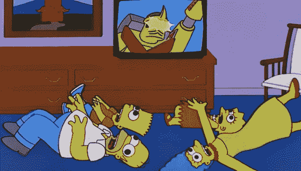

# 我的编码之旅:第 7 周——我如何解决 CSS 闪烁问题。

> 原文：<https://medium.datadriveninvestor.com/my-coding-journey-week-7-how-i-solved-the-css-flicker-problem-1e9f4d661eb6?source=collection_archive---------12----------------------->

[上周](https://medium.com/datadriveninvestor/my-coding-journey-week-6-a-css-revelation-46a549d756f2)，我终于展示了我的新的改进的 CSS 作品，可怕但准确命名的 [ExplodingRabbitHead3.6](https://codepen.io/LKRR/pen/rZRKyJ) 。

您可能想知道 exploding rabbit heads 0–3.5 有什么问题。答案，是“哦，几百，主要是响应性。”然而，还有另一个更微妙但同样令人困惑的难题，我称之为 CSS 闪烁问题。简而言之，问题是当鼠标悬停在

上时，兔子的头被设置为爆炸，这是组成兔子脸的 div 的父项，即、等。

问题是悬停效应缩小了兔子的脸的宽度，这意味着尽管老鼠没有移动，但它不再悬停在兔子的脸上。这导致兔子的头又回到了原来的状态。原来的状态更宽，这意味着鼠标再次悬停在“脸”div 上方，这意味着悬停效果再次被激活，导致头部变窄，这意味着鼠标不再悬停在兔子的头部上方……你明白了吧。

结果是一只兔子的头在它的盘旋状态(粉红色和狭窄)和自然状态(白色和或多或少的圆形)之间不停地闪烁，让观众(或至少是我)在看它时有这样的感觉:

Not the effect I was going for.

经过一番谷歌搜索，我终于找到了解决办法。我给了

一个比兔子头略大的高度和宽度属性，并将它的类重命名为“光环”,主要是为了好玩，但也因为它现在就像一个光环一样围绕在兔子的头上。

最重要的是，我将悬停效果应用于兔子的头部本身，而不是光环，这意味着光环始终保持圆形，悬停效果只有在鼠标移开时才会被停用，从而稳定悬停效果。你可以在下面的钢笔中看到“光环”在起作用(为了清晰起见，涂上蓝色)。

显然，我没有保留蓝色的背景色，即使以这部动画的标准来看，这也很奇怪。相反，我将它的背景颜色与视窗的其余部分进行了匹配，这样一般鼠标悬停在 ExplodingRabbitHead3.6 上的观众甚至不会知道它在那里。

成品，如上周所示，是这样的:

不再闪烁，只是有意的颤抖和面容弥散。任务:完成。

我将很快在更多奇怪的兔子头上工作(我喜欢用富有想象力的项目名称)，并希望最终建立一个网站。你先在这里看到的…