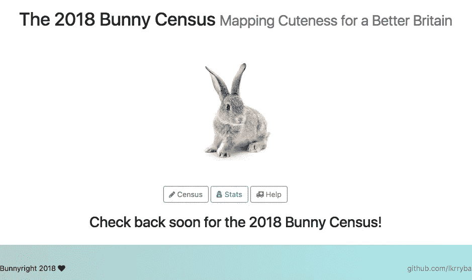

# 我的编码之旅:第 8 周——放下我的脚(有点)

> 原文：<https://medium.datadriveninvestor.com/my-coding-journey-week-8-putting-my-foot-down-kind-of-74e9b77d85a6?source=collection_archive---------16----------------------->

在我们家，我和我丈夫把任务严格地划分为“我的职责范围”和“不属于我的职责范围”。我这周的任务是完成[兔子普查](https://lkrryba.github.io/index.html)网站的前端。后端肯定不是我的职权范围，所以除了做饭和洗碗，丈夫还会设置 API 的调用…或者其他什么。

Said 丈夫已经向我展示了如何将代码推送到 Github，这意味着 2018 年兔子普查网站现在在现实生活中的互联网上直播。(是的，我们还没完工就上线了，淘气鬼。)

在添加了一个 FAQ 页面并调整了人口普查的内容后，我认为网站的前端差不多完成了(哈！)“我只要添加一个页脚就可以了，”我想。嗯，俗话说“旅途中最危险的部分是终点。”在这种情况下，这也是最令人毛骨悚然，最令人沮丧的部分。

添加页脚没有问题(甚至我可以输入页脚标签。)困难在于 1)让它停留在页面底部，而不是在页面上方 10 个左右恼人的像素，2)确保页脚的内容保持在页面内部，不管视窗有多小。所以基本上，除了名义上，让它以任何方式表现得像一个页脚是一个问题。

问题 2)相对容易解决。嗯，我应该说绝对容易，因为解决方案是使用像素而不是 vh 来设置大小，这是我最初所做的。

问题 1)完全是另一回事。根据互联网的说法，将 bottom 设置为 0 是您需要做的全部工作。这不起作用。所以我试着用了一个盒子阴影。这样做比较成功，但是我不能用我喜欢的渐变来给它上色，这导致了在页脚放置内容的问题。

最后，我不得不放弃我所做的大部分工作，从头开始。我发现最接近解决页脚间距的方法是给整个页脚顶部和底部填充 40px。

页面现在看起来是这样的(点击查看实物！):

页脚完美吗？没有。我是否尝试在同一行中添加三个元素，但没有成功，最后说“管它呢，我只删除一个，然后至少两个会正确排列？”是的。这个页脚在这一页上工作，但是弄乱了其他兔子普查页面的布局吗？是的。我知道为什么吗？不，不是真的。这是一整天工作的完全令人满意的结果吗？肯定不是。

也就是说，页脚的状态比我今天早上开始工作时要好得多，所以我会用老子的名言来安慰自己:“一只移动的蚂蚁比一只打瞌睡的牛做得更多。”我今天没有拉任何网页设计车(或任何黄牛做的事)，但我至少从一个分支到另一个分支移动了一小片叶子。考虑到这一点，希望这只蚂蚁能在不久的将来弄清楚如何轻松地制作一个可靠的网站页脚。如果是的话，你会先在这里看到它。