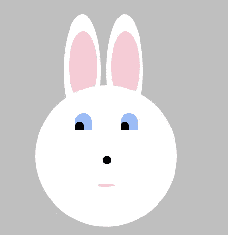
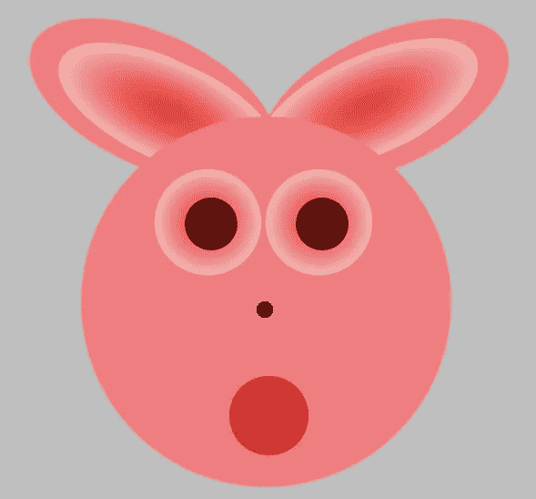
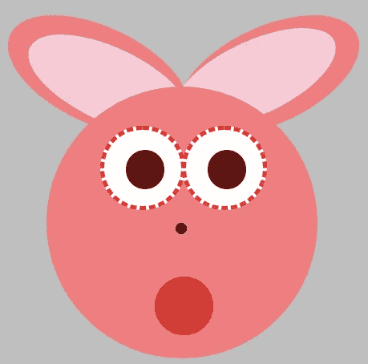

# 我的编码之旅-第 9 周:研究生院

> 原文：<https://medium.datadriveninvestor.com/my-coding-journey-week-9-grad-ient-school-abba35149290?source=collection_archive---------9----------------------->

仍然为 [ExplodingRabbitHead3.6](https://medium.com/datadriveninvestor/my-coding-journey-week-6-a-css-revelation-46a549d756f2) 的成功而欢欣鼓舞(如果你可以称之为成功的话)，我本周决定创造另一个奇异的 abbitHead。我想说的是，我创造这些有点可怕的卡通兔子是为了展示我的剧目中广泛的 CSS 效果，但这是一个谎言。真正发生的是，一个奇怪的脑袋突然出现在我的脑海中，要求被创造出来，然后我花几个小时喝咖啡，在网上搜索，试图找到如何做到这一点。

这个星期突然出现在我脑海中的奇怪的东西最终变成了《膨胀的气球》(是的，我做了很多尝试才最终得到了我想要的结果。)

它的想法是，用户看到一只非常可爱的蓝眼睛兔子，它的脸恰好在悬停时变大并变红。基本上，它是这样的:

Meet ExplodingRabbitHead3.6’s twin

对此:

Yikes.

我的第一个想法是用*动画*创造这个效果(在这里插入脸-手掌表情符号)。然而，我很快意识到这是不合适的，因为它既没有提供平滑的过渡(除非我真的想为动画的每 1%指定一个非常微小的增加，但我肯定没有)，也没有任何类型的过渡，所以兔子会直接回到它的原始状态，而不是慢慢缩小，这正是我想要的。

幸运的是，我找到了 CSS 过渡形式的解决方案。使用这个很棒，因为它不仅提供了与大尺寸之间完全平滑的过渡，而且我还可以用它来着色，所以兔子慢慢地从白色变成粉红色，变成猩红色，然后再变回来。

然后，我决定让兔子在盘旋时眼睛布满血丝(谁不想呢？)起初，我试图在眼睛周围用红色虚线边框来实现这一点。这当然看起来很可怕:

In the style of computer games circa 1994

然后我想到一个红白渐变可以达到这个效果。我发现，唯一的问题是渐变背景是不可动画化的，这意味着当鼠标悬停时，眼睛会立即从正常的蓝色渐变到红白渐变，当鼠标移开时，又会迅速恢复。因为这是我们说的 CSS，事情不能就这么简单。

一个正常的人可能会耸耸肩，就此作罢。然而，我强烈地感觉到，我的兔子的眼睛需要慢慢地过渡到它的凸出效果，并喝了更多的咖啡和拖网更多的互联网来寻找解决方案。

谢天谢地，我碰巧看到了[戴夫·伦尼](https://medium.com/u/b8d359bdc61b?source=post_page-----abba35149290--------------------------------)发来的[这篇](https://medium.com/@dave_lunny/animating-css-gradients-using-only-css-d2fd7671e759)帖子。他解释说，虽然背景渐变是不可动画化的，但不透明度是可动画化的，所以解决方案是在非悬停状态对后面建立第二组眼睛，在悬停时不透明度从 0 到 1，而正常状态对在悬停时从 1 到 0。天才！

我也给兔子的内耳添加了类似的效果，然后终于准备好揭开 BulgeEyedBunny13 的面纱:

最终会有一个 StrangeRabbitHeads 网站，上面会显示一个范围(沃伦？)的兔子头展示了各种 CSS 效果。请关注此处了解更多详情。