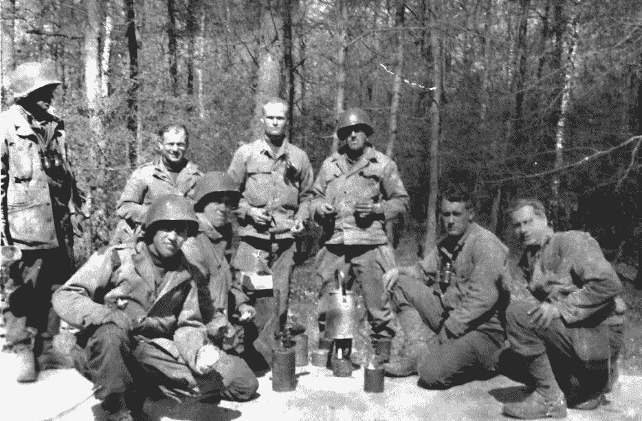

# 我爸爸的诺曼底故事

> 原文：<https://medium.datadriveninvestor.com/my-dads-great-normandy-adventure-883a15a77b5a?source=collection_archive---------10----------------------->

那时有巨人。

七十五年前的今天，我父亲在英格兰北部，与集结在加莱海峡的德国军队隔着多佛海峡。多佛海峡是英吉利海峡最窄的地方。他当时并不知道，但他的部队是一个精心策划的骗局的一部分，这个骗局被称为“南方坚韧行动”，旨在让纳粹将军们相信盟军的入侵将从那个地方开始，而不是诺曼底。他经常想，那个看似随意的决定是否救了他的命。

那时候他没有太多时间去考虑这个问题。在首次登陆六天后，他的部队作为增援部队在诺曼底登陆。仍然有阵阵枪声，腐烂的尸体，空气中弥漫着死亡的恶臭。

我父亲是巴顿将军第三军第 80 步兵团——“蓝岭师”的战斗工程师。巴顿的部队领导了从诺曼底海滩发起的“眼镜蛇突围”行动，在接下来的 239 天里——直到战争结束——横扫法国北部、比利时、卢森堡、莱茵兰和奥地利——除了在突出部战役期间的一次小迂回之外，一直处于进攻状态。

随着德国人从迪尤沃德跨过莫塞勒河牢牢地挖好了工事，我父亲的部队在猛烈的炮火下连夜修建了浮桥，使得巴顿的坦克得以继续向莱茵河前进。他们在步兵部队穿越阿登和阿尔萨斯进入德国之前修建了道路和临时桥梁。当德国人试图在突出部分裂盟军时，他的部队向北挺进卢森堡以解救被围困的部队。这是欧洲历史上最糟糕的冬天之一，夜间温度超过零下 15 华氏度。地面冻得非常结实，士兵们经常用半根炸药来挖散兵坑。

我知道这一切不是因为他告诉我，而是因为我在互联网上找到了他的部队日常指挥所的记录，并将它们与战争历史进行了匹配。他可能说过天气很冷。他可能说过这很艰难。但是，在他告诉我的故事中，没有人死亡。无论他忍受了什么样的恐怖(肯定有很多)，他都默默地忍受着。

我想我们大多数人现在都知道第二次世界大战是残酷的，但在那里服役的人似乎来自一个更古老，也许更高贵的家族，他们不会公开或轻易透露他们的感情，我们听到的大多数第一人称口述历史都是为了家庭讲述而编辑的。

他死后，我在他的遗物中发现了一个盒子，里面有一枚青铜星章和一张印刷好的纸。报纸上写着:

*“1945 年 1 月 24 日，在卢森堡的勒林伦附近，下士鲍尔斯在被敌军其他小分队发现之前占领了两个敌对的炮阵地。然后，在猛烈的炮火下，他占领了另一个阵地。在寡不敌众的情况下，他摧毁了枪支，切断了爆破电线，并在激烈的敌对火力下撤退，从而挽救了一条重要的道路免遭破坏。”*

盒子里也有几张有趣的图片。其中一个展示的是法国小镇 Pont-au-Masson 的一栋完全毁坏的建筑。在背面，他潦草地写着“保存这张照片”。爆炸的时候我就在这栋楼里。”上面标题下的第一张照片是 1945 年 3 月在凯泽斯劳滕附近拍摄的。它展示了八个穿着迷彩服的士兵——我爸爸跪在右边第二个。在背面，他写道“这是我的排。以前我们有十四个人。”