# 我梦想中的个人电脑

> 原文：<https://medium.datadriveninvestor.com/my-dream-pc-build-769a9b16b1ed?source=collection_archive---------31----------------------->

我想把我梦想中的电脑放在网站或论坛上已经有一段时间了，但是我还没有找到合适的平台。直到现在。我很可能永远也不会有这样的身材，但是梦想一下也无妨。

首先，我梦想中的 CPU 是锐龙 Threadripper 2990WX 处理器中的极品。这款 32 核 64 线程的强大处理器本身就要 1730 美元，所以我根本买不起。它如此强大，如此紧凑，以至于它有自己的芯片组。我想最强大的桌面 CPU 应该有一些额外的功能。

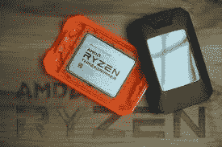

The Threadripper 2990WX in all of it’s 32-core, rectangular glory.

由于 Threadripper 有一个独立于锐龙处理器的插槽，主板的选择有些有限。我在技嘉 Z370 Aorus Extreme 和华硕 ROG Zenith Extreme 之间犹豫了一段时间，但由于华硕更微妙的 RGB 照明和更广泛的功能，我决定选择华硕。在这种情况下，微妙是一种不太明显的方式来说，几乎没有任何 RGB 照明，但千兆字节的选项是完全多余的。(不言而喻，这整个电脑是多余的，但灯光有点花哨。)

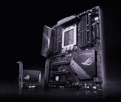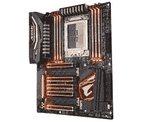

对于 CPU，必须始终有一个 CPU 冷却器。<insert witty="" segue="" into="" yoda="" quote="">。CPU 确实需要 CPU 冷却器才能正常工作，否则它就会爆炸。到目前为止，我最喜欢的 CPU 冷却器是海盗船 H150i PRO。这是一个 AIO(多合一)冷却器，噪音水平非常低，最大值约为 25 分贝。它没有 RGB 风扇，而是选择黑色和灰色风扇，但有一个简单的解决方案。所有的风扇都是可拆卸的，所以我会用一套海盗船的 ML120 风扇取代库存风扇。此外，我会为该案例添加 3 个 LL120 风扇。这些扇子是 RGB 的，所以会进一步突出配色，如果 RGB 能算配色的话。此外，没有关于 CPU 插座的问题，因为这个冷却器与名为 TR4 的 Threadripper 插座格式兼容。</insert>

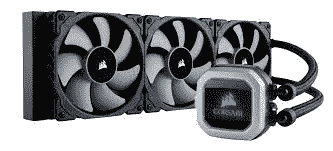

对于 RAM，我只喜欢一种类型的 RAM。是 G.Skill 的 TridentZ RGB RAM(还有呢？).然而，32gb 的内存对我来说是最合适的，所以这是我会放入我的电脑的容量。拜托，是 RGB！此外，我喜欢高时钟速度，因此 3200 MHz 的变体将是这个系统的理想选择。这台电脑将会是有史以来最 RGB 化的东西。如果它建成的话。

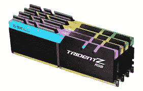

The only thing better than this is the Royal version. Those are made of gold/silver and crystals though.

说到储物，我被选择宠坏了。即便如此，我还是更喜欢三星的固态硬盘，因为它们的速度更快，质量也更好。因此，这台电脑上的所有数据都存储在 2 个三星固态硬盘上，一个 2TB 860 Evo 和一个 512GB 970 Pro M.2 固态硬盘上，用于 Windows，游戏和其他任何我想高速运行的东西。可悲的是，这两个都不是 RGB。970 Pro 的速度非常快，因为它采用了 NVMe 闪存技术和 M.2 格式。

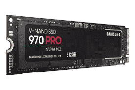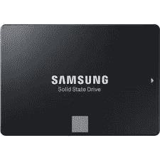

现在，我们来看看显卡。继续完全矫枉过正的主题，不是一个而是两个华硕 Strix 2080TIs 在 SLI 将这台电脑带到了疯狂的新水平。这些卡中的每一个都有 11g 的 GDDR5 VRAM，因此不会缺少 RAM，总共有 22g 可供计算机使用。这怎么可能变得更过分呢？

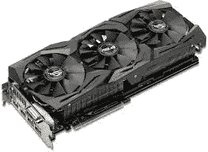

“This is getting out of hand. Now there are two of them!”

所有这些疯狂的矫枉过正的部分将驻留在安静！黑暗基地临 900 盒。这种情况是非常模块化的，有一个完整的塔式外形，看起来很神奇，这就是我喜欢它的原因。此外，它有一个钢化玻璃窗口，这将让我弯曲我的极端过分的组件(特别是对使用控制台的人)。此外，它还提供了 RGB 照明的绝佳视角。

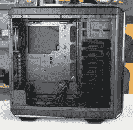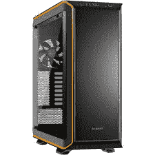

为了完成这个过度杀戮的 PC 游戏展览，这个庞然大物的电源是海盗船 AX1500i。这是一个 1500 瓦的电源，钛效率等级为 80+。除此之外，还有；这没什么特别的。

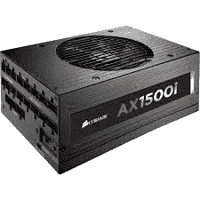

这是我梦寐以求的台式电脑的全部怪物。请随时分享您的想法和建议，我可以对这个版本做任何修改。