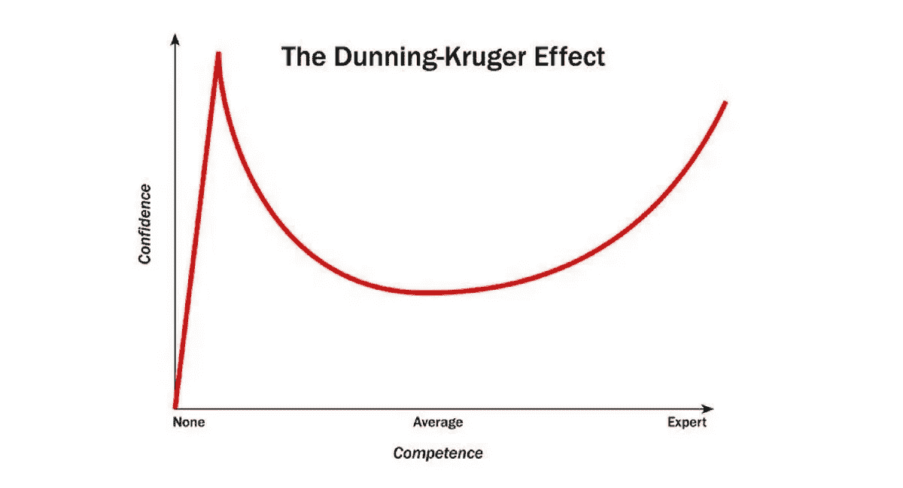

# 我作为初级开发人员的第一个月

> 原文：<https://medium.datadriveninvestor.com/my-first-month-as-a-junior-developer-cd7807de156e?source=collection_archive---------5----------------------->

[rawpixel](https://unsplash.com/@rawpixel?utm_source=medium&utm_medium=referral) on [Unsplash](https://unsplash.com?utm_source=medium&utm_medium=referral)

*一名编码训练营毕业生的想法*

周一早上 8 点 55 分，我第一次走进我的新工作场所。在进入零售地狱的最后几天之前，我度过了一个周末，并在两天前完成了为期六个月的编码训练营。

在一个新的工作场所开始总是令人生畏的，但是在一个你以前从未从事过的职业中在一个新的工作场所开始？

*太可怕了。*

[Sabri Tuzcu](https://unsplash.com/@sabrituzcu?utm_source=medium&utm_medium=referral) on [Unsplash](https://unsplash.com?utm_source=medium&utm_medium=referral)

谢天谢地，我的工作场所给我找了一个“伙伴”——她已经是我即将开始的初级开发人员项目的一部分(尽管已经深入其中)。我的朋友在接待处见了我，带我参观了大楼，并带我去了地面控制中心，在那里我收到了一个装满苹果赃物的背包和一台全新的顶级 MacBook Pro。多酷啊！？

我的桌子上耐心地放着两张纸，欢迎我加入初级开发人员项目，并概述了最初几天的日程安排。在把我介绍给我的学弟学妹和 a 之后，“如果你需要什么，就帮我松绑！”我的朋友停下来继续她自己的工作。

我现在该怎么办？

从零售工作过渡到软件开发工作最奇怪的事情是，我不再有人监视我，确保我轮班的每一秒都很忙。我过去常常在工作时去不必要的洗手间，只是为了能坐下来休息一两分钟。但是在这里？没什么。没人在乎。太神奇了。

*我的入职文件甚至规定写这篇博文构成了对我工作时间的合理利用。*

[rawpixel](https://unsplash.com/@rawpixel?utm_source=medium&utm_medium=referral) on [Unsplash](https://unsplash.com?utm_source=medium&utm_medium=referral)

我的工作场所也给我指派了两位导师——经验丰富的开发人员，他们乐于指导我成为一名成熟的开发人员。他们是最棒的人，真心希望我成功，对此我感激不尽。

尽管我的新工作场所提供了所有的支持，我的头四周仍然有点混乱。在 web 开发训练营中，我对自己的技能水平相当满意，但当我从 Java 和面向对象编程的深渊中走出来时，我对自己是否有能力成为一名开发人员感到有点不确定。

I ended my bootcamp on the high, and fell very quickly into the low.

在与我的导师、软件架构师和一直支持我的训练营同学的交谈中分享这些恐惧是我在过去四周做的最好的事情——这不仅让他们知道我对自己的进步有些担忧，还帮助我意识到他们每个人都曾在某个时候处于相同的位置。我结束了作为初级开发人员的第一个月，有了明确的前进方向和长期目标。

无论如何，不再赘述——我作为初级开发人员的前四周的意识流:

## 第一周

*   我每天都做些什么？
*   我真的可以整天坐在这里看书吗？
*   如果我要去买咖啡，我需要告诉别人吗？
*   等等，咖啡是免费的？
*   等等，我们可以随时离开大楼去买咖啡？
*   为什么有这么多会议？
*   我必须参加所有的会议吗？
*   一个巴到底*做什么* ？
*   我要学 Java？？？

## *第二周*

*   很明显，我选择了有史以来最好的职业
*   Java 是有史以来最糟糕的语言
*   耦合和内聚到底是什么？
*   所有这些缩写是什么意思？
*   …我真的适合这个吗？

## *第三周*

*   也许我选择了错误的职业
*   这就是生存危机的感觉吗？
*   我如何分解一个问题来找到解决方案？
*   所有这些抽象的流行词汇是什么意思？
*   我不确定我在做什么，所以我会尽可能多地邀请自己参加会议
*   即使是我没有理由参加的会议
*   我是否因为不确定自己能做到而利用会议来推迟编写代码？
*   *没错*
*   我希望我正在开发一个实际的产品，而不是试图用 Java 制作一个计算器
*   等等，我想 TDD 开始有意义了

## *第四周*

*   这些软件架构师知道的太多了
*   总有一天我会成为一名软件架构师
*   没有人期望我知道什么，他们只是期望我的努力
*   有导师很好
*   我不知道我在做什么，这也很好
*   这是一个多么好的机会

感谢阅读！你可以在推特上找到我。