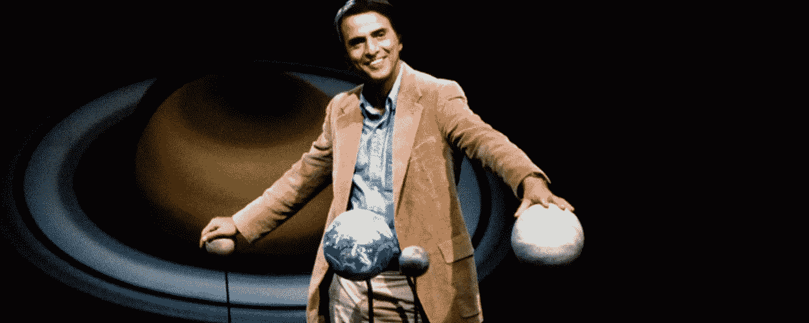

# 想象力的丰富

> 原文：<https://medium.datadriveninvestor.com/my-grandfather-killed-a-mule-8a0d3c01ca14?source=collection_archive---------10----------------------->

“无论你想做什么，你都会在生活中发现，如果你对工作没有热情，你就无法坚持下去。”杰夫·贝佐斯

我不知道如何骑马。我从来不知道。即使来自内地，我也很少有机会骑在马背上。作为一名职业伐木工人的孙子，我看到许多动物在搬运柴火的交易中受到虐待，这些柴火点燃了卡拉廷加市的几个炉子。直到 20 世纪 70 年代，这种交易还很常见，因为在我父亲的家乡，气瓶对大多数人来说都是极其奢侈的物品。拉满车的工作对动物来说是可怕的。很久以前，我听说他们中的一个在一次运送途中被我的祖父杀死了。毫无疑问，驯服马、骡、甚至驴的艺术，在某种程度上，并没有让我觉得充满激情。

我为什么要讲这个故事？因为我们都生活在同样的情况下。我相信所有的人，没有例外，都生来具有一种力量，讽刺的是，这种力量是不可想象的。

唯一能让我们在这个野蛮的星球上生存下来的是我们的想象能力。想象力是一种天赋。但是，不要误会我的意思，它并不那么神圣，即使它有改变现实和改变生活的力量。我们拥有的生物躯体是脆弱的。非常脆弱。如果我们不得不单独依靠它，我们就会迷失。人类的想象力赋予了我们战胜所有生存挑战的能力。然而，同样的想象是一种野兽。

我希望它保持这样。

当我的祖父决定驯服他的骡子并把它们用作“发动机”时，他选择了一条简单的出路。当然，那一刻他几乎没有意识到自己的行为。这几乎是一种本能。我只是想用这个真实的故事作为一个比喻，来象征我们大多数人最终在做什么:在被驯服的想象力的鞭策下，用我们最好的想法装满马车，并把它们送到需要它们的地方。

现代创造力有时是个笑话。

我喜欢读历史书。不是因为地上散落着枣子和血迹；或者摧毁了城市、人民和语言。历史总是向我展示一幅幅画布。在这些照片中，我可以看到我们，智人，在每个时代可以用我们所有的东西做什么。有一天，是轮子；然后，火了。很快，农业。再往前，是文字，然后是火药。不久以前，我们可以在河流、海洋和大洋上航行。那些空间现在是如此多的光纤电缆的途径，那里是当前人类去的地方。人类的创造性行为在今天看来。问谷歌，一切都解决了。都在那了。回答一切的神谕也定义了我们的创造力。

是这样吗？可能，错了？

这不是我的观点。让我担心的是，我们越来越多地创造新的方法来驯服我祖父的骡子。我们越来越掌握了创造的艺术，但随之也失去了它的魅力。人类的想象力是一种野生动物。它必须像那样继续下去。掠食者的最佳版本是在大草原和大草原上悄悄盘旋的那种。没有适合一本书或一个简单讲座的创造精神，甚至不能在互联网搜索引擎中自由找到。创作过程中存在风险，无论是谁提出进入这个世界，如果他或她想成为原创，就必须意识到这一点。

我不知道如何驯服马。明白这一点很好。人们不应该驯服创造力。让它在浩瀚无垠的宇宙中自由自在。驯化的想象力对我们毫无用处。当我读到发射旅行者号探测器的项目时，我意识到人类的思维是多么神奇。我们想象在太阳系之外找到生命的可能性。在探针的结构中，嵌入在一个金盘中，我们发送一系列的符号、声音和图像，希望能找到一个未知的接收者。它可以改变我们的命运，如果它在那里，在无限中，如果它能够阅读我们的信息。如果发生这种情况，责怪或感谢天体物理学家卡尔萨根，这是他的想法。

这证明了人类想象力的力量。我们的想象力不再依附于地球的大气层。它即将打破已知宇宙的最远边界，可能不会独自归来。

一个孩子创作他的第一个涂鸦是一个爆炸的炸弹。凭借最低限度的敏感性，我们可以感觉到地面在颤抖，并想象如果他的无知能够飞向无限，甚至更远，将会造成多大的破坏。当我的祖父杀死那头可怜的骡子时，那是因为它不服从他，固执，不想走他坚持要走的路。

关于人生，我们有时会坚持走错误的路；关于我们的朋友，我们的员工，我们的家庭或我们自己。特别是关于我们的孩子，我们以许多可怕的方式结束，选择拉缰绳，举起鞭子，不害怕结果，即使是血浇在他们的头上，因为我们相信这样一个祝福的方式是最好的。

自由的思想是很可怕的。我同意！但是，只对那些仍然相信人才需要笼子，栅栏，墙壁或笼头。对于有创造力的人来说，找到了他的元素，他的艺术，最好的方法是让想象力保持它被创造时的样子:野性。这将确保它的力量没有边界，即使仍然有许多人坚持认为天空将是它的极限。