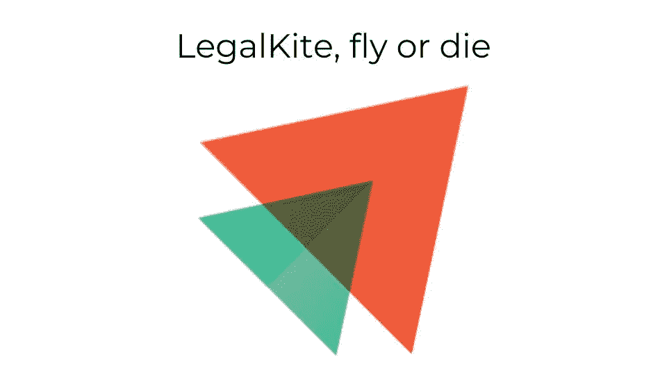
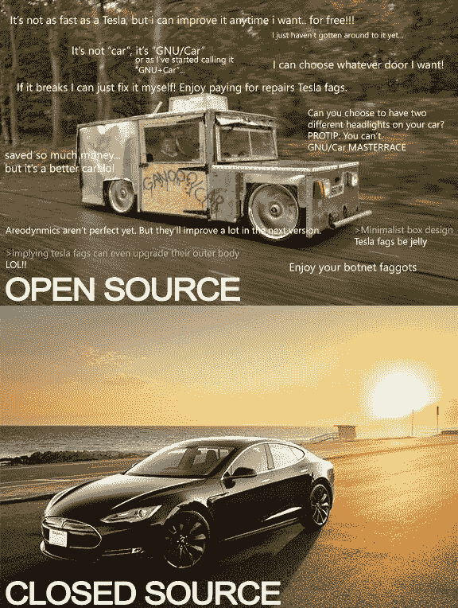

# 作为一家没有 IT 背景的科技公司的创始人，我最初的挣扎

> 原文：<https://medium.datadriveninvestor.com/my-initial-struggles-as-a-founder-of-a-tech-company-without-an-it-background-1592ac7ef37d?source=collection_archive---------7----------------------->

这是我的第一篇博客，我希望我不会破坏第一印象。你可能想知道是什么让我想告诉你我作为一个企业家的历程。我有什么特别的成就吗？不，诚实的回答是我正在推广我的创业，我需要你的关注。在这一点上，我可能已经失去了你们中一些人的注意。但是等等，你知道每个博主都在宣传什么吗？如果是产品，那就叫*内容营销*如果是作者，那就叫*虚荣*。请放心，即使你不买我的东西，即使你不喜欢法律技术，你仍然会找到外卖；)

*初创企业*和*企业家*这两个词最近已经失去了吸引力。事实上，如今每个人都在或想成为企业家，因为你可以在两小时内几乎零成本地创建一个电子商务网站，或者在几天内创建一个社交应用程序，同时保留你的日常工作、你的妻子甚至你的猫。很方便，不是吗？根据记录，我没有养猫，但其余的几乎都适用于我。然而，正如你可能从文章标题中猜到的那样，现实有点不同。

当我决定创办 LegalKite 时，我对自己的想法非常兴奋，以至于一头扎了进去。我对自己说:*在有人有同样的好主意之前，让我们尽快开发这个杀手级的应用程序。*

仅供参考， [LegalKite](https://legalkite.com/en.html) 是一个网络平台，律师可以在这里以协作的方式在线注释瑞士法律，创建注释之间的交叉引用，添加标签，附加文件等等。这基本上是 Evernote 遇到了 Swisslex(或者我们称之为 Westlaw)。我会让你对这个想法的高明之处发表自己的看法。

那时，我刚刚退出了我的第一次冒险(这里的动词“退出”更多地是指爵士在著名的《新鲜王子》中被菲尔叔叔赶出了家门，而不是指埃隆·马斯克卖掉了他在 PayPal 的股份)，当然，我迫切需要跳上下一辆过山车。

借鉴我第一次创业的经验，我决定这次不从头开始开发任何软件，而是使用开源代码。事实上，我们生活在一个美好的时代，你可以在开源社区找到几乎任何软件，并免费使用，在这个过程中节省时间和金钱。在 LegalKite 的例子中，我需要一个注释工具，它可以集成为法律文本之上的一个层。我很快发现了一个非常吸引人的东西，叫做*假设*。他们有一个维护良好的存储库，至少这是我根据提交的频率和被它吸引的人数所假设的。然后，我寻找一个负担得起的自由职业者，他应该在撰写假设的语言，即 Python，方面有相当的技能水平。我最终雇佣了一个年轻的西班牙开发人员，他看起来非常积极和快乐。唯一的问题是他常驻泰国。我仍然不知道这是为了寺庙还是夜生活。然而，我列出了项目要求，他估计整个开发大约需要 3000 美元和 3 到 4 周的工作。真的吗？看着价格，我决定尽快开始，跳过市场调查部分。最坏的情况是，我会失去 3k，并在这个过程中学到一些东西。

我们按计划开始，我决定从一开始就非常亲力亲为，以避免在赛道上出现糟糕的意外。因此，我每天都会通过 Slack 与他交流，这有一个附带的好处，可以让我了解项目的技术方面(当你没有 it 背景时，这非常有用，就像我当时的情况一样)。在最初的两个星期里，我们进展顺利。

然后他开始意识到他低估了项目的复杂性。然后，他会建议雇佣第二个开发人员来负责前端，这样他就可以专注于后端。我同意了。毕竟，3k 似乎无论如何都不现实，所以我准备在口袋里挖得更深。然后，我有一个由 2 名远程开发人员组成的团队，几乎全职工作在我的项目上。有了第二个“员工”，我的首席执行官头衔突然看起来不那么可笑了。另外，我觉得我们每天都取得了一些真正的进步，团队互动创造了积极的动力。但另一方面，成本开始快速增长。

接着，第一个令人不快的重大惊喜出现了。我们使用的开源代码并没有那么开放…他们没有开放注册，更糟糕的是，它是硬编码的(不能修改来满足我们的需求)。

这意味着每一个 LegalKite 的新用户都必须首先注册使用 Hypothesis。相当大的交易破坏者…我们不得不从头开始。那时，我们已经为整个项目花费了比最初预算更多的钱，面临着一个真正的困境。似乎很明显，最终成本将是最初预算的数倍，但另一方面，我们越深入这个项目，就越感到兴奋。所以，扼杀项目从来没有成为一个选项。我指示开发人员继续进行，这样我们可以尽快发布 MVP(最小可行产品)。

第二个不愉快的事件:我们的后端开发人员突然宣布他被新西兰的一家公司录用了，并将在 3 周后离开 LegalKite。你能重复一遍吗？

是的，我只有 3 周时间去找一个新的后端开发人员，让他/她跟上进度。我很快在 Upwork 上发布了一份工作邀请，收到了来自半个印度的申请。我并不反对印度，但我最终选择了一位意大利开发商，他似乎对法律技术、区块链和智能合约感兴趣(当时加密投机还没有让一夜之间成为亿万富翁，因此我认为他的兴趣是真诚的)。我们没想太久就雇佣了他。但是他变得非常不同……他过去常常在下午醒来，选择他要回答的请求，而忽略其他的。他还养成了取笑前一个开发者留下的代码质量的习惯。

我们的前端开发人员很快表明他不喜欢他，我被一个后端开发人员缠住了，我不能解雇他，因为他是北半球唯一知道我们代码的人。

最后，我们花了大约 6 个月的努力、汗水和外交，加上几十万美元，终于发布了我们的测试版。后来，由于关系恶化，我解雇了我们的后端开发人员，换上了一位才华横溢、值得信赖的开发人员，他也是意大利人，但一点也不像他的前任。

吸取的教训:

1.  虽然开源对你项目的小部分非常有帮助，但是当你严重依赖它的时候，你应该非常小心。在开始任何开发之前，应对代码质量、灵活性和可维护性进行深入评估。如果预期的开源代码没有检查所有的框，你通常最好从头构建它，即使感觉像是重新发明轮子。
2.  永远不要雇佣仅仅因为他/她的技术能力而在你的团队中扮演核心角色的开发人员。应特别注意评估个性检查和长期目标一致性。当我们雇佣新的自由职业者时，我们会让团队中的其他自由职业者对他们进行面试。如果事情从一开始就感觉不对劲，它们通常不会随着时间的推移而变好，这可能是生活中唯一一种耐心不是美德的情况。
3.  最后，永远不要依赖开发人员对交付一个功能性的、经过测试的产品所需时间的估计，因为他/她总是过于乐观。这通常是因为他们从来没有预见到他们会在一个 bug 上被困 2 周，他们不知道如何修复，或者他们不能预测在开发期间发生的不可避免的需求修改。如果这是你和某个开发者的第一次合作，实际上没有办法准确估计交付的时间，你最好接受这个事实。

感谢把我的第一篇帖子看到底！希望我没有助长你的拖延症。下周，我将分享我与独立 IT 自由职业者和外包公司合作的经历。如果你喜欢我的帖子，不要犹豫，分享它。

